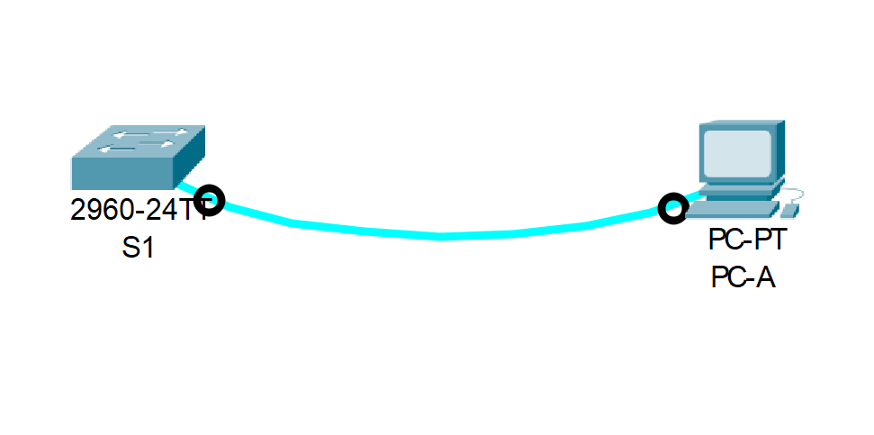
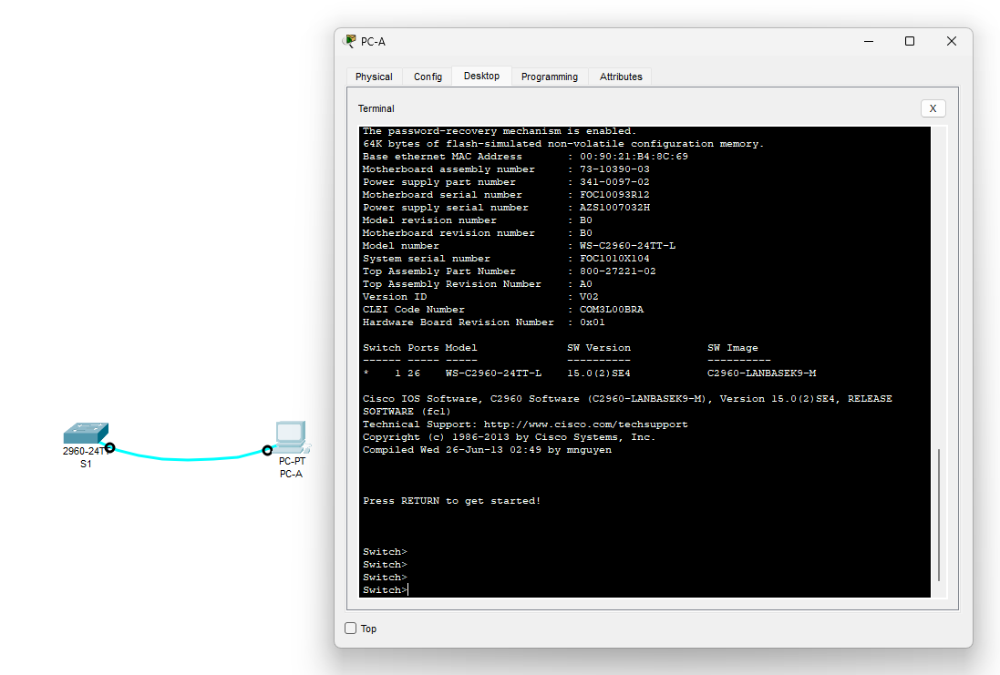
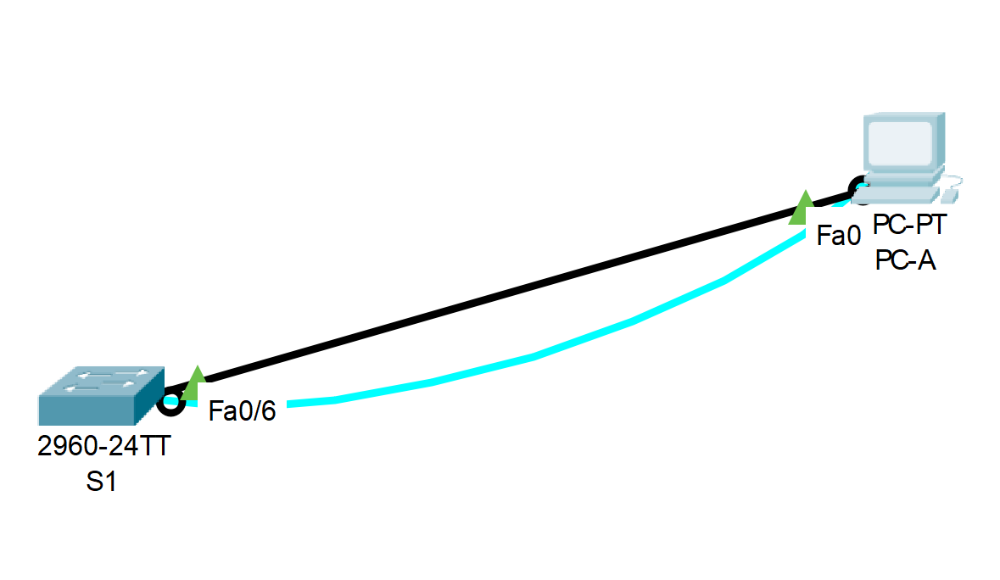

# Лабораторная работа. Базовая настройка коммутатора.
### Дано:
###	Топология

###	Таблица адресации
| Устройство | Интерфейс | IP-адрес / Маска             |
|------------|-----------|------------------------------|
| S1         | VLAN 1    | 192.168.1.2 / 255.255.255.0  |
| PC-A       | NIC       | 192.168.1.10 / 255.255.255.0 |
### Задание:
1. [Создание сети и проверка настроек коммутатора по умолчанию.]
 - [Создайте сеть согласно топологии](https://github.com/getmandv/Network_Engineer._Basic/edit/main/Home_work/Lab_01/README.md#1-%D1%81%D0%BE%D0%B7%D0%B4%D0%B0%D0%B9%D1%82%D0%B5-%D1%81%D0%B5%D1%82%D1%8C-%D1%81%D0%BE%D0%B3%D0%BB%D0%B0%D1%81%D0%BD%D0%BE-%D1%82%D0%BE%D0%BF%D0%BE%D0%BB%D0%BE%D0%B3%D0%B8%D0%B8)
 - [Проверьте настройки коммутатора по умолчанию](https://github.com/getmandv/Network_Engineer._Basic/blob/main/Home_work/Lab_01/README.md#2-%D0%BF%D1%80%D0%BE%D0%B2%D0%B5%D1%80%D1%8C%D1%82%D0%B5-%D0%BD%D0%B0%D1%81%D1%82%D1%80%D0%BE%D0%B9%D0%BA%D0%B8-%D0%BA%D0%BE%D0%BC%D0%BC%D1%83%D1%82%D0%B0%D1%82%D0%BE%D1%80%D0%B0-%D0%BF%D0%BE-%D1%83%D0%BC%D0%BE%D0%BB%D1%87%D0%B0%D0%BD%D0%B8%D1%8E)
## Часть 1. Создание сети и проверка настроек коммутатора по умолчанию.
###  1. Создайте сеть согласно топологии.
a. Подсоедините консольный кабель, как показано в топологии. На данном этапе не подключайте кабель Ethernet компьютера PC-A.



b. Установите консольное подключение к коммутатору с компьютера PC-A с помощью Tera Term или другой программы эмуляции терминала.



- Почему нужно использовать консольное подключение для первоначальной настройки коммутатора?

 Потому что к не сконфигурированному коммутатору нельзя подключиться иначе.
 
- Почему нельзя подключиться к коммутатору через Telnet или SSH?

Потому что у коммутатора не сконфигурирован SVI.
###  2. Проверьте настройки коммутатора по умолчанию.
a. Введите команду enable, чтобы войти в привилегированный режим EXEC.
```
Switch>
Switch>enable
Switch#
```
b. Изучите текущий файл running configuration.
```
Switch#show running-config 
Building configuration...

Current configuration : 1080 bytes
!
version 15.0
no service timestamps log datetime msec
no service timestamps debug datetime msec
no service password-encryption
!
hostname Switch
!
!
!
!
!
!
spanning-tree mode pvst
spanning-tree extend system-id
!
interface FastEthernet0/1
!
interface FastEthernet0/2
!
interface FastEthernet0/3
!
interface FastEthernet0/4
!
interface FastEthernet0/5
!
interface FastEthernet0/6
!
interface FastEthernet0/7
!
interface FastEthernet0/8
!
interface FastEthernet0/9
!
interface FastEthernet0/10
!
interface FastEthernet0/11
!
interface FastEthernet0/12
!
interface FastEthernet0/13
!
interface FastEthernet0/14
!
interface FastEthernet0/15
!
interface FastEthernet0/16
!
interface FastEthernet0/17
!
interface FastEthernet0/18
!
interface FastEthernet0/19
!
interface FastEthernet0/20
!
interface FastEthernet0/21
!
interface FastEthernet0/22
!
interface FastEthernet0/23
!
interface FastEthernet0/24
!
interface GigabitEthernet0/1
!
interface GigabitEthernet0/2
!
interface Vlan1
 no ip address
 shutdown
!
!
!
!
line con 0
!
line vty 0 4
 login
line vty 5 15
 login
!
!
!
!
end


Switch#
```
- Сколько интерфейсов FastEthernet имеется на коммутаторе 2960?

На коммутаторе Cisco Catalyst 2960 имеется 24 интерфейса FastEthernet.
```
interface FastEthernet0/24
```
- Сколько интерфейсов Gigabit Ethernet имеется на коммутаторе 2960?

На коммутаторе Cisco Catalyst 2960 имеется 2 интерфейса Gigabit Ethernet.
```
interface GigabitEthernet0/2
```
- Каков диапазон значений, отображаемых в vty-линиях?

Два диапазона. 5 линий с 0 по 4 и 10 линий с 5 по 15. Суммарно 16 линий.
```
line vty 0 4
 login
line vty 5 15
 login
```
c. Изучите файл загрузочной конфигурации (startup configuration), который содержится в энергонезависимом ОЗУ (NVRAM).
```
Switch#show startup-config 
startup-config is not present
Switch#
```
- Почему появляется это сообщение?

Потому что этого файла в энергонезависимой памяти ещё не существует, так как я не сохранял никаких изменений внесённых в runing-config

d. Изучите характеристики SVI для VLAN 1.
```
Switch#show interface vlan1
Vlan1 is administratively down, line protocol is down
  Hardware is CPU Interface, address is 0090.21b4.8c69 (bia 0090.21b4.8c69)
  MTU 1500 bytes, BW 100000 Kbit, DLY 1000000 usec,
     reliability 255/255, txload 1/255, rxload 1/255
  Encapsulation ARPA, loopback not set
  ARP type: ARPA, ARP Timeout 04:00:00
  Last input 21:40:21, output never, output hang never
  Last clearing of "show interface" counters never
  Input queue: 0/75/0/0 (size/max/drops/flushes); Total output drops: 0
  Queueing strategy: fifo
  Output queue: 0/40 (size/max)
  5 minute input rate 0 bits/sec, 0 packets/sec
  5 minute output rate 0 bits/sec, 0 packets/sec
     1682 packets input, 530955 bytes, 0 no buffer
     Received 0 broadcasts (0 IP multicast)
     0 runts, 0 giants, 0 throttles
     0 input errors, 0 CRC, 0 frame, 0 overrun, 0 ignored
     563859 packets output, 0 bytes, 0 underruns
     0 output errors, 23 interface resets
     0 output buffer failures, 0 output buffers swapped out

Switch#
```
- Назначен ли IP-адрес сети VLAN 1?

Нет.
- Какой MAC-адрес имеет SVI?

SVI имеет базовый MAC-адрес коммутатора 00:90:21:B4:8C:69
```
Hardware is CPU Interface, address is 0090.21b4.8c69 (bia 0090.21b4.8c69)
```
- Данный интерфейс включен?

Нет, интерфейс выключен.

e. Изучите IP-свойства интерфейса SVI сети VLAN 1.
```
Switch#show ip interface vlan1
Vlan1 is administratively down, line protocol is down
  Internet protocol processing disabled

Switch#
```
- Какие выходные данные вы видите?

То, что интерфейс выключен.

f. Подсоедините кабель Ethernet компьютера PC-A к порту 6 на коммутаторе и изучите IP-свойства интерфейса SVI сети VLAN 1. Дождитесь согласования параметров скорости и дуплекса между коммутатором и ПК.


- Какие выходные данные вы видите?

6 интерфейс коммутатора включился.
```
Switch#
%LINK-5-CHANGED: Interface FastEthernet0/6, changed state to up

%LINEPROTO-5-UPDOWN: Line protocol on Interface FastEthernet0/6, changed state to up

Switch#
```
g. Изучите сведения о версии ОС Cisco IOS на коммутаторе.
```
Switch#show version 
Cisco IOS Software, C2960 Software (C2960-LANBASEK9-M), Version 15.0(2)SE4, RELEASE SOFTWARE (fc1)
Technical Support: http://www.cisco.com/techsupport
Copyright (c) 1986-2013 by Cisco Systems, Inc.
Compiled Wed 26-Jun-13 02:49 by mnguyen

ROM: Bootstrap program is C2960 boot loader
BOOTLDR: C2960 Boot Loader (C2960-HBOOT-M) Version 12.2(25r)FX, RELEASE SOFTWARE (fc4)

Switch uptime is 39 minutes
System returned to ROM by power-on
System image file is "flash:c2960-lanbasek9-mz.150-2.SE4.bin"


This product contains cryptographic features and is subject to United
States and local country laws governing import, export, transfer and
use. Delivery of Cisco cryptographic products does not imply
third-party authority to import, export, distribute or use encryption.
Importers, exporters, distributors and users are responsible for
compliance with U.S. and local country laws. By using this product you
agree to comply with applicable laws and regulations. If you are unable
to comply with U.S. and local laws, return this product immediately.

A summary of U.S. laws governing Cisco cryptographic products may be found at:
http://www.cisco.com/wwl/export/crypto/tool/stqrg.html

If you require further assistance please contact us by sending email to
export@cisco.com.

cisco WS-C2960-24TT-L (PowerPC405) processor (revision B0) with 65536K bytes of memory.
Processor board ID FOC1010X104
Last reset from power-on
1 Virtual Ethernet interface
24 FastEthernet interfaces
2 Gigabit Ethernet interfaces
The password-recovery mechanism is enabled.

64K bytes of flash-simulated non-volatile configuration memory.
Base ethernet MAC Address       : 00:90:21:B4:8C:69
Motherboard assembly number     : 73-10390-03
Power supply part number        : 341-0097-02
Motherboard serial number       : FOC10093R12
Power supply serial number      : AZS1007032H
Model revision number           : B0
Motherboard revision number     : B0
Model number                    : WS-C2960-24TT-L
System serial number            : FOC1010X104
Top Assembly Part Number        : 800-27221-02
Top Assembly Revision Number    : A0
Version ID                      : V02
CLEI Code Number                : COM3L00BRA
Hardware Board Revision Number  : 0x01


Switch Ports Model              SW Version            SW Image
------ ----- -----              ----------            ----------
*    1 26    WS-C2960-24TT-L    15.0(2)SE4            C2960-LANBASEK9-M


Configuration register is 0xF


Switch#
```
- Под управлением какой версии ОС Cisco IOS работает коммутатор?
```
Cisco IOS Software, C2960 Software (C2960-LANBASEK9-M), Version 15.0(2)SE4, RELEASE SOFTWARE (fc1)
```
- Как называется файл образа системы?
```
System image file is "flash:c2960-lanbasek9-mz.150-2.SE4.bin"
```
h. Изучите свойства по умолчанию интерфейса FastEthernet, который используется компьютером PC-A.
```
Switch#show interfaces f0/6
FastEthernet0/6 is up, line protocol is up (connected)
  Hardware is Lance, address is 000c.85e3.c106 (bia 000c.85e3.c106)
 BW 100000 Kbit, DLY 1000 usec,
     reliability 255/255, txload 1/255, rxload 1/255
  Encapsulation ARPA, loopback not set
  Keepalive set (10 sec)
  Full-duplex, 100Mb/s
  input flow-control is off, output flow-control is off
  ARP type: ARPA, ARP Timeout 04:00:00
  Last input 00:00:08, output 00:00:05, output hang never
  Last clearing of "show interface" counters never
  Input queue: 0/75/0/0 (size/max/drops/flushes); Total output drops: 0
  Queueing strategy: fifo
  Output queue :0/40 (size/max)
  5 minute input rate 0 bits/sec, 0 packets/sec
  5 minute output rate 0 bits/sec, 0 packets/sec
     956 packets input, 193351 bytes, 0 no buffer
     Received 956 broadcasts, 0 runts, 0 giants, 0 throttles
     0 input errors, 0 CRC, 0 frame, 0 overrun, 0 ignored, 0 abort
     0 watchdog, 0 multicast, 0 pause input
     0 input packets with dribble condition detected
     2357 packets output, 263570 bytes, 0 underruns
     0 output errors, 0 collisions, 10 interface resets
     0 babbles, 0 late collision, 0 deferred
     0 lost carrier, 0 no carrier
     0 output buffer failures, 0 output buffers swapped out

Switch#
```
- Интерфейс включен или выключен?

Интерфейс включен.
```
FastEthernet0/6 is up, line protocol is up (connected)
```
- Что нужно сделать, чтобы включить интерфейс?

Ничего, он включён. Однако если бы он был выключен, то потребовалась бы команда no shutdown из режима глобальной конфигурации.
