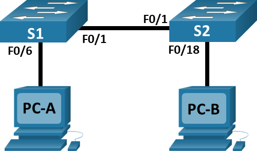
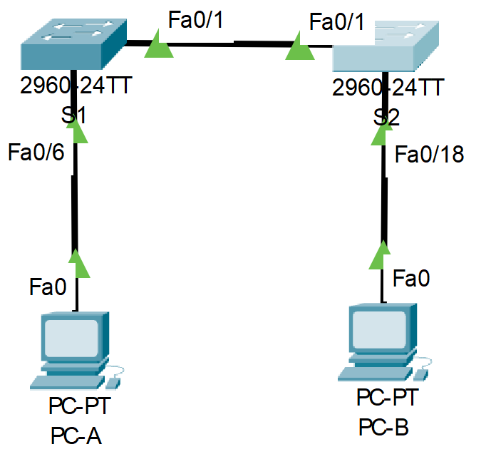
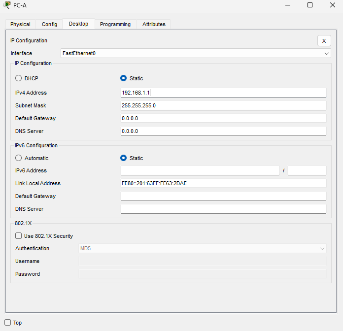
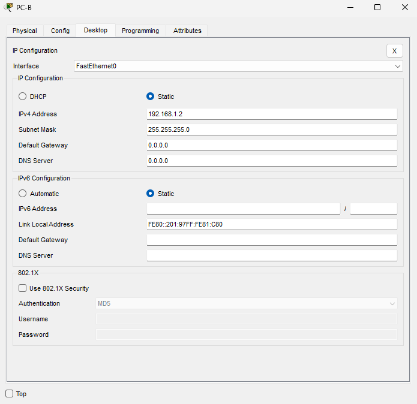
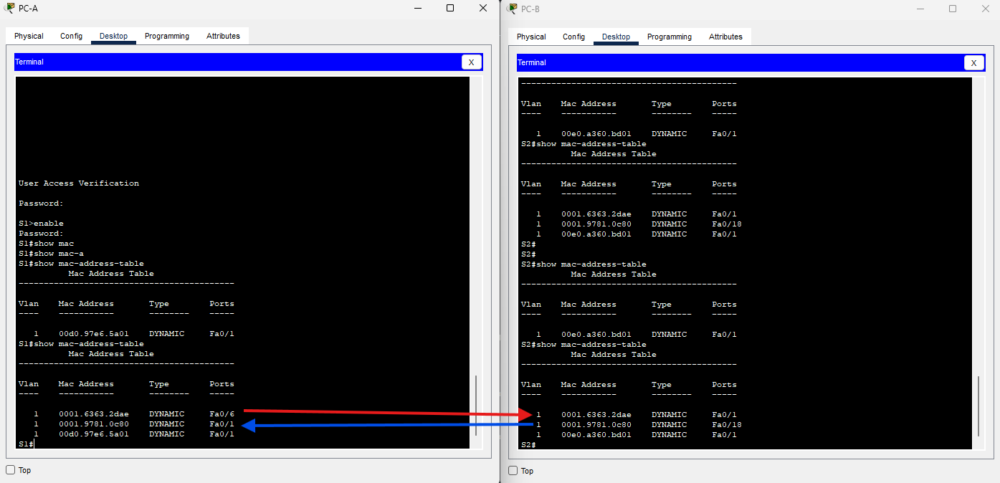

# Лабораторная работа. Просмотр таблицы MAC-адресов коммутатора.
### Дано:
###	Топология

###	Таблица адресации
| Устройство | Интерфейс | IP-адрес     | Маска         |
|------------|-----------|--------------|---------------|
| S1         | VLAN 1    | 192.168.1.11 | 255.255.255.0 |
| S2         | VLAN 1    | 192.168.1.12 | 255.255.255.0 |
| PC-A       | NIC       | 192.168.1.1  | 255.255.255.0 |
| PC-B       | NIC       | 192.168.1.2  | 255.255.255.0 |
### Задание:
1. [Часть 1. Создание и настройка сети.](https://github.com/getmandv/Network_Engineer._Basic/blob/main/Home_work/Lab_02/README.md#%D1%87%D0%B0%D1%81%D1%82%D1%8C-1-%D1%81%D0%BE%D0%B7%D0%B4%D0%B0%D0%BD%D0%B8%D0%B5-%D0%B8-%D0%BD%D0%B0%D1%81%D1%82%D1%80%D0%BE%D0%B9%D0%BA%D0%B0-%D1%81%D0%B5%D1%82%D0%B8)
   - [Шаг 1. Подключите сеть в соответствии с топологией.](https://github.com/getmandv/Network_Engineer._Basic/blob/main/Home_work/Lab_02/README.md#1-%D0%BF%D0%BE%D0%B4%D0%BA%D0%BB%D1%8E%D1%87%D0%B8%D1%82%D0%B5-%D1%81%D0%B5%D1%82%D1%8C-%D0%B2-%D1%81%D0%BE%D0%BE%D1%82%D0%B2%D0%B5%D1%82%D1%81%D1%82%D0%B2%D0%B8%D0%B8-%D1%81-%D1%82%D0%BE%D0%BF%D0%BE%D0%BB%D0%BE%D0%B3%D0%B8%D0%B5%D0%B9)
   - [Шаг 2. Настройте узлы ПК.](https://github.com/getmandv/Network_Engineer._Basic/blob/main/Home_work/Lab_02/README.md#%D1%88%D0%B0%D0%B3-2-%D0%BD%D0%B0%D1%81%D1%82%D1%80%D0%BE%D0%B9%D1%82%D0%B5-%D1%83%D0%B7%D0%BB%D1%8B-%D0%BF%D0%BA)
   - [Шаг 3. Выполните инициализацию и перезагрузку коммутаторов.](https://github.com/getmandv/Network_Engineer._Basic/blob/main/Home_work/Lab_02/README.md#%D1%88%D0%B0%D0%B3-3-%D0%B2%D1%8B%D0%BF%D0%BE%D0%BB%D0%BD%D0%B8%D1%82%D0%B5-%D0%B8%D0%BD%D0%B8%D1%86%D0%B8%D0%B0%D0%BB%D0%B8%D0%B7%D0%B0%D1%86%D0%B8%D1%8E-%D0%B8-%D0%BF%D0%B5%D1%80%D0%B5%D0%B7%D0%B0%D0%B3%D1%80%D1%83%D0%B7%D0%BA%D1%83-%D0%BA%D0%BE%D0%BC%D0%BC%D1%83%D1%82%D0%B0%D1%82%D0%BE%D1%80%D0%BE%D0%B2)
   - [Шаг 4. Настройте базовые параметры каждого коммутатора.](https://github.com/getmandv/Network_Engineer._Basic/blob/main/Home_work/Lab_02/README.md#%D1%88%D0%B0%D0%B3-4-%D0%BD%D0%B0%D1%81%D1%82%D1%80%D0%BE%D0%B9%D1%82%D0%B5-%D0%B1%D0%B0%D0%B7%D0%BE%D0%B2%D1%8B%D0%B5-%D0%BF%D0%B0%D1%80%D0%B0%D0%BC%D0%B5%D1%82%D1%80%D1%8B-%D0%BA%D0%B0%D0%B6%D0%B4%D0%BE%D0%B3%D0%BE-%D0%BA%D0%BE%D0%BC%D0%BC%D1%83%D1%82%D0%B0%D1%82%D0%BE%D1%80%D0%B0)
2. [Часть 2. Изучение таблицы МАС-адресов коммутатора.](https://github.com/getmandv/Network_Engineer._Basic/blob/main/Home_work/Lab_02/README.md#%D1%87%D0%B0%D1%81%D1%82%D1%8C-2-%D0%B8%D0%B7%D1%83%D1%87%D0%B5%D0%BD%D0%B8%D0%B5-%D1%82%D0%B0%D0%B1%D0%BB%D0%B8%D1%86%D1%8B-%D0%BC%D0%B0%D1%81-%D0%B0%D0%B4%D1%80%D0%B5%D1%81%D0%BE%D0%B2-%D0%BA%D0%BE%D0%BC%D0%BC%D1%83%D1%82%D0%B0%D1%82%D0%BE%D1%80%D0%B0)
   - [Шаг 1. Запишите МАС-адреса сетевых устройств.](https://github.com/getmandv/Network_Engineer._Basic/blob/main/Home_work/Lab_02/README.md#%D1%88%D0%B0%D0%B3-1-%D0%B7%D0%B0%D0%BF%D0%B8%D1%88%D0%B8%D1%82%D0%B5-%D0%BC%D0%B0%D1%81-%D0%B0%D0%B4%D1%80%D0%B5%D1%81%D0%B0-%D1%81%D0%B5%D1%82%D0%B5%D0%B2%D1%8B%D1%85-%D1%83%D1%81%D1%82%D1%80%D0%BE%D0%B9%D1%81%D1%82%D0%B2)
   - [Шаг 2. Просмотрите таблицу МАС-адресов коммутатора.](https://github.com/getmandv/Network_Engineer._Basic/blob/main/Home_work/Lab_02/README.md#%D1%88%D0%B0%D0%B3-2-%D0%BF%D1%80%D0%BE%D1%81%D0%BC%D0%BE%D1%82%D1%80%D0%B8%D1%82%D0%B5-%D1%82%D0%B0%D0%B1%D0%BB%D0%B8%D1%86%D1%83-%D0%BC%D0%B0%D1%81-%D0%B0%D0%B4%D1%80%D0%B5%D1%81%D0%BE%D0%B2-%D0%BA%D0%BE%D0%BC%D0%BC%D1%83%D1%82%D0%B0%D1%82%D0%BE%D1%80%D0%B0)
   - [Шаг 3. Очистите таблицу МАС-адресов коммутатора S2 и снова отобразите таблицу МАС-адресов.](https://github.com/getmandv/Network_Engineer._Basic/blob/main/Home_work/Lab_02/README.md#%D1%88%D0%B0%D0%B3-3-%D0%BE%D1%87%D0%B8%D1%81%D1%82%D0%B8%D1%82%D0%B5-%D1%82%D0%B0%D0%B1%D0%BB%D0%B8%D1%86%D1%83-%D0%BC%D0%B0%D1%81-%D0%B0%D0%B4%D1%80%D0%B5%D1%81%D0%BE%D0%B2-%D0%BA%D0%BE%D0%BC%D0%BC%D1%83%D1%82%D0%B0%D1%82%D0%BE%D1%80%D0%B0-s2-%D0%B8-%D1%81%D0%BD%D0%BE%D0%B2%D0%B0-%D0%BE%D1%82%D0%BE%D0%B1%D1%80%D0%B0%D0%B7%D0%B8%D1%82%D0%B5-%D1%82%D0%B0%D0%B1%D0%BB%D0%B8%D1%86%D1%83-%D0%BC%D0%B0%D1%81-%D0%B0%D0%B4%D1%80%D0%B5%D1%81%D0%BE%D0%B2)
   - [Шаг 4. С компьютера PC-B отправьте эхо-запросы устройствам в сети и просмотрите таблицу МАС-адресов коммутатора.](https://github.com/getmandv/Network_Engineer._Basic/blob/main/Home_work/Lab_02/README.md#%D1%88%D0%B0%D0%B3-4-%D1%81-%D0%BA%D0%BE%D0%BC%D0%BF%D1%8C%D1%8E%D1%82%D0%B5%D1%80%D0%B0-pc-b-%D0%BE%D1%82%D0%BF%D1%80%D0%B0%D0%B2%D1%8C%D1%82%D0%B5-%D1%8D%D1%85%D0%BE-%D0%B7%D0%B0%D0%BF%D1%80%D0%BE%D1%81%D1%8B-%D1%83%D1%81%D1%82%D1%80%D0%BE%D0%B9%D1%81%D1%82%D0%B2%D0%B0%D0%BC-%D0%B2-%D1%81%D0%B5%D1%82%D0%B8-%D0%B8-%D0%BF%D1%80%D0%BE%D1%81%D0%BC%D0%BE%D1%82%D1%80%D0%B8%D1%82%D0%B5-%D1%82%D0%B0%D0%B1%D0%BB%D0%B8%D1%86%D1%83-%D0%BC%D0%B0%D1%81-%D0%B0%D0%B4%D1%80%D0%B5%D1%81%D0%BE%D0%B2-%D0%BA%D0%BE%D0%BC%D0%BC%D1%83%D1%82%D0%B0%D1%82%D0%BE%D1%80%D0%B0)
3. [Вопросы для повторения]()
4. Файлы Cisco Packet Tracer
   - [Основной файл домашнего задания](https://github.com/getmandv/Network_Engineer._Basic/blob/main/Home_work/Lab_02/pkt/lab_02.pkt)

## Часть 1. Создание и настройка сети.
###  Шаг 1. Подключите сеть в соответствии с топологией.


###  Шаг 2. Настройте узлы ПК.


### Шаг 3. Выполните инициализацию и перезагрузку коммутаторов.
S1
```
Switch>
Switch>enable
Switch#reload
Proceed with reload? [confirm]
C2960 Boot Loader (C2960-HBOOT-M) Version 12.2(25r)FX, RELEASE SOFTWARE (fc4)
Cisco WS-C2960-24TT (RC32300) processor (revision C0) with 21039K bytes of memory.
2960-24TT starting...
Base ethernet MAC Address: 00E0.A395.5B01
Xmodem file system is available.
Initializing Flash...
flashfs[0]: 1 files, 0 directories
flashfs[0]: 0 orphaned files, 0 orphaned directories
flashfs[0]: Total bytes: 64016384
flashfs[0]: Bytes used: 4670455
flashfs[0]: Bytes available: 59345929
flashfs[0]: flashfs fsck took 1 seconds.
...done Initializing Flash.

Boot Sector Filesystem (bs:) installed, fsid: 3
Parameter Block Filesystem (pb:) installed, fsid: 4


Loading "flash:/2960-lanbasek9-mz.150-2.SE4.bin"...
########################################################################## [OK]
Smart Init is enabled
smart init is sizing iomem
                  TYPE      MEMORY_REQ
                TOTAL:      0x00000000
Rounded IOMEM up to: 0Mb.
Using 6 percent iomem. [0Mb/512Mb]

              Restricted Rights Legend
Use, duplication, or disclosure by the Government is
subject to restrictions as set forth in subparagraph
(c) of the Commercial Computer Software - Restricted
Rights clause at FAR sec. 52.227-19 and subparagraph
(c) (1) (ii) of the Rights in Technical Data and Computer
Software clause at DFARS sec. 252.227-7013.
           cisco Systems, Inc.
           170 West Tasman Drive
           San Jose, California 95134-1706
Cisco IOS Software, C2960 Software (C2960-LANBASEK9-M), Version 15.0(2)SE4, RELEASE SOFTWARE (fc1)
Technical Support: http://www.cisco.com/techsupport
Copyright (c) 1986-2013 by Cisco Systems, Inc.
Compiled Wed 26-Jun-13 02:49 by mnguyen
Initializing flashfs...
fsck: Disable shadow buffering due to heap fragmentation.
flashfs[2]: 2 files, 1 directories
flashfs[2]: 0 orphaned files, 0 orphaned directories
flashfs[2]: Total bytes: 32514048
flashfs[2]: Bytes used: 11952128
flashfs[2]: Bytes available: 20561920
flashfs[2]: flashfs fsck took 2 seconds.
flashfs[2]: Initialization complete....done Initializing flashfs.
Checking for Bootloader upgrade..
Boot Loader upgrade not required (Stage 2)
POST: CPU MIC register Tests : Begin
POST: CPU MIC register Tests : End, Status Passed
POST: PortASIC Memory Tests : Begin
POST: PortASIC Memory Tests : End, Status Passed
POST: CPU MIC interface Loopback Tests : Begin
POST: CPU MIC interface Loopback Tests : End, Status Passed
POST: PortASIC RingLoopback Tests : Begin
POST: PortASIC RingLoopback Tests : End, Status Passed
POST: PortASIC CAM Subsystem Tests : Begin
POST: PortASIC CAM Subsystem Tests : End, Status Passed
POST: PortASIC Port Loopback Tests : Begin
POST: PortASIC Port Loopback Tests : End, Status Passed
Waiting for Port download...Complete

This product contains cryptographic features and is subject to United
States and local country laws governing import, export, transfer and
use. Delivery of Cisco cryptographic products does not imply
third-party authority to import, export, distribute or use encryption.
Importers, exporters, distributors and users are responsible for
compliance with U.S. and local country laws. By using this product you
agree to comply with applicable laws and regulations. If you are unable
to comply with U.S. and local laws, return this product immediately.
A summary of U.S. laws governing Cisco cryptographic products may be found at:
http://www.cisco.com/wwl/export/crypto/tool/stqrg.html
If you require further assistance please contact us by sending email to
export@cisco.com.
cisco WS-C2960-24TT-L (PowerPC405) processor (revision B0) with 65536K bytes of memory.
Processor board ID FOC1010X104
Last reset from power-on
1 Virtual Ethernet interface
24 FastEthernet interfaces
2 Gigabit Ethernet interfaces
The password-recovery mechanism is enabled.
64K bytes of flash-simulated non-volatile configuration memory.
Base ethernet MAC Address       : 00:E0:A3:95:5B:01
Motherboard assembly number     : 73-10390-03
Power supply part number        : 341-0097-02
Motherboard serial number       : FOC10093R12
Power supply serial number      : AZS1007032H
Model revision number           : B0
Motherboard revision number     : B0
Model number                    : WS-C2960-24TT-L
System serial number            : FOC1010X104
Top Assembly Part Number        : 800-27221-02
Top Assembly Revision Number    : A0
Version ID                      : V02
CLEI Code Number                : COM3L00BRA
Hardware Board Revision Number  : 0x01

Switch Ports Model              SW Version            SW Image
------ ----- -----              ----------            ----------
*    1 26    WS-C2960-24TT-L    15.0(2)SE4            C2960-LANBASEK9-M

Cisco IOS Software, C2960 Software (C2960-LANBASEK9-M), Version 15.0(2)SE4, RELEASE SOFTWARE (fc1)
Technical Support: http://www.cisco.com/techsupport
Copyright (c) 1986-2013 by Cisco Systems, Inc.
Compiled Wed 26-Jun-13 02:49 by mnguyen


Press RETURN to get started!


%LINK-5-CHANGED: Interface FastEthernet0/1, changed state to up

%LINEPROTO-5-UPDOWN: Line protocol on Interface FastEthernet0/1, changed state to up

%LINK-5-CHANGED: Interface FastEthernet0/6, changed state to up

%LINEPROTO-5-UPDOWN: Line protocol on Interface FastEthernet0/6, changed state to up


Switch>
```
S2
```
Switch>
Switch>enable
Switch#reload
Proceed with reload? [confirm]
C2960 Boot Loader (C2960-HBOOT-M) Version 12.2(25r)FX, RELEASE SOFTWARE (fc4)
Cisco WS-C2960-24TT (RC32300) processor (revision C0) with 21039K bytes of memory.
2960-24TT starting...
Base ethernet MAC Address: 0003.E43E.D533
Xmodem file system is available.
Initializing Flash...
flashfs[0]: 1 files, 0 directories
flashfs[0]: 0 orphaned files, 0 orphaned directories
flashfs[0]: Total bytes: 64016384
flashfs[0]: Bytes used: 4670455
flashfs[0]: Bytes available: 59345929
flashfs[0]: flashfs fsck took 1 seconds.
...done Initializing Flash.

Boot Sector Filesystem (bs:) installed, fsid: 3
Parameter Block Filesystem (pb:) installed, fsid: 4


Loading "flash:/2960-lanbasek9-mz.150-2.SE4.bin"...
########################################################################## [OK]
Smart Init is enabled
smart init is sizing iomem
                  TYPE      MEMORY_REQ
                TOTAL:      0x00000000
Rounded IOMEM up to: 0Mb.
Using 6 percent iomem. [0Mb/512Mb]

              Restricted Rights Legend
Use, duplication, or disclosure by the Government is
subject to restrictions as set forth in subparagraph
(c) of the Commercial Computer Software - Restricted
Rights clause at FAR sec. 52.227-19 and subparagraph
(c) (1) (ii) of the Rights in Technical Data and Computer
Software clause at DFARS sec. 252.227-7013.
           cisco Systems, Inc.
           170 West Tasman Drive
           San Jose, California 95134-1706
Cisco IOS Software, C2960 Software (C2960-LANBASEK9-M), Version 15.0(2)SE4, RELEASE SOFTWARE (fc1)
Technical Support: http://www.cisco.com/techsupport
Copyright (c) 1986-2013 by Cisco Systems, Inc.
Compiled Wed 26-Jun-13 02:49 by mnguyen
Initializing flashfs...
fsck: Disable shadow buffering due to heap fragmentation.
flashfs[2]: 2 files, 1 directories
flashfs[2]: 0 orphaned files, 0 orphaned directories
flashfs[2]: Total bytes: 32514048
flashfs[2]: Bytes used: 11952128
flashfs[2]: Bytes available: 20561920
flashfs[2]: flashfs fsck took 2 seconds.
flashfs[2]: Initialization complete....done Initializing flashfs.
Checking for Bootloader upgrade..
Boot Loader upgrade not required (Stage 2)
POST: CPU MIC register Tests : Begin
POST: CPU MIC register Tests : End, Status Passed
POST: PortASIC Memory Tests : Begin
POST: PortASIC Memory Tests : End, Status Passed
POST: CPU MIC interface Loopback Tests : Begin
POST: CPU MIC interface Loopback Tests : End, Status Passed
POST: PortASIC RingLoopback Tests : Begin
POST: PortASIC RingLoopback Tests : End, Status Passed
POST: PortASIC CAM Subsystem Tests : Begin
POST: PortASIC CAM Subsystem Tests : End, Status Passed
POST: PortASIC Port Loopback Tests : Begin
POST: PortASIC Port Loopback Tests : End, Status Passed
Waiting for Port download...Complete

This product contains cryptographic features and is subject to United
States and local country laws governing import, export, transfer and
use. Delivery of Cisco cryptographic products does not imply
third-party authority to import, export, distribute or use encryption.
Importers, exporters, distributors and users are responsible for
compliance with U.S. and local country laws. By using this product you
agree to comply with applicable laws and regulations. If you are unable
to comply with U.S. and local laws, return this product immediately.
A summary of U.S. laws governing Cisco cryptographic products may be found at:
http://www.cisco.com/wwl/export/crypto/tool/stqrg.html
If you require further assistance please contact us by sending email to
export@cisco.com.
cisco WS-C2960-24TT-L (PowerPC405) processor (revision B0) with 65536K bytes of memory.
Processor board ID FOC1010X104
Last reset from power-on
1 Virtual Ethernet interface
24 FastEthernet interfaces
2 Gigabit Ethernet interfaces
The password-recovery mechanism is enabled.
64K bytes of flash-simulated non-volatile configuration memory.
Base ethernet MAC Address       : 00:03:E4:3E:D5:33
Motherboard assembly number     : 73-10390-03
Power supply part number        : 341-0097-02
Motherboard serial number       : FOC10093R12
Power supply serial number      : AZS1007032H
Model revision number           : B0
Motherboard revision number     : B0
Model number                    : WS-C2960-24TT-L
System serial number            : FOC1010X104
Top Assembly Part Number        : 800-27221-02
Top Assembly Revision Number    : A0
Version ID                      : V02
CLEI Code Number                : COM3L00BRA
Hardware Board Revision Number  : 0x01

Switch Ports Model              SW Version            SW Image
------ ----- -----              ----------            ----------
*    1 26    WS-C2960-24TT-L    15.0(2)SE4            C2960-LANBASEK9-M

Cisco IOS Software, C2960 Software (C2960-LANBASEK9-M), Version 15.0(2)SE4, RELEASE SOFTWARE (fc1)
Technical Support: http://www.cisco.com/techsupport
Copyright (c) 1986-2013 by Cisco Systems, Inc.
Compiled Wed 26-Jun-13 02:49 by mnguyen


Press RETURN to get started!


%LINK-5-CHANGED: Interface FastEthernet0/1, changed state to up

%LINEPROTO-5-UPDOWN: Line protocol on Interface FastEthernet0/1, changed state to up

%LINK-5-CHANGED: Interface FastEthernet0/18, changed state to up

%LINEPROTO-5-UPDOWN: Line protocol on Interface FastEthernet0/18, changed state to up


Switch>
```
### Шаг 4. Настройте базовые параметры каждого коммутатора.
a.	Настройте имена устройств в соответствии с топологией.

S1
```
Switch>
Switch>enable
Switch#conf t
Enter configuration commands, one per line.  End with CNTL/Z.
Switch(config)#hostname S1
S1(config)#
```
S2
```
Switch>
Switch>enable
Switch#conf t
Enter configuration commands, one per line.  End with CNTL/Z.
Switch(config)#hostname S2
S2(config)#
```
b.	Настройте IP-адреса, как указано в таблице адресации.

S1
```
S1>
S1>enable
S1#conf t
Enter configuration commands, one per line.  End with CNTL/Z.
S1(config)#interface vlan1
S1(config-if)#ip address 192.168.1.11 255.255.255.0
S1(config-if)#no shutdown

S1(config-if)#
%LINK-5-CHANGED: Interface Vlan1, changed state to up

%LINEPROTO-5-UPDOWN: Line protocol on Interface Vlan1, changed state to up

S1(config-if)#
```
S2
```
S2>
S2>enable
S2#conf t
Enter configuration commands, one per line.  End with CNTL/Z.
S2(config)#interface vlan1
S2(config-if)#ip address 192.168.1.12 255.255.255.0
S2(config-if)#no shutdown

S2(config-if)#
%LINK-5-CHANGED: Interface Vlan1, changed state to up

%LINEPROTO-5-UPDOWN: Line protocol on Interface Vlan1, changed state to up

S2(config-if)#
```
c.	Назначьте cisco в качестве паролей консоли и VTY.

S1
```
S1(config)#
S1(config)#line console 0
S1(config-line)#password cisco
S1(config-line)#login
S1(config-line)#line vty 0 4
S1(config-line)#password cisco
S1(config-line)#login
S1(config-line)#
```
S2
```
S2(config)#
S2(config)#line console 0
S2(config-line)#password cisco
S2(config-line)#login
S2(config-line)#line vty 0 4
S2(config-line)#password cisco
S2(config-line)#login
S2(config-line)#
```
d.	Назначьте class в качестве пароля доступа к привилегированному режиму EXEC.

S1
```
S1(config)#
S1(config)#enable secret class
S1(config)#
```
S2
```
S2(config)#
S2(config)#enable secret class
S2(config)#
```


## Часть 2. Изучение таблицы МАС-адресов коммутатора.
###  Шаг 1. Запишите МАС-адреса сетевых устройств.
a.	Откройте командную строку на PC-A и PC-B и введите команду ipconfig /all.

PC-A
```
C:\>ipconfig /all

FastEthernet0 Connection:(default port)

   Connection-specific DNS Suffix..: 
   Physical Address................: 0001.6363.2DAE
   Link-local IPv6 Address.........: FE80::201:63FF:FE63:2DAE
   IPv6 Address....................: ::
   IPv4 Address....................: 192.168.1.1
   Subnet Mask.....................: 255.255.255.0
   Default Gateway.................: ::
                                     0.0.0.0
   DHCP Servers....................: 0.0.0.0
   DHCPv6 IAID.....................: 
   DHCPv6 Client DUID..............: 00-01-00-01-24-5C-AB-08-00-01-63-63-2D-AE
   DNS Servers.....................: ::
                                     0.0.0.0

Bluetooth Connection:

   Connection-specific DNS Suffix..: 
   Physical Address................: 0000.0CA6.7425
   Link-local IPv6 Address.........: ::
   IPv6 Address....................: ::
   IPv4 Address....................: 0.0.0.0
   Subnet Mask.....................: 0.0.0.0
   Default Gateway.................: ::
                                     0.0.0.0
   DHCP Servers....................: 0.0.0.0
   DHCPv6 IAID.....................: 
   DHCPv6 Client DUID..............: 00-01-00-01-24-5C-AB-08-00-01-63-63-2D-AE
   DNS Servers.....................: ::
                                     0.0.0.0


C:\>
```
PC-B
```
C:\>ipconfig /all

FastEthernet0 Connection:(default port)

   Connection-specific DNS Suffix..: 
   Physical Address................: 0001.9781.0C80
   Link-local IPv6 Address.........: FE80::201:97FF:FE81:C80
   IPv6 Address....................: ::
   IPv4 Address....................: 192.168.1.2
   Subnet Mask.....................: 255.255.255.0
   Default Gateway.................: ::
                                     0.0.0.0
   DHCP Servers....................: 0.0.0.0
   DHCPv6 IAID.....................: 
   DHCPv6 Client DUID..............: 00-01-00-01-33-2A-49-71-00-01-97-81-0C-80
   DNS Servers.....................: ::
                                     0.0.0.0

Bluetooth Connection:

   Connection-specific DNS Suffix..: 
   Physical Address................: 0001.43C4.C65D
   Link-local IPv6 Address.........: ::
   IPv6 Address....................: ::
   IPv4 Address....................: 0.0.0.0
   Subnet Mask.....................: 0.0.0.0
   Default Gateway.................: ::
                                     0.0.0.0
   DHCP Servers....................: 0.0.0.0
   DHCPv6 IAID.....................: 
   DHCPv6 Client DUID..............: 00-01-00-01-33-2A-49-71-00-01-97-81-0C-80
   DNS Servers.....................: ::
                                     0.0.0.0


C:\>
```
- Назовите физические адреса адаптера Ethernet.

MAC-адрес компьютера PC-A: 00:01:63:63:2D:AE

MAC-адрес компьютера PC-B: 00:01:97:81:0C:80

b.	Подключитесь к коммутаторам S1 и S2 через консоль и введите команду show interface F0/1 на каждом коммутаторе.

S1
```
S1>show interfaces f0/1
FastEthernet0/1 is up, line protocol is up (connected)
  Hardware is Lance, address is 00e0.a360.bd01 (bia 00e0.a360.bd01)
 BW 100000 Kbit, DLY 1000 usec,
     reliability 255/255, txload 1/255, rxload 1/255
  Encapsulation ARPA, loopback not set
  Keepalive set (10 sec)
  Full-duplex, 100Mb/s
  input flow-control is off, output flow-control is off
  ARP type: ARPA, ARP Timeout 04:00:00
  Last input 00:00:08, output 00:00:05, output hang never
  Last clearing of "show interface" counters never
  Input queue: 0/75/0/0 (size/max/drops/flushes); Total output drops: 0
  Queueing strategy: fifo
  Output queue :0/40 (size/max)
  5 minute input rate 0 bits/sec, 0 packets/sec
  5 minute output rate 0 bits/sec, 0 packets/sec
     956 packets input, 193351 bytes, 0 no buffer
     Received 956 broadcasts, 0 runts, 0 giants, 0 throttles
     0 input errors, 0 CRC, 0 frame, 0 overrun, 0 ignored, 0 abort
     0 watchdog, 0 multicast, 0 pause input
     0 input packets with dribble condition detected
     2357 packets output, 263570 bytes, 0 underruns
     0 output errors, 0 collisions, 10 interface resets
     0 babbles, 0 late collision, 0 deferred
     0 lost carrier, 0 no carrier
     0 output buffer failures, 0 output buffers swapped out

S1>
```
S2
```
S2>show interfaces f0/1
FastEthernet0/1 is up, line protocol is up (connected)
  Hardware is Lance, address is 00d0.97e6.5a01 (bia 00d0.97e6.5a01)
 BW 100000 Kbit, DLY 1000 usec,
     reliability 255/255, txload 1/255, rxload 1/255
  Encapsulation ARPA, loopback not set
  Keepalive set (10 sec)
  Full-duplex, 100Mb/s
  input flow-control is off, output flow-control is off
  ARP type: ARPA, ARP Timeout 04:00:00
  Last input 00:00:08, output 00:00:05, output hang never
  Last clearing of "show interface" counters never
  Input queue: 0/75/0/0 (size/max/drops/flushes); Total output drops: 0
  Queueing strategy: fifo
  Output queue :0/40 (size/max)
  5 minute input rate 0 bits/sec, 0 packets/sec
  5 minute output rate 0 bits/sec, 0 packets/sec
     956 packets input, 193351 bytes, 0 no buffer
     Received 956 broadcasts, 0 runts, 0 giants, 0 throttles
     0 input errors, 0 CRC, 0 frame, 0 overrun, 0 ignored, 0 abort
     0 watchdog, 0 multicast, 0 pause input
     0 input packets with dribble condition detected
     2357 packets output, 263570 bytes, 0 underruns
     0 output errors, 0 collisions, 10 interface resets
     0 babbles, 0 late collision, 0 deferred
     0 lost carrier, 0 no carrier
     0 output buffer failures, 0 output buffers swapped out

S2>
```
- Назовите адреса оборудования во второй строке выходных данных команды (или зашитый адрес — bia).

МАС-адрес коммутатора S1 Fast Ethernet 0/1: 00:E0:A3:60:BD:01

МАС-адрес коммутатора S2 Fast Ethernet 0/1: 00:D0:97:E6:5A:01
### Шаг 2. Просмотрите таблицу МАС-адресов коммутатора.
a.	Подключитесь к коммутатору S2 через консоль и войдите в привилегированный режим EXEC.
```
User Access Verification

Password: 

S2>enable
Password: 
S2#
```
b.	В привилегированном режиме EXEC введите команду show mac address-table и нажмите клавишу ввода.
```
S2#show mac-address-table 
          Mac Address Table
-------------------------------------------

Vlan    Mac Address       Type        Ports
----    -----------       --------    -----

   1    00e0.a360.bd01    DYNAMIC     Fa0/1
S2#
```

- Записаны ли в таблице МАС-адресов какие-либо МАС-адреса?

Да.

- Какие МАС-адреса записаны в таблице? 

00:E0:A3:60:BD:01

- С какими портами коммутатора они сопоставлены и каким устройствам принадлежат?

С портом Fast Ethernet 0/1. Принадлежит коммутатору S1.

- Если вы не записали МАС-адреса сетевых устройств в шаге 1, как можно определить, каким устройствам принадлежат МАС-адреса, используя только выходные данные команды show mac address-table?

Что бы развёрнуто ответить на этот вопрос, потребуется забежать немного вперёд по ходу лабораторной работы и дать команду ping 192.168.1.2 c ПК PC-A для того что бы "засветить" все MAC-адреса в нашей сети и они попали в таблицу MAC-адресов коммутаторов. Далее выводим таблицу на обоих коммутаторах (Вопрос не ограничивает просмотр таблицы только на одном коммутаторе.) и сравниваем.



На коммутаторе S1 к 6 порту подключен PC-A с MAC-адресом 00:01:63:63:2D:AE, этот же MAC-адрес видно и на комутаторе S2 на 1 порту (красная стрелка).Соответственно оставшийся MAC-адрес на порту 1 коммутатора S2 00:E0:A3:60:BD:01 это MAC-адрес порта 1 коммутатора S1. Аналогичная логика и в обратном направлении. На коммутаторе S2 к 18 порту подключен PC-B с MAC-адресом 00:01:97:81:0C:80, этот же MAC-адрес видно и на комутаторе S1 на 1 порту (синяя стрелка). Соответственно оставшийся MAC-адрес на порту 1 коммутатора 1 00:D0:97:E6:5A:01 это MAC-адрес порта 1 коммутатора S2.

- Работает ли это решение в любой ситуации?

Нет, так как, например, один из коммутаторов, может быть не управляемым или к нему может не быть доступа, и мы не сомжем посмотреть его таблицу MAC-адресов.
### Шаг 3. Очистите таблицу МАС-адресов коммутатора S2 и снова отобразите таблицу МАС-адресов.
a.	В привилегированном режиме EXEC введите команду clear mac address-table dynamic и нажмите клавишу Enter.
```
S2#clear mac address-table dynamic 
S2#
```
b.	Снова быстро введите команду show mac address-table.
```
S2#show mac-address-table 
          Mac Address Table
-------------------------------------------

Vlan    Mac Address       Type        Ports
----    -----------       --------    -----

   1    00e0.a360.bd01    DYNAMIC     Fa0/1
S2#
```
- Указаны ли в таблице МАС-адресов адреса для VLAN 1?

Нет.
- Указаны ли другие МАС-адреса?

Да. Указан MAC-адрес порта 1 коммутатора S1.
- Через 10 секунд введите команду show mac address-table и нажмите клавишу ввода.
```
S2#show mac-address-table 
          Mac Address Table
-------------------------------------------

Vlan    Mac Address       Type        Ports
----    -----------       --------    -----

   1    00e0.a360.bd01    DYNAMIC     Fa0/1
S2#
```
- Появились ли в таблице МАС-адресов новые адреса?

Нет не появились, так как в сети нет активности кроме обмена трафиком между двумя коммутаторами.
### Шаг 4. С компьютера PC-B отправьте эхо-запросы устройствам в сети и просмотрите таблицу МАС-адресов коммутатора.
a.	На компьютере PC-B откройте командную строку и еще раз введите команду arp -a.
```
C:\>arp -a
  Internet Address      Physical Address      Type
  192.168.1.1           0001.6363.2dae        dynamic

C:\>
```
- Не считая адресов многоадресной и широковещательной рассылки, сколько пар IP- и МАС-адресов устройств было получено через протокол ARP?

Одна пара.

b.	Из командной строки PC-B отправьте эхо-запросы на компьютер PC-A, а также коммутаторы S1 и S2.
```
C:\>ping 192.168.1.1

Pinging 192.168.1.1 with 32 bytes of data:

Reply from 192.168.1.1: bytes=32 time<1ms TTL=128
Reply from 192.168.1.1: bytes=32 time<1ms TTL=128
Reply from 192.168.1.1: bytes=32 time<1ms TTL=128
Reply from 192.168.1.1: bytes=32 time<1ms TTL=128

Ping statistics for 192.168.1.1:
    Packets: Sent = 4, Received = 4, Lost = 0 (0% loss),
Approximate round trip times in milli-seconds:
    Minimum = 0ms, Maximum = 0ms, Average = 0ms

C:\>ping 192.168.1.11

Pinging 192.168.1.11 with 32 bytes of data:

Request timed out.
Reply from 192.168.1.11: bytes=32 time<1ms TTL=255
Reply from 192.168.1.11: bytes=32 time<1ms TTL=255
Reply from 192.168.1.11: bytes=32 time=1ms TTL=255

Ping statistics for 192.168.1.11:
    Packets: Sent = 4, Received = 3, Lost = 1 (25% loss),
Approximate round trip times in milli-seconds:
    Minimum = 0ms, Maximum = 1ms, Average = 0ms

C:\>ping 192.168.1.12

Pinging 192.168.1.12 with 32 bytes of data:

Request timed out.
Reply from 192.168.1.12: bytes=32 time<1ms TTL=255
Reply from 192.168.1.12: bytes=32 time<1ms TTL=255
Reply from 192.168.1.12: bytes=32 time<1ms TTL=255

Ping statistics for 192.168.1.12:
    Packets: Sent = 4, Received = 3, Lost = 1 (25% loss),
Approximate round trip times in milli-seconds:
    Minimum = 0ms, Maximum = 0ms, Average = 0ms
```
- От всех ли устройств получены ответы?

Да.

c.	Подключившись через консоль к коммутатору S2, введите команду show mac address-table.
```
S2#show mac-address-table 
          Mac Address Table
-------------------------------------------

Vlan    Mac Address       Type        Ports
----    -----------       --------    -----

   1    0001.6363.2dae    DYNAMIC     Fa0/1
   1    0001.9781.0c80    DYNAMIC     Fa0/18
   1    00e0.a360.bd01    DYNAMIC     Fa0/1
   1    00e0.a395.5b01    DYNAMIC     Fa0/1
S2#
```
- Добавил ли коммутатор в таблицу МАС-адресов дополнительные МАС-адреса? Если да, то какие адреса и устройства?

Да. МАС-адрес 00:E0:A3:95:5B:01. Это базовый MAC-адрес коммутатора S1.
```
S1#show version 
...
Base ethernet MAC Address       : 00:E0:A3:95:5B:01
...

S1#
```
Этот же MAC-адрес назначается интерфейсу VLAN1 коммутатора S1.
```
S1#show interfaces vlan 1
Vlan1 is up, line protocol is up
  Hardware is CPU Interface, address is 00e0.a395.5b01 (bia 00e0.a395.5b01)
  Internet address is 192.168.1.11/24
 ...
S1#
```
- На компьютере PC-B откройте командную строку и еще раз введите команду arp -a.
```
C:\>arp -a
  Internet Address      Physical Address      Type
  192.168.1.1           0001.6363.2dae        dynamic
  192.168.1.11          00e0.a395.5b01        dynamic
  192.168.1.12          0003.e43e.d533        dynamic

C:\>
```
- Появились ли в ARP-кэше компьютера PC-B дополнительные записи для всех сетевых устройств, которым были отправлены эхо-запросы?

Да.

## Вопрос для повторения.
- В сетях Ethernet данные передаются на устройства по соответствующим МАС-адресам. Для этого коммутаторы и компьютеры динамически создают ARP-кэш и таблицы МАС-адресов. Если компьютеров в сети немного, эта процедура выглядит достаточно простой. Какие сложности могут возникнуть в крупных сетях?

В больших сетях широковещательный ARP трафик может создавать существенную нагрузку и замедлять работу всей сети. Кроме того, протокол ARP никак не защищён что может привести к "подмене устройства" злоумышленником. 
