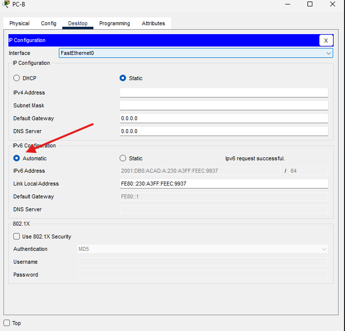
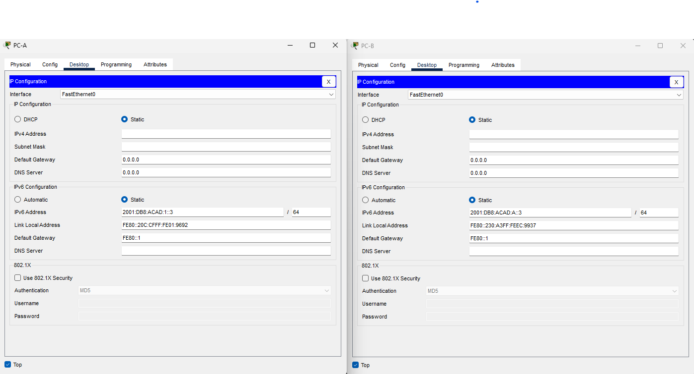
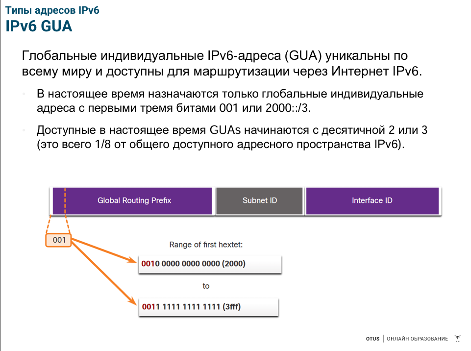
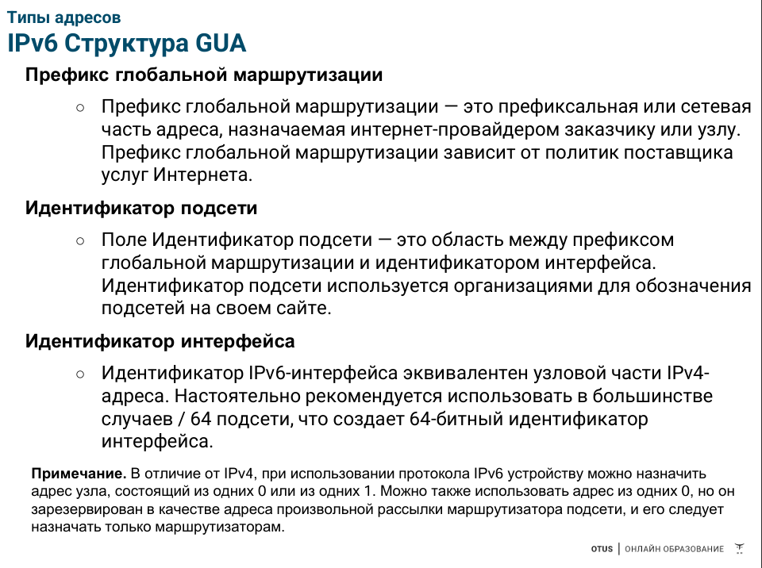

# Лабораторная работа. Настройка IPv6-адресов на сетевых устройствах
### Дано:
###	Топология

###	Таблица адресации
|Устройство  |Интерфейс  |IPv6-адрес         |Link local IPv6-адрес|Длина префикса|Шлюз по умолчанию|
|------------|-----------|-------------------|---------------------|--------------|-----------------|
|R1          |G0/0/0     | 2001:db8:acad:a::1|fe80::1              |64            |-                |
|R1          |G0/0/1     | 2001:db8:acad:1::1|fe80::1              |64            |-                |
|S1          |VLAN 1     | 2001:db8:acad:1::b|fe80::b              |64            |-                |
|PC-A        |NIC        | 2001:db8:acad:1::3|SLACC                |64            |fe80::1          |
|PC-B        |NIC        | 2001:db8:acad:a::3|SLACC                |64            |fe80::1          |
### Задание:
1. [Часть 1. Настройка топологии и конфигурация основных параметров маршрутизатора и коммутатора]()
2. [Часть 2. Ручная настройка IPv6-адресов]()
3. [Часть 3. Проверка сквозного подключения]()
4. [Вопросы для повторения]()
5. Файлы Cisco Packet Tracer
   - [Основной файл домашнего задания]()


## Часть 1. Настройка топологии и конфигурация основных параметров маршрутизатора и коммутатора
###  Шаг 1. Настройте маршрутизатор.
- Назначьте имя хоста и настройте основные параметры устройства.
```
Router>
Router>enable
Router#conf t
Enter configuration commands, one per line.  End with CNTL/Z.
Router(config)#hostname R1
R1(config)#no ip domain-lookup
R1(config)#enable secret class
R1(config)#line con 0
R1(config-line)#password cisco
R1(config-line)#login
R1(config-line)#exit
R1(config)#line vty 0 15
R1(config-line)#password cisco
R1(config-line)#login
R1(config-line)#transport input ssh
R1(config-line)#login local
R1(config-line)#exit
R1(config)#service password-encryption
R1(config)#banner motd #
Enter TEXT message.  End with the character '#'.
Router R1 otus.ru HW 4
Authorized User Only!#

R1(config)#ip domain-name otus.ru
R1(config)#crypto key generate rsa general-keys modulus 1024
The name for the keys will be: R1.otus.ru

% The key modulus size is 1024 bits
% Generating 1024 bit RSA keys, keys will be non-exportable...[OK]
*Mar 1 0:22:7.287: %SSH-5-ENABLED: SSH 1.99 has been enabled
R1(config)#username admin privilege 15 secret Adm1nP@55
R1(config)#ip ssh version 2
R1(config)#exit
R1#wr
Building configuration...
[OK]
R1#
```
###  Шаг 2. Настройте коммутатор.
- Назначьте имя хоста и настройте основные параметры устройства.
```
Switch>
Switch>en
Switch#conf t
Enter configuration commands, one per line.  End with CNTL/Z.
Switch(config)#hostname S1
S1(config)#no ip domain-lookup
S1(config)#enable secret class
S1(config)#line con 0
S1(config-line)#password cisco
S1(config-line)#login
S1(config-line)#exit
S1(config)#line vty 0 15
S1(config-line)#password cisco
S1(config-line)#login
S1(config-line)#transport input ssh
S1(config-line)#login local
S1(config-line)#exit
S1(config)#service password-encryption
S1(config)#banner motd #
Enter TEXT message.  End with the character '#'.
Switch S1 otus.ru HW 4
Authorized User Only!#

S1(config)#ip domain-name otus.ru
S1(config)#crypto key generate rsa general-keys modulus 1024
The name for the keys will be: S1.otus.ru

% The key modulus size is 1024 bits
% Generating 1024 bit RSA keys, keys will be non-exportable...[OK]
*Mar 1 0:56:25.840: %SSH-5-ENABLED: SSH 1.99 has been enabled
S1(config)#username admin privilege 15 secret Adm1nP@55
S1(config)#ip ssh version 2
S1(config)#exit
S1#
%SYS-5-CONFIG_I: Configured from console by console

S1#wr
Building configuration...
[OK]
S1#
```
Дополнительно переключаем шаблон для возмодности адресации ipv6.
```
S1#show sdm prefer 
 The current template is "default" template.
 The selected template optimizes the resources in
 the switch to support this level of features for
 0 routed interfaces and 1024 VLANs.

  number of unicast mac addresses:                  8K
  number of IPv4 IGMP groups + multicast routes:    0.25K
  number of IPv4 unicast routes:                    0
  number of IPv6 multicast groups:                  0
  number of directly-connected IPv6 addresses:      0
  number of indirect IPv6 unicast routes:           0
  number of IPv4 policy based routing aces:         0
  number of IPv4/MAC qos aces:                      0.125k
  number of IPv4/MAC security aces:                 0.375k
  number of IPv6 policy based routing aces:         0
  number of IPv6 qos aces:                          20
  number of IPv6 security aces:                     25

S1#conf t
Enter configuration commands, one per line.  End with CNTL/Z.
S1(config)#sdm prefer dual-ipv4-and-ipv6 default 
Changes to the running SDM preferences have been stored, but cannot take effect until the next reload.
Use 'show sdm prefer' to see what SDM preference is currently active.
S1(config)#end
S1#
%SYS-5-CONFIG_I: Configured from console by console

S1#wr
Building configuration...
[OK]
S1#reload
```
## Часть 2. Ручная настройка IPv6-адресов
### Шаг 1. Назначьте IPv6-адреса интерфейсам Ethernet на R1.
a.	Назначьте глобальные индивидуальные IPv6-адреса, указанные в таблице адресации обоим интерфейсам Ethernet на R1.
```
R1(config)#interface g0/0/0
R1(config-if)#ipv6 address 2001:0db8:acad:000a:0000:0000:0000:0001/64
R1(config-if)#no shutdown
R1(config-if)#
%LINK-5-CHANGED: Interface GigabitEthernet0/0/0, changed state to up

%LINEPROTO-5-UPDOWN: Line protocol on Interface GigabitEthernet0/0/0, changed state to up 
R1(config-if)#exit
R1(config)#interface g0/0/1
R1(config-if)#ipv6 address 2001:db8:acad:1::1/64
R1(config-if)#no shutdown 
R1(config-if)#
%LINK-5-CHANGED: Interface GigabitEthernet0/0/1, changed state to up

%LINEPROTO-5-UPDOWN: Line protocol on Interface GigabitEthernet0/0/1, changed state to up
R1(config-if)#exit
R1(config)#exit
R1#
%SYS-5-CONFIG_I: Configured from console by console
R1#wr
Building configuration...
[OK]
R1#
```
b.	Введите команду show ipv6 interface brief, чтобы проверить, назначен ли каждому интерфейсу корректный индивидуальный IPv6-адрес.
```
R1#show ipv6 interface brief 
GigabitEthernet0/0/0       [up/up]
    FE80::290:2BFF:FE4E:7B01
    2001:DB8:ACAD:A::1
GigabitEthernet0/0/1       [up/up]
    FE80::290:2BFF:FE4E:7B02
    2001:DB8:ACAD:1::1
GigabitEthernet0/0/2       [administratively down/down]
    unassigned
Vlan1                      [administratively down/down]
    unassigned
R1#
```
c.	Чтобы обеспечить соответствие локальных адресов канала индивидуальному адресу, вручную введите локальные адреса канала на каждом интерфейсе Ethernet на R1.
```
R1(config)#interface g0/0/0
R1(config-if)#ipv6 address fe80::1 link-local 
R1(config-if)#exit
R1(config)#interface g0/0/1
R1(config-if)#ipv6 address fe80::1 link-local 
R1(config-if)#
```
d.	Используйте выбранную команду, чтобы убедиться, что локальный адрес связи изменен на fe80::1.
```
R1#show ipv6 interface brief 
GigabitEthernet0/0/0       [up/up]
    FE80::1
    2001:DB8:ACAD:A::1
GigabitEthernet0/0/1       [up/up]
    FE80::1
    2001:DB8:ACAD:1::1
GigabitEthernet0/0/2       [administratively down/down]
    unassigned
Vlan1                      [administratively down/down]
    unassigned
R1#
```
- Какие группы многоадресной рассылки назначены интерфейсу G0/0?
На нашем маршрутизаторе нет такого интерфейса, однако предположу что допущена опечатка и подразумевался итерфейс g0/0/0. В таком случае:
```
R1#show ipv6 interface g0/0/0
GigabitEthernet0/0/0 is up, line protocol is up
  IPv6 is enabled, link-local address is FE80::1
  No Virtual link-local address(es):
  Global unicast address(es):
    2001:DB8:ACAD:A::1, subnet is 2001:DB8:ACAD:A::/64
  Joined group address(es):
    FF02::1
    FF02::1:FF00:1
  MTU is 1500 bytes
  ICMP error messages limited to one every 100 milliseconds
  ICMP redirects are enabled
  ICMP unreachables are sent
  ND DAD is enabled, number of DAD attempts: 1
  ND reachable time is 30000 milliseconds
R1#
```
Группы
```
  Joined group address(es):
    FF02::1
    FF02::1:FF00:1
```
### Шаг 2. Активируйте IPv6-маршрутизацию на R1.
a.	В командной строке на PC-B введите команду ipconfig, чтобы получить данные IPv6-адреса, назначенного интерфейсу ПК.
```
C:\>ipconfig

FastEthernet0 Connection:(default port)

   Connection-specific DNS Suffix..: 
   Link-local IPv6 Address.........: FE80::230:A3FF:FEEC:9937
   IPv6 Address....................: ::
   IPv4 Address....................: 0.0.0.0
   Subnet Mask.....................: 0.0.0.0
   Default Gateway.................: ::
                                     0.0.0.0
C:\>
```
- Назначен ли индивидуальный IPv6-адрес сетевой интерфейсной карте (NIC) на PC-B?

Да. Сформирован автоматически. FE80::230:A3FF:FEEC:9937
b.	Активируйте IPv6-маршрутизацию на R1 с помощью команды IPv6 unicast-routing.
```
R1(config)#ipv6 unicast-routing 
R1(config)#
```
c.	Теперь, когда R1 входит в группу многоадресной рассылки всех маршрутизаторов, еще раз введите команду ipconfig на PC-B. Проверьте данные IPv6-адреса.
```
C:\>ipconfig

FastEthernet0 Connection:(default port)

   Connection-specific DNS Suffix..: 
   Link-local IPv6 Address.........: FE80::230:A3FF:FEEC:9937
   IPv6 Address....................: 2001:DB8:ACAD:A:230:A3FF:FEEC:9937
   IPv4 Address....................: 0.0.0.0
   Subnet Mask.....................: 0.0.0.0
   Default Gateway.................: FE80::1
                                     0.0.0.0
C:\>
```
Стоит отметить что для автоматического получения ipv6 адреса на ПК, разумеется потребуется вклчить автоматическое получения в сетевых настройках целевого ПК.


- Почему PC-B получил глобальный префикс маршрутизации и идентификатор подсети, которые вы настроили на R1?

Потому что после команды "ipv6 unicast-routing" R1 действует как маршрутизатор для сети, ответственный за назначение адресов IPv6.
### Шаг 3. Назначьте IPv6-адреса интерфейсу управления (SVI) на S1.
```
S1(config)#interface vlan 1
S1(config-if)#ipv6 address fe80::b link-local 
S1(config-if)#ipv6 address 2001:db8:acad:1::b/64
S1(config-if)#no shutdown 

S1(config-if)#
%LINK-5-CHANGED: Interface Vlan1, changed state to up

%LINEPROTO-5-UPDOWN: Line protocol on Interface Vlan1, changed state to up

S1(config-if)#
```
b.	Проверьте правильность назначения IPv6-адресов интерфейсу управления с помощью команды show ipv6 interface vlan1.
```
S1#show ipv6 interface vlan 1
Vlan1 is up, line protocol is up
  IPv6 is enabled, link-local address is FE80::B
  No Virtual link-local address(es):
  Global unicast address(es):
    2001:DB8:ACAD:1::B, subnet is 2001:DB8:ACAD:1::/64
  Joined group address(es):
    FF02::1
    FF02::1:FF00:B
  MTU is 1500 bytes
  ICMP error messages limited to one every 100 milliseconds
  ICMP redirects are enabled
  ICMP unreachables are sent
  Output features: Check hwidb
  ND DAD is enabled, number of DAD attempts: 1
  ND reachable time is 30000 milliseconds
S1#
```
### Шаг 4. Назначьте компьютерам статические IPv6-адреса.

## Часть 3. Проверка сквозного подключения
- С PC-A отправьте эхо-запрос на FE80::1. Это локальный адрес канала, назначенный G0/1 на R1.
```
C:\>ping FE80::1

Pinging FE80::1 with 32 bytes of data:

Reply from FE80::1: bytes=32 time=2ms TTL=255
Reply from FE80::1: bytes=32 time=1ms TTL=255
Reply from FE80::1: bytes=32 time<1ms TTL=255
Reply from FE80::1: bytes=32 time=8ms TTL=255

Ping statistics for FE80::1:
    Packets: Sent = 4, Received = 4, Lost = 0 (0% loss),
Approximate round trip times in milli-seconds:
    Minimum = 0ms, Maximum = 8ms, Average = 2ms

C:\>
```
- Отправьте эхо-запрос на интерфейс управления S1 с PC-A.
```
C:\>ping fe80::b

Pinging fe80::b with 32 bytes of data:

Reply from FE80::B: bytes=32 time=2009ms TTL=255
Reply from FE80::B: bytes=32 time<1ms TTL=255
Reply from FE80::B: bytes=32 time<1ms TTL=255
Reply from FE80::B: bytes=32 time<1ms TTL=255

Ping statistics for FE80::B:
    Packets: Sent = 4, Received = 4, Lost = 0 (0% loss),
Approximate round trip times in milli-seconds:
    Minimum = 0ms, Maximum = 2009ms, Average = 502ms

C:\>
```
- Введите команду tracert на PC-A, чтобы проверить наличие сквозного подключения к PC-B.
```
C:\>tracert 2001:DB8:ACAD:A::3

Tracing route to 2001:DB8:ACAD:A::3 over a maximum of 30 hops: 

  1   0 ms      0 ms      0 ms      2001:DB8:ACAD:1::1
  2   0 ms      0 ms      0 ms      2001:DB8:ACAD:A::3

Trace complete.

C:\>
```
- С PC-B отправьте эхо-запрос на PC-A.
```
C:\>ping 2001:DB8:ACAD:1::3

Pinging 2001:DB8:ACAD:1::3 with 32 bytes of data:

Reply from 2001:DB8:ACAD:1::3: bytes=32 time<1ms TTL=127
Reply from 2001:DB8:ACAD:1::3: bytes=32 time<1ms TTL=127
Reply from 2001:DB8:ACAD:1::3: bytes=32 time<1ms TTL=127
Reply from 2001:DB8:ACAD:1::3: bytes=32 time<1ms TTL=127

Ping statistics for 2001:DB8:ACAD:1::3:
    Packets: Sent = 4, Received = 4, Lost = 0 (0% loss),
Approximate round trip times in milli-seconds:
    Minimum = 0ms, Maximum = 0ms, Average = 0ms

C:\>
```
- С PC-B отправьте эхо-запрос на локальный адрес канала G0/0 на R1.
```
C:\>ping FE80::1

Pinging FE80::1 with 32 bytes of data:

Reply from FE80::1: bytes=32 time<1ms TTL=255
Reply from FE80::1: bytes=32 time<1ms TTL=255
Reply from FE80::1: bytes=32 time<1ms TTL=255
Reply from FE80::1: bytes=32 time<1ms TTL=255

Ping statistics for FE80::1:
    Packets: Sent = 4, Received = 4, Lost = 0 (0% loss),
Approximate round trip times in milli-seconds:
    Minimum = 0ms, Maximum = 0ms, Average = 0ms

C:\>
```
## Вопросы для повторения.
1.	Почему обоим интерфейсам Ethernet на R1 можно назначить один и тот же локальный адрес канала — FE80::1?

Потому что локальные адреса канала привязаны к одному сегменту локальной сети и используются только для связи между устройствами в этом же сегменте.

2.	Какой идентификатор подсети в индивидуальном IPv6-адресе 2001:db8:acad::aaaa:1234/64?

Адрес 2001:db8:acad::aaaa:1234 это сокращённая запись адреса 2001:0db8:acad:0000:0000:0000:aaaa:1234 соответсвтенно первые 64 бита или первые 4 хекстета адреса будут определять сеть и подсеть. Однако предположу что это вопрос с небольшим подвохом и если мы говорим именно о идентификаторе подсети то его опреедляет 4 хекстет. В нашем случае 0000.
Опирался на следующие слайды презентации:




