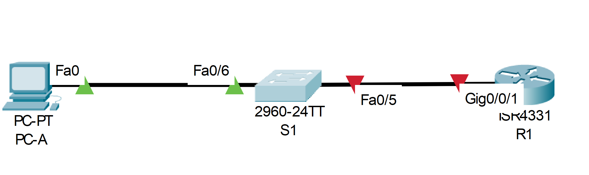
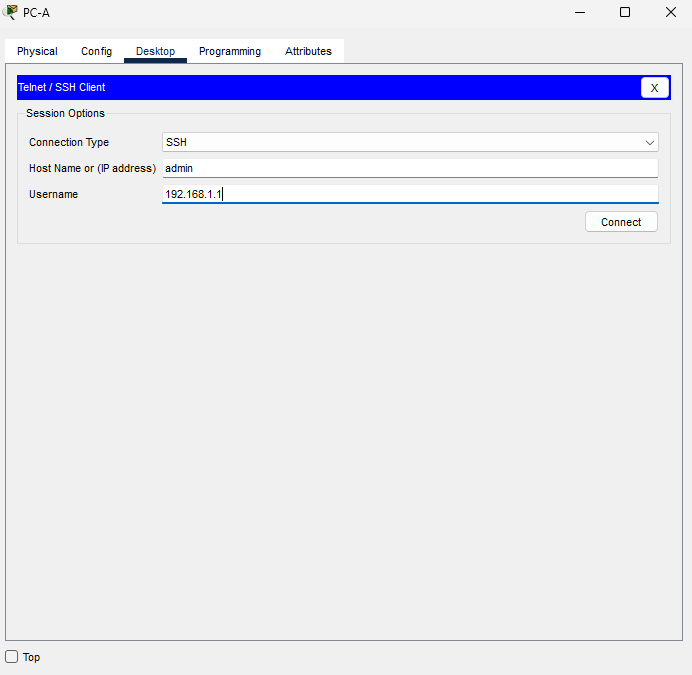
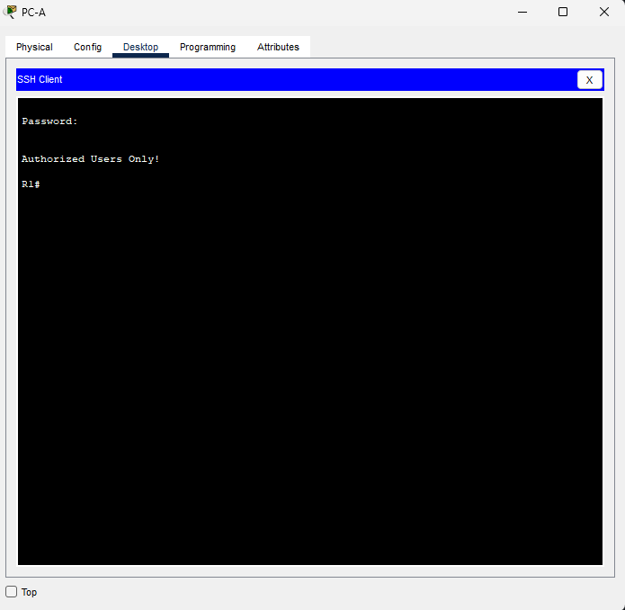
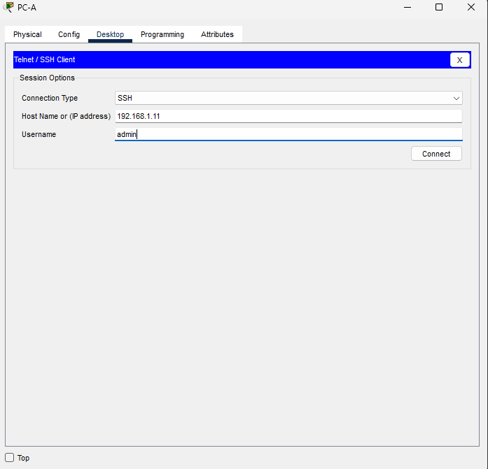
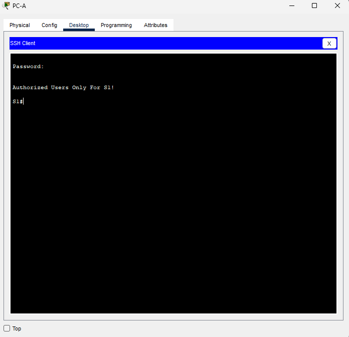

# Лабораторная работа. Доступ к сетевым устройствам по протоколу SSH
### Дано:
###	Топология

###	Таблица адресации
|Устройство  |Интерфейс  |IP-адрес     |Маска подсети|Шлюз по умолчанию|
|------------|-----------|-------------|-------------|-----------------|
|R1          |G0/0/1     | 192.168.1.1 |255.255.255.0|-
|S1          |VLAN 1     | 192.168.1.11|255.255.255.0|192.168.1.1      |
|PC-A        |NIC        | 192.168.1.3 |255.255.255.0|192.168.1.1      |
### Задание:
1. [Часть 1. Настройка основных параметров устройства.]()
2. [Часть 2. Настройка маршрутизатора для доступа по протоколу SSH]()
3. [Часть 3. Настройка коммутатора для доступа по протоколу SSH]()
4. [Часть 4.]()
5. [Вопросы для повторения](https://github.com/getmandv/Network_Engineer._Basic/blob/main/Home_work/Lab_01/README.md#%D0%B2%D0%BE%D0%BF%D1%80%D0%BE%D1%81%D1%8B-%D0%B4%D0%BB%D1%8F-%D0%BF%D0%BE%D0%B2%D1%82%D0%BE%D1%80%D0%B5%D0%BD%D0%B8%D1%8F)
6. Файлы Cisco Packet Tracer
   - [Основной файл домашнего задания](https://github.com/getmandv/Network_Engineer._Basic/blob/main/Home_work/Lab_01/pkt/lab_01.pkt)
   - [Файл Приложения А](https://github.com/getmandv/Network_Engineer._Basic/blob/main/Home_work/Lab_01/pkt/lab_01_appendix_a.pkt)


## Часть 1. Настройка основных параметров устройства.
###  Шаг 1. Создайте сеть согласно топологии.

###  Шаг 2. Выполните инициализацию и перезагрузку маршрутизатора и коммутатора.
- Маршрутизатор
```
Router>enable
Router#erase startup-config 
Erasing the nvram filesystem will remove all configuration files! Continue? [confirm]y[OK]
Erase of nvram: complete
%SYS-7-NV_BLOCK_INIT: Initialized the geometry of nvram
Router#delete vlan.dat
Delete filename [vlan.dat]?
Delete flash:/vlan.dat? [confirm]y%Error deleting flash:/vlan.dat (No such file or directory)
Router#reload
Proceed with reload? [confirm]y
Initializing Hardware ...
```
- Коммутатор
```
Switch>enable 
Switch#erase startup-config 
Erasing the nvram filesystem will remove all configuration files! Continue? [confirm]y[OK]
Erase of nvram: complete
%SYS-7-NV_BLOCK_INIT: Initialized the geometry of nvram
Switch#delete vlan.dat
Delete filename [vlan.dat]?
Delete flash:/vlan.dat? [confirm]y%Error deleting flash:/vlan.dat (No such file or directory)
Switch#reload
Proceed with reload? [confirm]y
C2960 Boot Loader (C2960-HBOOT-M) ...
```
###  Шаг 3. Настройте маршрутизатор.
a.	Подключитесь к маршрутизатору с помощью консоли и активируйте привилегированный режим EXEC.
```
Router>enable 
Router#
```
b.	Войдите в режим конфигурации.
```
Router#conf t
Enter configuration commands, one per line.  End with CNTL/Z.
Router(config)#
```
c.	Отключите поиск DNS, чтобы предотвратить попытки маршрутизатора неверно преобразовывать введенные команды таким образом, как будто они являются именами узлов.
```
Router(config)#no ip domain-lookup 
Router(config)#
```
d.	Назначьте class в качестве зашифрованного пароля привилегированного режима EXEC.
```
Router(config)#enable secret class 
Router(config)#
```
e.	Назначьте cisco в качестве пароля консоли и включите вход в систему по паролю.
```
Router(config)#line con 0
Router(config-line)#password cisco
Router(config-line)#login
Router(config-line)#
```
f.	Назначьте cisco в качестве пароля VTY и включите вход в систему по паролю.
```
Router(config)#line vty 0 15
Router(config-line)#password cisco
Router(config-line)#login
Router(config-line)#
```
g.	Зашифруйте открытые пароли.
```
Router(config)#service password-encryption 
Router(config)#
```
h.	Создайте баннер, который предупреждает о запрете несанкционированного доступа.
```
Router(config)#banner motd #
Enter TEXT message.  End with the character '#'.
Authorized Users Only!#

Router(config)#
```
i.	Настройте и активируйте на маршрутизаторе интерфейс G0/0/1, используя информацию, приведенную в таблице адресации.
```
Router(config)#interface gig0/0/1
Router(config-if)#ip address 192.168.1.1 255.255.255.0
Router(config-if)#no shutdown 
Router(config-if)#
%LINK-5-CHANGED: Interface GigabitEthernet0/0/1, changed state to up

%LINEPROTO-5-UPDOWN: Line protocol on Interface GigabitEthernet0/0/1, changed state to up

Router(config-if)#
```
j.	Сохраните текущую конфигурацию в файл загрузочной конфигурации.
```
Router#copy running-config startup-config 
Destination filename [startup-config]? 
Building configuration...
[OK]
Router#
```
###  Шаг 4. Настройте компьютер PC-A.
a.	Настройте для PC-A IP-адрес и маску подсети.
b.	Настройте для PC-A шлюз по умолчанию.


###  Шаг 5. Проверьте подключение к сети.
```
C:\>ping 192.168.1.1

Pinging 192.168.1.1 with 32 bytes of data:

Reply from 192.168.1.1: bytes=32 time<1ms TTL=255
Reply from 192.168.1.1: bytes=32 time<1ms TTL=255
Reply from 192.168.1.1: bytes=32 time<1ms TTL=255
Reply from 192.168.1.1: bytes=32 time<1ms TTL=255

Ping statistics for 192.168.1.1:
    Packets: Sent = 4, Received = 4, Lost = 0 (0% loss),
Approximate round trip times in milli-seconds:
    Minimum = 0ms, Maximum = 0ms, Average = 0ms

C:\>
```
## Часть 2. Настройка маршрутизатора для доступа по протоколу SSH
###  Шаг 1. Настройте аутентификацию устройств.
a.	Задайте имя устройства.
```
Router(config)#hostname R1
R1(config)#
```
b.	Задайте домен для устройства.
```
R1(config)#ip domain-name otus.ru
R1(config)#
```
###  Шаг 2. Создайте ключ шифрования с указанием его длины.
```
R1(config)#crypto key generate rsa  general-keys modulus 1024
The name for the keys will be: R1.otus.ru

% The key modulus size is 1024 bits
% Generating 1024 bit RSA keys, keys will be non-exportable...[OK]
*Mar 3 3:29:8.909: %SSH-5-ENABLED: SSH 1.99 has been enabled
R1(config)#
```
###  Шаг 3. Создайте имя пользователя в локальной базе учетных записей.
```
R1(config)#username admin privilege 15 secret Adm1nP@55
R1(config)#
```
### Шаг 4. Активируйте протокол SSH на линиях VTY.
a.	Активируйте протоколы Telnet и SSH на входящих линиях VTY с помощью команды transport input.
```
R1(config)#line vty 0 15
R1(config-line)#transport input ssh 
R1(config-line)#
```
b.	Измените способ входа в систему таким образом, чтобы использовалась проверка пользователей по локальной базе учетных записей.
```
R1(config-line)#login local 
R1(config-line)#
```
### Шаг 5. Сохраните текущую конфигурацию в файл загрузочной конфигурации.
```
R1#copy running-config startup-config 
Destination filename [startup-config]? 
Building configuration...
[OK]
R1#
```
### Шаг 6. Установите соединение с маршрутизатором по протоколу SSH.
a.	Запустите Tera Term с PC-A.


b.	Установите SSH-подключение к R1. Use the username admin and password Adm1nP@55. У вас должно получиться установить SSH-подключение к R1.


## Часть 3. Настройка коммутатора для доступа по протоколу SSH
### Шаг 1. Настройте основные параметры коммутатора.
a.	Подключитесь к маршрутизатору с помощью консоли и активируйте привилегированный режим EXEC.
```
Switch>enable
Switch#
```
b.	Войдите в режим конфигурации.
```
Switch#conf t
Enter configuration commands, one per line.  End with CNTL/Z.
Switch(config)#
```
c.	Отключите поиск DNS, чтобы предотвратить попытки маршрутизатора неверно преобразовывать введенные команды таким образом, как будто они являются именами узлов.
```
Switch(config)#no ip domain-lookup
Switch(config)#
```
d.	Назначьте class в качестве зашифрованного пароля привилегированного режима EXEC.
```
Switch(config)#enable secret class
Switch(config)#
```
e.	Назначьте cisco в качестве пароля консоли и включите вход в систему по паролю.
```
Switch(config)#line con 0
Switch(config-line)#password cisco
Switch(config-line)#login
Switch(config-line)#
```
f.	Назначьте cisco в качестве пароля VTY и включите вход в систему по паролю.
```
Switch(config)#line vty 0 15
Switch(config-line)#password cisco
Switch(config-line)#login
Switch(config-line)#
```
g.	Зашифруйте открытые пароли.
```
Switch(config)#service password-encryption 
Switch(config)#
```
h.	Создайте баннер, который предупреждает о запрете несанкционированного доступа.
```
Switch(config)#banner motd #
Enter TEXT message.  End with the character '#'.
Authorized Users Only For S1!#

Switch(config)#
```
i.	Настройте и активируйте на коммутаторе интерфейс VLAN 1, используя информацию, приведенную в таблице адресации.
```
Switch(config)#interface vlan1
Switch(config-if)#ip address 192.168.1.11 255.255.255.0
Switch(config-if)#no shutdown

Switch(config-if)#
%LINK-5-CHANGED: Interface Vlan1, changed state to up

%LINEPROTO-5-UPDOWN: Line protocol on Interface Vlan1, changed state to up
Switch(config-if)#exit
Switch(config)#ip default-gateway 192.168.1.1
Switch(config)#
```
j.	Сохраните текущую конфигурацию в файл загрузочной конфигурации.
```
Switch#copy running-config startup-config 
Destination filename [startup-config]? 
Building configuration...
[OK]
Switch#
```
### Шаг 2. Настройте коммутатор для соединения по протоколу SSH.
a.	Настройте имя устройства, как указано в таблице адресации.
```
Switch(config)#hostname S1
S1(config)#
```
b.	Задайте домен для устройства.
```
S1(config)#ip domain-name otus.ru
S1(config)#
```
c.	Создайте ключ шифрования с указанием его длины.
```
S1(config)#crypto key generate rsa  general-keys modulus 1024
The name for the keys will be: S1.otus.ru

% The key modulus size is 1024 bits
% Generating 1024 bit RSA keys, keys will be non-exportable...[OK]
*Mar 4 1:58:2.161: %SSH-5-ENABLED: SSH 1.99 has been enabled
S1(config)#
```
d.	Создайте имя пользователя в локальной базе учетных записей.
```
S1(config)#username admin privilege 15 secret Adm1nP@55
S1(config)#
```
e.	Активируйте протоколы Telnet и SSH на линиях VTY.
```
S1(config)#line vty 0 15
S1(config-line)#transport input all
S1(config-line)#
```
f.	Измените способ входа в систему таким образом, чтобы использовалась проверка пользователей по локальной базе учетных записей.
```
S1(config-line)#login local 
S1(config-line)#
```
### Шаг 3. Установите соединение с коммутатором по протоколу SSH.


- Удалось ли вам установить SSH-соединение с коммутатором?

Да.

## Часть 4. Настройка протокола SSH с использованием интерфейса командной строки (CLI) коммутатора
