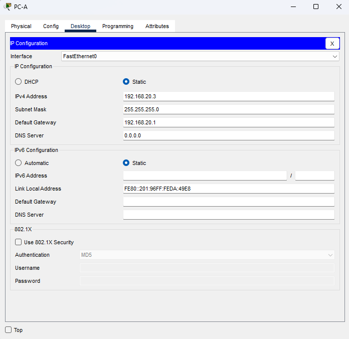
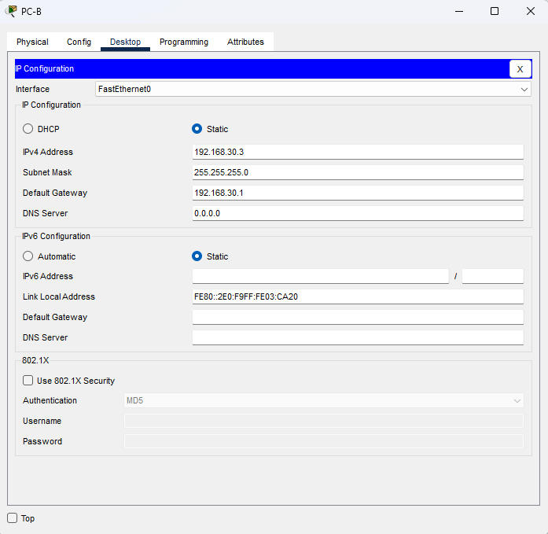
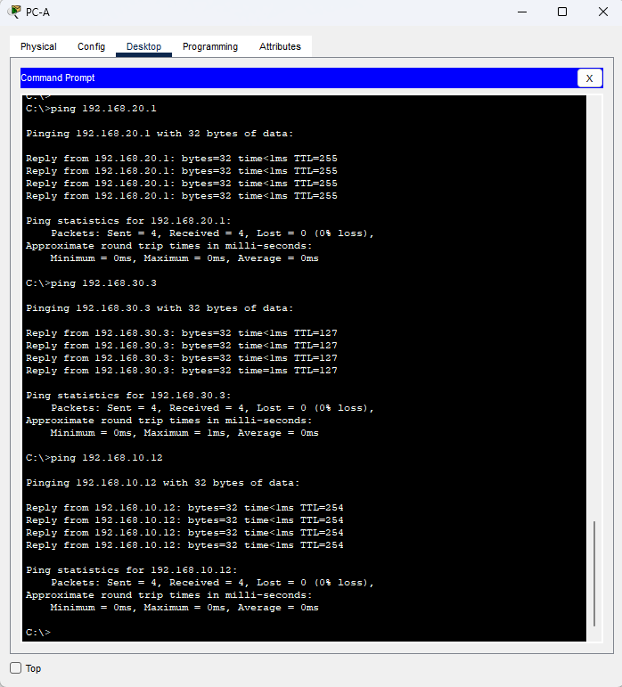
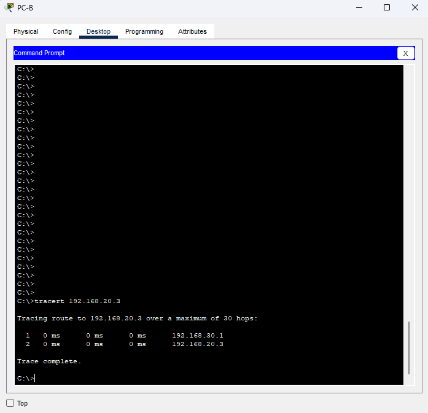

# Внедрение маршрутизации между виртуальными локальными сетями.
### Дано:
###	Топология

###	Таблица адресации
|Устройство  |Интерфейс  |IP-адрес     |Маска подсети|Шлюз по умолчанию|
|------------|-----------|-------------|-------------|-----------------|
|R1          |G0/0/1.10  |192.168.10.1 |255.255.255.0|-                |
|R1          |G0/0/1.20  |192.168.20.1 |255.255.255.0|-                |
|R1          |G0/0/1.30  |192.168.30.1 |255.255.255.0|-                |
|R1          |G0/0/1.1000|-            |-            |-                |
|S1          |VLAN 10    |192.168.10.11|255.255.255.0|192.168.10.1     |
|S2          |VLAN 10    |192.168.10.12|255.255.255.0|192.168.10.1     |
|PC-A        |NIC        |192.168.20.3 |255.255.255.0|192.168.20.1     |
|PC-B        |NIC        |192.168.30.3 |255.255.255.0|192.168.30.1     |
###	Таблица VLAN
|VLAN        |Имя        |Назначенный интерфейс        |
|------------|-----------|-----------------------------|
|10          |Управление |S1: VLAN 10                  |
|10          |Управление |S2: VLAN 10                  |
|20          |Sales      |S1: F0/6                     |
|30          |Operations |S2: F0/18                    |
|999         |Parking_Lot|S1: F0/2-4, F0/7-24, G0/1-2  |
|999         |Parking_Lot|S2: F0/2-17, F0/19-24, G0/1-2|
|1000        |Собственная|-                            |
### Задание:
- [Часть 1. Создание сети и настройка основных параметров устройства.](https://github.com/getmandv/Network_Engineer._Basic/blob/main/Home_work/Lab_06/README.md#%D1%87%D0%B0%D1%81%D1%82%D1%8C-1-%D1%81%D0%BE%D0%B7%D0%B4%D0%B0%D0%BD%D0%B8%D0%B5-%D1%81%D0%B5%D1%82%D0%B8-%D0%B8-%D0%BD%D0%B0%D1%81%D1%82%D1%80%D0%BE%D0%B9%D0%BA%D0%B0-%D0%BE%D1%81%D0%BD%D0%BE%D0%B2%D0%BD%D1%8B%D1%85-%D0%BF%D0%B0%D1%80%D0%B0%D0%BC%D0%B5%D1%82%D1%80%D0%BE%D0%B2-%D1%83%D1%81%D1%82%D1%80%D0%BE%D0%B9%D1%81%D1%82%D0%B2%D0%B0)
- [Часть 2. Создание сетей VLAN и назначение портов коммутатора.](https://github.com/getmandv/Network_Engineer._Basic/blob/main/Home_work/Lab_06/README.md#%D1%87%D0%B0%D1%81%D1%82%D1%8C-2-%D1%81%D0%BE%D0%B7%D0%B4%D0%B0%D0%BD%D0%B8%D0%B5-%D1%81%D0%B5%D1%82%D0%B5%D0%B9-vlan-%D0%B8-%D0%BD%D0%B0%D0%B7%D0%BD%D0%B0%D1%87%D0%B5%D0%BD%D0%B8%D0%B5-%D0%BF%D0%BE%D1%80%D1%82%D0%BE%D0%B2-%D0%BA%D0%BE%D0%BC%D0%BC%D1%83%D1%82%D0%B0%D1%82%D0%BE%D1%80%D0%B0)
- [Часть 3. Конфигурация магистрального канала стандарта 802.1Q между коммутаторами.](https://github.com/getmandv/Network_Engineer._Basic/blob/main/Home_work/Lab_06/README.md#%D1%87%D0%B0%D1%81%D1%82%D1%8C-3-%D0%BA%D0%BE%D0%BD%D1%84%D0%B8%D0%B3%D1%83%D1%80%D0%B0%D1%86%D0%B8%D1%8F-%D0%BC%D0%B0%D0%B3%D0%B8%D1%81%D1%82%D1%80%D0%B0%D0%BB%D1%8C%D0%BD%D0%BE%D0%B3%D0%BE-%D0%BA%D0%B0%D0%BD%D0%B0%D0%BB%D0%B0-%D1%81%D1%82%D0%B0%D0%BD%D0%B4%D0%B0%D1%80%D1%82%D0%B0-8021q-%D0%BC%D0%B5%D0%B6%D0%B4%D1%83-%D0%BA%D0%BE%D0%BC%D0%BC%D1%83%D1%82%D0%B0%D1%82%D0%BE%D1%80%D0%B0%D0%BC%D0%B8)
- [Часть 4. Настройка маршрутизации между сетями VLAN.](https://github.com/getmandv/Network_Engineer._Basic/blob/main/Home_work/Lab_06/README.md#%D1%87%D0%B0%D1%81%D1%82%D1%8C-4-%D0%BD%D0%B0%D1%81%D1%82%D1%80%D0%BE%D0%B9%D0%BA%D0%B0-%D0%BC%D0%B0%D1%80%D1%88%D1%80%D1%83%D1%82%D0%B8%D0%B7%D0%B0%D1%86%D0%B8%D0%B8-%D0%BC%D0%B5%D0%B6%D0%B4%D1%83-%D1%81%D0%B5%D1%82%D1%8F%D0%BC%D0%B8-vlan)
- [Часть 5. Проверьте, работает ли маршрутизация между VLAN.](https://github.com/getmandv/Network_Engineer._Basic/blob/main/Home_work/Lab_06/README.md#%D1%87%D0%B0%D1%81%D1%82%D1%8C-5-%D0%BF%D1%80%D0%BE%D0%B2%D0%B5%D1%80%D1%8C%D1%82%D0%B5-%D1%80%D0%B0%D0%B1%D0%BE%D1%82%D0%B0%D0%B5%D1%82-%D0%BB%D0%B8-%D0%BC%D0%B0%D1%80%D1%88%D1%80%D1%83%D1%82%D0%B8%D0%B7%D0%B0%D1%86%D0%B8%D1%8F-%D0%BC%D0%B5%D0%B6%D0%B4%D1%83-vlan)
- Файлы Cisco Packet Tracer
   - [Основной файл домашнего задания](https://github.com/getmandv/Network_Engineer._Basic/blob/main/Home_work/Lab_06/pkt/lab_06.pkt)
## Часть 1. Создание сети и настройка основных параметров устройства.
###  Шаг 1. Создайте сеть согласно топологии.

###  Шаг 2. Настройте базовые параметры для маршрутизатора.
a.	Подключитесь к маршрутизатору с помощью консоли и активируйте привилегированный режим EXEC.

b.	Войдите в режим конфигурации.

c.	Назначьте маршрутизатору имя устройства.

d.	Отключите поиск DNS, чтобы предотвратить попытки маршрутизатора неверно преобразовывать введенные команды таким образом, как будто они являются именами узлов.

e.	Назначьте class в качестве зашифрованного пароля привилегированного режима EXEC.

f.	Назначьте cisco в качестве пароля консоли и включите вход в систему по паролю.

g.	Установите cisco в качестве пароля виртуального терминала и активируйте вход.

h.	Зашифруйте открытые пароли.

i.	Создайте баннер с предупреждением о запрете несанкционированного доступа к устройству.

j.	Сохраните текущую конфигурацию в файл загрузочной конфигурации.

k.	Настройте на маршрутизаторе время.
```
Router>en
Router#conf t
Enter configuration commands, one per line.  End with CNTL/Z.
Router(config)#hostname R1
R1(config)#no ip domain-lookup
R1(config)#enable secret class
R1(config)#line con 0
R1(config-line)#password cisco
R1(config-line)#login
R1(config-line)#exit
R1(config)#line vty 0 15
R1(config-line)#password cisco
R1(config-line)#login
R1(config-line)#exit
R1(config)#service password-encryption
R1(config)#banner motd #
Enter TEXT message.  End with the character '#'.
This is R1 router.
Authorized Users Only!#

R1(config)#exit
R1#
%SYS-5-CONFIG_I: Configured from console by console

R1#wr
Building configuration...
[OK]
R1#clock set 16:27:00 Feb 23 2026
R1#
```
###  Шаг 3. Настройте базовые параметры каждого коммутатора.
a.	Присвойте коммутатору имя устройства.

b.	Отключите поиск DNS, чтобы предотвратить попытки маршрутизатора неверно преобразовывать введенные команды таким образом, как будто они являются именами узлов.

c.	Назначьте class в качестве зашифрованного пароля привилегированного режима EXEC.

d.	Назначьте cisco в качестве пароля консоли и включите вход в систему по паролю.

e.	Установите cisco в качестве пароля виртуального терминала и активируйте вход.

f.	Зашифруйте открытые пароли.

g.	Создайте баннер с предупреждением о запрете несанкционированного доступа к устройству.

h.	Настройте на коммутаторах время.

i.	Сохранение текущей конфигурации в качестве начальной.

Коммутатор S1
```
Switch>en
Switch#conf t
Enter configuration commands, one per line.  End with CNTL/Z.
Switch(config)#hostname S1
S1(config)#no ip domain-lookup
S1(config)#enable secret class
S1(config)#line con 0
S1(config-line)#password cisco
S1(config-line)#login
S1(config-line)#exit
S1(config)#line vty 0 15
S1(config-line)#password cisco
S1(config-line)#login
S1(config-line)#exit
S1(config)#service password-encryption
S1(config)#banner motd #
Enter TEXT message.  End with the character '#'.
This is S1 switch.
Authorized Users Only!#

S1(config)#exit
S1#
%SYS-5-CONFIG_I: Configured from console by console

S1#clock set 16:40:00 Feb 23 2026
S1#wr
Building configuration...
[OK]
S1#
```
Коммутатор S2
```
Switch>en
Switch#conf t
Enter configuration commands, one per line.  End with CNTL/Z.
Switch(config)#hostname S2
S2(config)#no ip domain-lookup
S2(config)#enable secret class
S2(config)#line con 0
S2(config-line)#password cisco
S2(config-line)#login
S2(config-line)#exit
S2(config)#line vty 0 15
S2(config-line)#password cisco
S2(config-line)#login
S2(config-line)#exit
S2(config)#service password-encryption
S2(config)#banner motd #
Enter TEXT message.  End with the character '#'.
This is S2 switch.
Authorized Users Only!#

S2(config)#exit
S2#
%SYS-5-CONFIG_I: Configured from console by console

S2#clock set 16:49:00 Feb 23 2026
S2#wr
Building configuration...
[OK]
S2#
```
###  Шаг 4. Настройте узлы ПК.
ПК PC-A



ПК PC-B


## Часть 2. Создание сетей VLAN и назначение портов коммутатора.
###  Шаг 1. Создайте сети VLAN на коммутаторах.
a.	Создайте и назовите необходимые VLAN на каждом коммутаторе из таблицы выше.

Коммутатор S1
```
S1(config)#vlan 10
S1(config-vlan)#name Management
S1(config-vlan)#exit
S1(config)#vlan 20
S1(config-vlan)#name Sales
S1(config)#vlan 30
S1(config-vlan)#name Operations
S1(config-vlan)#exit
S1(config)#vlan 999
S1(config-vlan)#name Parking_Lot
S1(config-vlan)#
```
Коммутатор S2
```
S2(config)#vlan 10
S2(config-vlan)#name Management
S2(config-vlan)#exit
S2(config)#vlan 30
S2(config-vlan)#name Operations
S2(config-vlan)#exit
S2(config)#vlan
S2(config)#vlan 999
S2(config-vlan)#name Parking_Lot
S2(config-vlan)#
```
b.	Настройте интерфейс управления и шлюз по умолчанию на каждом коммутаторе, используя информацию об IP-адресе в таблице адресации. 

Коммутатор S1
```
S1(config)#interface vlan 10
S1(config-if)#
%LINK-5-CHANGED: Interface Vlan10, changed state to up

S1(config-if)#ip address 192.168.10.11 255.255.255.0
S1(config-if)#no shutdown
S1(config-if)#exit
S1(config)#ip default-gateway 192.168.10.1
```
Коммутатор S2
```
S2(config)#interface vlan 10
S2(config-if)#
%LINK-5-CHANGED: Interface Vlan10, changed state to up

S2(config-if)#ip address 192.168.10.12 255.255.255.0
S2(config-if)#no shutdown 
S2(config-if)#exit
S2(config)#ip default-gateway 192.168.10.1
S2(config)#
```
c.	Назначьте все неиспользуемые порты коммутатора VLAN Parking_Lot, настройте их для статического режима доступа и административно деактивируйте их.

Коммутатор S1
```
S1(config)#interface range f0/2-4, f0/7-24, g0/1-2
S1(config-if-range)#switchport access vlan 999
S1(config-if-range)#switchport mode access 
S1(config-if-range)#shutdown 

%LINK-5-CHANGED: Interface FastEthernet0/2, changed state to administratively down

%LINK-5-CHANGED: Interface FastEthernet0/3, changed state to administratively down

%LINK-5-CHANGED: Interface FastEthernet0/4, changed state to administratively down

%LINK-5-CHANGED: Interface FastEthernet0/7, changed state to administratively down

%LINK-5-CHANGED: Interface FastEthernet0/8, changed state to administratively down

%LINK-5-CHANGED: Interface FastEthernet0/9, changed state to administratively down

%LINK-5-CHANGED: Interface FastEthernet0/10, changed state to administratively down

%LINK-5-CHANGED: Interface FastEthernet0/11, changed state to administratively down

%LINK-5-CHANGED: Interface FastEthernet0/12, changed state to administratively down

%LINK-5-CHANGED: Interface FastEthernet0/13, changed state to administratively down

%LINK-5-CHANGED: Interface FastEthernet0/14, changed state to administratively down

%LINK-5-CHANGED: Interface FastEthernet0/15, changed state to administratively down

%LINK-5-CHANGED: Interface FastEthernet0/16, changed state to administratively down

%LINK-5-CHANGED: Interface FastEthernet0/17, changed state to administratively down

%LINK-5-CHANGED: Interface FastEthernet0/18, changed state to administratively down

%LINK-5-CHANGED: Interface FastEthernet0/19, changed state to administratively down

%LINK-5-CHANGED: Interface FastEthernet0/20, changed state to administratively down

%LINK-5-CHANGED: Interface FastEthernet0/21, changed state to administratively down

%LINK-5-CHANGED: Interface FastEthernet0/22, changed state to administratively down

%LINK-5-CHANGED: Interface FastEthernet0/23, changed state to administratively down

%LINK-5-CHANGED: Interface FastEthernet0/24, changed state to administratively down

%LINK-5-CHANGED: Interface GigabitEthernet0/1, changed state to administratively down

%LINK-5-CHANGED: Interface GigabitEthernet0/2, changed state to administratively down
S1(config-if-range)#
```
Коммутатор S2
```
S2(config)#interface range f0/2-17, f0/19-24, g0/1-2
S2(config-if-range)#switchport access vlan 999
S2(config-if-range)#switchport mode access
S2(config-if-range)#shutdown

%LINK-5-CHANGED: Interface FastEthernet0/2, changed state to administratively down

%LINK-5-CHANGED: Interface FastEthernet0/3, changed state to administratively down

%LINK-5-CHANGED: Interface FastEthernet0/4, changed state to administratively down

%LINK-5-CHANGED: Interface FastEthernet0/5, changed state to administratively down

%LINK-5-CHANGED: Interface FastEthernet0/6, changed state to administratively down

%LINK-5-CHANGED: Interface FastEthernet0/7, changed state to administratively down

%LINK-5-CHANGED: Interface FastEthernet0/8, changed state to administratively down

%LINK-5-CHANGED: Interface FastEthernet0/9, changed state to administratively down

%LINK-5-CHANGED: Interface FastEthernet0/10, changed state to administratively down

%LINK-5-CHANGED: Interface FastEthernet0/11, changed state to administratively down

%LINK-5-CHANGED: Interface FastEthernet0/12, changed state to administratively down

%LINK-5-CHANGED: Interface FastEthernet0/13, changed state to administratively down

%LINK-5-CHANGED: Interface FastEthernet0/14, changed state to administratively down

%LINK-5-CHANGED: Interface FastEthernet0/15, changed state to administratively down

%LINK-5-CHANGED: Interface FastEthernet0/16, changed state to administratively down

%LINK-5-CHANGED: Interface FastEthernet0/17, changed state to administratively down

%LINK-5-CHANGED: Interface FastEthernet0/19, changed state to administratively down

%LINK-5-CHANGED: Interface FastEthernet0/20, changed state to administratively down

%LINK-5-CHANGED: Interface FastEthernet0/21, changed state to administratively down

%LINK-5-CHANGED: Interface FastEthernet0/22, changed state to administratively down

%LINK-5-CHANGED: Interface FastEthernet0/23, changed state to administratively down

%LINK-5-CHANGED: Interface FastEthernet0/24, changed state to administratively down

%LINK-5-CHANGED: Interface GigabitEthernet0/1, changed state to administratively down

%LINK-5-CHANGED: Interface GigabitEthernet0/2, changed state to administratively down
S2(config-if-range)#
```
###  Шаг 2. Назначьте сети VLAN соответствующим интерфейсам коммутатора.

Коммутатор S1
```
S1(config)#interface f0/6
S1(config-if)#switchport access vlan 20
S1(config-if)#switchport mode access
S1(config-if)#
```
Коммутатор S2
```
S2(config)#interface f0/18
S2(config-if)#switchport access vlan 30
S2(config-if)#switchport mode access 
S2(config-if)#
```
b.	Убедитесь, что VLAN назначены на правильные интерфейсы.

Коммутатор S1
```
S1#show vlan brief 

VLAN Name                             Status    Ports
---- -------------------------------- --------- -------------------------------
1    default                          active    
10   Management                       active    
20   Sales                            active    Fa0/6
30   Operations                       active    
999  Parking_Lot                      active    Fa0/2, Fa0/3, Fa0/4, Fa0/7
                                                Fa0/8, Fa0/9, Fa0/10, Fa0/11
                                                Fa0/12, Fa0/13, Fa0/14, Fa0/15
                                                Fa0/16, Fa0/17, Fa0/18, Fa0/19
                                                Fa0/20, Fa0/21, Fa0/22, Fa0/23
                                                Fa0/24, Gig0/1, Gig0/2
1002 fddi-default                     active    
1003 token-ring-default               active    
1004 fddinet-default                  active    
1005 trnet-default                    active    
S1#
```
Коммутатор S2
```
S2#show vlan brief 

VLAN Name                             Status    Ports
---- -------------------------------- --------- -------------------------------
1    default                          active    Fa0/1
10   Management                       active    
30   Operations                       active    Fa0/18
999  Parking_Lot                      active    Fa0/2, Fa0/3, Fa0/4, Fa0/5
                                                Fa0/6, Fa0/7, Fa0/8, Fa0/9
                                                Fa0/10, Fa0/11, Fa0/12, Fa0/13
                                                Fa0/14, Fa0/15, Fa0/16, Fa0/17
                                                Fa0/19, Fa0/20, Fa0/21, Fa0/22
                                                Fa0/23, Fa0/24, Gig0/1, Gig0/2
1002 fddi-default                     active    
1003 token-ring-default               active    
1004 fddinet-default                  active    
1005 trnet-default                    active    
S2#
```
## Часть 3. Конфигурация магистрального канала стандарта 802.1Q между коммутаторами.
### Шаг 1. Вручную настройте магистральный интерфейс F0/1 на коммутаторах S1 и S2.
a.	Настройка статического транкинга на интерфейсе F0/1 для обоих коммутаторов.

b.	Установите native VLAN 1000 на обоих коммутаторах.

c.	Укажите, что VLAN 10, 20, 30 и 1000 могут проходить по транку.

Коммутатор S1
```
S1(config)#interface f0/1
S1(config-if)#switchport mode trunk
S1(config-if)#switchport nonegotiate 
S1(config-if)#switchport trunk native vlan 1000
S1(config-if)#switchport trunk allowed vlan 10,20,30,1000
S1(config-if)#
```
Коммутатор S2
```
S2(config)#interface f0/1
S2(config-if)#switchport mode trunk
S2(config-if)#switchport nonegotiate 
S2(config-if)#switchport trunk native vlan 1000
S2(config-if)#switchport trunk allowed vlan 10,20,30,1000
S2(config-if)#
```
d.	Проверьте транки, native VLAN и разрешенные VLAN через транк.

Коммутатор S1
```
S1#show interfaces trunk 
Port        Mode         Encapsulation  Status        Native vlan
Fa0/1       on           802.1q         trunking      1000

Port        Vlans allowed on trunk
Fa0/1       10,20,30,1000

Port        Vlans allowed and active in management domain
Fa0/1       10,20

Port        Vlans in spanning tree forwarding state and not pruned
Fa0/1       10,20

S1#
```
Коммутатор S2
```
S2#show interfaces trunk 
Port        Mode         Encapsulation  Status        Native vlan
Fa0/1       on           802.1q         trunking      1000

Port        Vlans allowed on trunk
Fa0/1       10,20,30,1000

Port        Vlans allowed and active in management domain
Fa0/1       10,30

Port        Vlans in spanning tree forwarding state and not pruned
Fa0/1       10,30

S2#
```
### Шаг 2. Вручную настройте магистральный интерфейс F0/5 на коммутаторе S1.
a.	Настройте интерфейс S1 F0/5 с теми же параметрами транка, что и F0/1. Это транк до маршрутизатора.
```
S1(config)#interface f0/5
S1(config-if)#switchport mode trunk
S1(config-if)#switchport nonegotiate 
S1(config-if)#switchport trunk native vlan 1000
S1(config-if)#switchport trunk allowed vlan 10,20,30,1000
S1(config-if)#
```
b.	Сохраните текущую конфигурацию в файл загрузочной конфигурации.
```
S1(config-if)#exit
S1(config)#exit
S1#
%SYS-5-CONFIG_I: Configured from console by console

S1#wr
Building configuration...
[OK]
S1#
```
c.	Проверка транкинга.
```
S1#show interfaces trunk 
Port        Mode         Encapsulation  Status        Native vlan
Fa0/1       on           802.1q         trunking      1000
Fa0/5       on           802.1q         trunking      1000

Port        Vlans allowed on trunk
Fa0/1       10,20,30,1000
Fa0/5       10,20,30,1000

Port        Vlans allowed and active in management domain
Fa0/1       10,20
Fa0/5       10,20

Port        Vlans in spanning tree forwarding state and not pruned
Fa0/1       10,20
Fa0/5       none

S1#
```
- Что произойдет, если G0/0/1 на R1 будет отключен?

Стоит отметить что если слебовать методичке домашенго задания, то именно эта ситуация и происходит, интерфейс G0/0/1 на маршрутизаторе R1 выключин и в таком случае при настройке порта F0/5 на коммутаторе S1 данная информация не отображается в show interfaces trunk. То есть данная команда выведет только активные соединения.
## Часть 4. Настройка маршрутизации между сетями VLAN.
### Шаг 1. Настройте маршрутизатор.
a.	При необходимости активируйте интерфейс G0/0/1 на маршрутизаторе.

b.	Настройте подинтерфейсы для каждой VLAN, как указано в таблице IP-адресации. Все подинтерфейсы используют инкапсуляцию 802.1Q. Убедитесь, что подинтерфейсу для native VLAN не назначен IP-адрес. Включите описание для каждого подинтерфейса.

c.	Убедитесь, что вспомогательные интерфейсы работают

```
R1(config)#interface g0/0/1
R1(config-if)#no shutdown

R1(config-if)#
%LINK-5-CHANGED: Interface GigabitEthernet0/0/1, changed state to up

%LINEPROTO-5-UPDOWN: Line protocol on Interface GigabitEthernet0/0/1, changed state to up

R1(config-if)#exit
R1(config)#interface g0/0/1.10
R1(config-subif)#
%LINK-5-CHANGED: Interface GigabitEthernet0/0/1.10, changed state to up

%LINEPROTO-5-UPDOWN: Line protocol on Interface GigabitEthernet0/0/1.10, changed state to up

R1(config-subif)#encapsulation dot1Q 10
R1(config-subif)#ip address 192.168.10.1 255.255.255.0
R1(config-subif)#description Management
R1(config-subif)#exit
R1(config)#interface g0/0/1.20
R1(config-subif)#
%LINK-5-CHANGED: Interface GigabitEthernet0/0/1.20, changed state to up

%LINEPROTO-5-UPDOWN: Line protocol on Interface GigabitEthernet0/0/1.20, changed state to up

R1(config-subif)#encapsulation dot1Q 20
R1(config-subif)#ip address 192.168.20.1 255.255.255.0
R1(config-subif)#description Sales
R1(config-subif)#exit
R1(config)#interface g0/0/1.30
R1(config-subif)#
%LINK-5-CHANGED: Interface GigabitEthernet0/0/1.30, changed state to up

%LINEPROTO-5-UPDOWN: Line protocol on Interface GigabitEthernet0/0/1.30, changed state to up

R1(config-subif)#encapsulation dot1Q 30
R1(config-subif)#ip address 192.168.30.1 255.255.255.0
R1(config-subif)#description Operations
R1(config-subif)#exit
R1(config)#interface g0/0/1.1000
R1(config-subif)#
%LINK-5-CHANGED: Interface GigabitEthernet0/0/1.1000, changed state to up

%LINEPROTO-5-UPDOWN: Line protocol on Interface GigabitEthernet0/0/1.1000, changed state to up

R1(config-subif)#encapsulation dot1Q 1000 native
R1(config-subif)#no ip address
R1(config-subif)#exit
R1(config)#exit
R1#
%SYS-5-CONFIG_I: Configured from console by console

R1#show interfaces g0/0/1.10
GigabitEthernet0/0/1.10 is up, line protocol is up (connected)
  Hardware is PQUICC_FEC, address is 00d0.d39b.1a02 (bia 00d0.d39b.1a02)
  Internet address is 192.168.10.1/24
  MTU 1500 bytes, BW 100000 Kbit, DLY 100 usec, 
     reliability 255/255, txload 1/255, rxload 1/255
  Encapsulation 802.1Q Virtual LAN, Vlan ID 10
  ARP type: ARPA, ARP Timeout 04:00:00, 
  Last clearing of "show interface" counters never

R1#show interfaces g0/0/1.20
GigabitEthernet0/0/1.20 is up, line protocol is up (connected)
  Hardware is PQUICC_FEC, address is 00d0.d39b.1a02 (bia 00d0.d39b.1a02)
  Internet address is 192.168.20.1/24
  MTU 1500 bytes, BW 100000 Kbit, DLY 100 usec, 
     reliability 255/255, txload 1/255, rxload 1/255
  Encapsulation 802.1Q Virtual LAN, Vlan ID 20
  ARP type: ARPA, ARP Timeout 04:00:00, 
  Last clearing of "show interface" counters never

R1#show interfaces g0/0/1.30
GigabitEthernet0/0/1.30 is up, line protocol is up (connected)
  Hardware is PQUICC_FEC, address is 00d0.d39b.1a02 (bia 00d0.d39b.1a02)
  Internet address is 192.168.30.1/24
  MTU 1500 bytes, BW 100000 Kbit, DLY 100 usec, 
     reliability 255/255, txload 1/255, rxload 1/255
  Encapsulation 802.1Q Virtual LAN, Vlan ID 30
  ARP type: ARPA, ARP Timeout 04:00:00, 
  Last clearing of "show interface" counters never

R1#show interfaces g0/0/1.1000
GigabitEthernet0/0/1.1000 is up, line protocol is up (connected)
  Hardware is PQUICC_FEC, address is 00d0.d39b.1a02 (bia 00d0.d39b.1a02)
  MTU 1500 bytes, BW 100000 Kbit, DLY 100 usec, 
     reliability 255/255, txload 1/255, rxload 1/255
  Encapsulation 802.1Q Virtual LAN, Vlan ID 1000
  ARP type: ARPA, ARP Timeout 04:00:00, 
  Last clearing of "show interface" counters never

R1#
```
## Часть 5. Проверьте, работает ли маршрутизация между VLAN.
### Шаг 1. Выполните следующие тесты с PC-A. Все должно быть успешно.
a.	Отправьте эхо-запрос с PC-A на шлюз по умолчанию.

b.	Отправьте эхо-запрос с PC-A на PC-B.

c.	Отправьте команду ping с компьютера PC-A на коммутатор S2.



### Шаг 2. Пройдите следующий тест с PC-B
- В окне командной строки на PC-B выполните команду tracert на адрес PC-A.



- Какие промежуточные IP-адреса отображаются в результатах?

192.168.30.1 это шлюз для ПК PC-B (Адрес назначен для одного из сабинтерфейсов маршрутизатора g/0/0/1.30)
