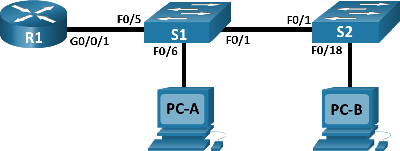
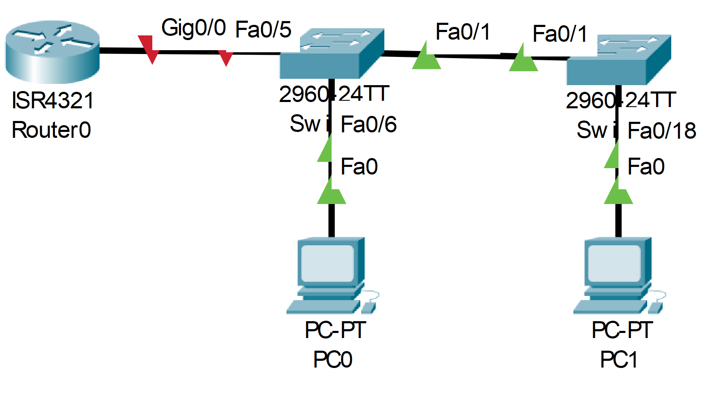

# Лабораторная работа - Внедрение маршрутизации между виртуальными локальными сетями
### Дано:
###	Топология

###	Таблица адресации
|Устройство  |Интерфейс  |IP-адрес     |Маска подсети|Шлюз по умолчанию|
|------------|-----------|-------------|-------------|-----------------|
|R1          |G0/0/1.10  |192.168.10.1 |255.255.255.0|-                |
|R1          |G0/0/1.20  |192.168.20.1 |255.255.255.0|-                |
|R1          |G0/0/1.30  |192.168.30.1 |255.255.255.0|-                |
|R1          |G0/0/1.1000|-            |-            |-                |
|S1          |VLAN 10    |192.168.10.11|255.255.255.0|192.168.10.1     |
|S2          |VLAN 10    |192.168.10.12|255.255.255.0|192.168.10.1     |
|PC-A        |NIC        |192.168.20.3 |255.255.255.0|192.168.20.1     |
|PC-B        |NIC        |192.168.30.3 |255.255.255.0|192.168.30.1     |
###	Таблица VLAN
|VLAN        |Имя        |Назначенный интерфейс        |
|------------|-----------|-----------------------------|
|10          |Управление |S1: VLAN 10                  |
|10          |Управление |S2: VLAN 10                  |
|20          |Sales      |S1: F0/6                     |
|30          |Operations |S2: F0/18                    |
|999         |Parking_Lot|С1: F0/2-4, F0/7-24, G0/1-2  |
|999         |Parking_Lot|С2: F0/2-17, F0/19-24, G0/1-2|
### Задание:
1. [Часть 1. Создание сети и настройка основных параметров устройства.]()
2. [Часть 2. Создание сетей VLAN и назначение портов коммутатора.]()
3. [Часть 3. Конфигурация магистрального канала стандарта 802.1Q между коммутаторами.]()
4. [Часть 4. Настройка маршрутизации между сетями VLAN.]()
5. [Часть 5. Проверьте, работает ли маршрутизация между VLAN.]()
6. [Вопрос для повторения]()
7. Файлы Cisco Packet Tracer
   - [Основной файл домашнего задания](https://github.com/getmandv/Network_Engineer._Basic/blob/main/Home_work/Lab_05/pkt/lab_05.pkt)
## Часть 1. Создание сети и настройка основных параметров устройства.
###  Шаг 1. Создайте сеть согласно топологии.

###  Шаг 2. Настройте базовые параметры для маршрутизатора.
a.	Подключитесь к маршрутизатору с помощью консоли и активируйте привилегированный режим EXEC.

b.	Войдите в режим конфигурации.

c.	Назначьте маршрутизатору имя устройства.

d.	Отключите поиск DNS, чтобы предотвратить попытки маршрутизатора неверно преобразовывать введенные команды таким образом, как будто они являются именами узлов.

e.	Назначьте class в качестве зашифрованного пароля привилегированного режима EXEC.

f.	Назначьте cisco в качестве пароля консоли и включите вход в систему по паролю.

g.	Установите cisco в качестве пароля виртуального терминала и активируйте вход.

h.	Зашифруйте открытые пароли.

i.	Создайте баннер с предупреждением о запрете несанкционированного доступа к устройству.

j.	Сохраните текущую конфигурацию в файл загрузочной конфигурации.

k.	Настройте на маршрутизаторе время.
```
Router>en
Router#conf t
Enter configuration commands, one per line.  End with CNTL/Z.
Router(config)#hostname R1
R1(config)#no ip domain-lookup
R1(config)#enable secret class
R1(config)#line con 0
R1(config-line)#password cisco
R1(config-line)#login
R1(config-line)#exit
R1(config)#line vty 0 15
R1(config-line)#password cisco
R1(config-line)#login
R1(config-line)#exit
R1(config)#service password-encryption
R1(config)#banner motd #
Enter TEXT message.  End with the character '#'.
This is R1 router.
Authorized Users Only!#

R1(config)#exit
R1#
%SYS-5-CONFIG_I: Configured from console by console

R1#wr
Building configuration...
[OK]
R1#clock set 16:27:00 Feb 23 2026
R1#
```
###  Шаг 3. Настройте базовые параметры каждого коммутатора.
a.	Присвойте коммутатору имя устройства.

b.	Отключите поиск DNS, чтобы предотвратить попытки маршрутизатора неверно преобразовывать введенные команды таким образом, как будто они являются именами узлов.

c.	Назначьте class в качестве зашифрованного пароля привилегированного режима EXEC.

d.	Назначьте cisco в качестве пароля консоли и включите вход в систему по паролю.

e.	Установите cisco в качестве пароля виртуального терминала и активируйте вход.

f.	Зашифруйте открытые пароли.

g.	Создайте баннер с предупреждением о запрете несанкционированного доступа к устройству.

h.	Настройте на коммутаторах время.

i.	Сохранение текущей конфигурации в качестве начальной.

Коммутатор S1
```
Switch>en
Switch#conf t
Enter configuration commands, one per line.  End with CNTL/Z.
Switch(config)#hostname S1
S1(config)#no ip domain-lookup
S1(config)#enable secret class
S1(config)#line con 0
S1(config-line)#password cisco
S1(config-line)#login
S1(config-line)#exit
S1(config)#line vty 0 15
S1(config-line)#password cisco
S1(config-line)#login
S1(config-line)#exit
S1(config)#service password-encryption
S1(config)#banner motd #
Enter TEXT message.  End with the character '#'.
This is S1 switch.
Authorized Users Only!#

S1(config)#exit
S1#
%SYS-5-CONFIG_I: Configured from console by console

S1#clock set 16:40:00 Feb 23 2026
S1#wr
Building configuration...
[OK]
S1#
```
Коммутатор S2
```
