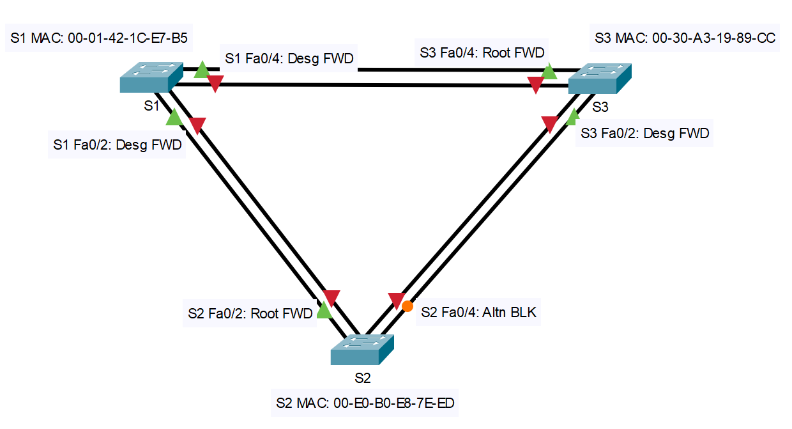

# Лабораторная работа. Развертывание коммутируемой сети с резервными каналами
### Дано:
###	Топология

###	Таблица адресации
|Устройство|Интерфейс|IP-адрес    |Маска подсети|
|----------|---------|------------|-------------|
|S1        |VLAN 1   |192.168.1.1|255.255.255.0|
|S2        |VLAN 1   |192.168.1.2|255.255.255.0|
|S3        |VLAN 1   |192.168.1.3|255.255.255.0|

### Задание:
1. [Часть 1. Создание сети и настройка основных параметров устройства.]()
2. [Часть 2. Выбор корневого моста.]()
3. [Часть 3. Наблюдение за процессом выбора протоколом STP порта, исходя из стоимости портов.]()
4. [Часть 4. Наблюдение за процессом выбора протоколом STP порта, исходя из приоритета портов.]()
5. Файлы Cisco Packet Tracer
   - [Основной файл домашнего задания](https://github.com/getmandv/Network_Engineer._Basic/blob/main/Home_work/Lab_07/pkt/lab_07.pkt)
## Часть 1:	Создание сети и настройка основных параметров устройства.
###  Шаг 1:	Создайте сеть согласно топологии.

###  Шаг 2:	Выполните инициализацию и перезагрузку коммутаторов.
Так как в нашем случае лабараторная работа выполняется в CPT процедура инициализации и перезагрузки смысла не имеет, так как коммутаторы условно "из коробки". Тем не менее, в случае использования реальных устройств, на каждом коммутаторе потребовалось удалить файл конфигурации и файл с VLAN, просле чего перезагрузить устройство.
```
Switch>enable 
Switch#erase startup-config 
Erasing the nvram filesystem will remove all configuration files! Continue? [confirm]y[OK]
Erase of nvram: complete
%SYS-7-NV_BLOCK_INIT: Initialized the geometry of nvram
Switch#delete vlan.dat
Delete filename [vlan.dat]?
Delete flash:/vlan.dat? [confirm]y%Error deleting flash:/vlan.dat (No such file or directory)
Switch#reload
Proceed with reload? [confirm]y
C2960 Boot Loader (C2960-HBOOT-M) ...
```
###  Шаг 3:	Настройте базовые параметры каждого коммутатора.
a.	Отключите поиск DNS.

b.	Присвойте имена устройствам в соответствии с топологией.

c.	Назначьте class в качестве зашифрованного пароля доступа к привилегированному режиму.

d.	Назначьте cisco в качестве паролей консоли и VTY и активируйте вход для консоли и VTY каналов.

e.	Настройте logging synchronous для консольного канала.

f.	Настройте баннерное сообщение дня (MOTD) для предупреждения пользователей о запрете несанкционированного доступа.

g.	Задайте IP-адрес, указанный в таблице адресации для VLAN 1 на всех коммутаторах.

h.	Скопируйте текущую конфигурацию в файл загрузочной конфигурации.

Позволю себе вышеуказанные шаги отобразить только для коммутатора S1. Разумеется аналогичные настройки проводим для коммутаторов S2 и S3 с учётом разницы в настройке имён и IP адресов.
```
Switch>en
Switch#conf t
Enter configuration commands, one per line.  End with CNTL/Z.
Switch(config)#no ip domain-lookup 
Switch(config)#hostname S1
S1(config)#enable secret class
S1(config)#line con 0
S1(config-line)#password cisco
S1(config-line)#login
S1(config-line)#exit
S1(config)#line vty 0 15
S1(config-line)#password cisco
S1(config-line)#login
S1(config-line)#exit
S1(config)#line con 0
S1(config-line)#logging synchronous 
S1(config-line)#exit
S1(config)#banner motd #
Enter TEXT message.  End with the character '#'.
This is S1 switch.
Authorized Users Only!#

S1(config)#interface vlan1
S1(config-if)#ip address 192.168.1.1 255.255.255.0
S1(config-if)#exit
S1(config)#exit
S1#
%SYS-5-CONFIG_I: Configured from console by console

S1#wr
Building configuration...
[OK]
S1#
```
### Шаг 4:	Проверьте связь.
Проверьте способность компьютеров обмениваться эхо-запросами.
- Успешно ли выполняется эхо-запрос от коммутатора S1 на коммутатор S2?

Да.
```
S1#ping 192.168.1.2

Type escape sequence to abort.
Sending 5, 100-byte ICMP Echos to 192.168.1.2, timeout is 2 seconds:
!!!!!
Success rate is 100 percent (5/5), round-trip min/avg/max = 0/0/0 ms

S1#
```
- Успешно ли выполняется эхо-запрос от коммутатора S1 на коммутатор S3?

Да.
```
S1#ping 192.168.1.3

Type escape sequence to abort.
Sending 5, 100-byte ICMP Echos to 192.168.1.3, timeout is 2 seconds:
!!!!!
Success rate is 100 percent (5/5), round-trip min/avg/max = 0/0/0 ms

S1#
```
- Успешно ли выполняется эхо-запрос от коммутатора S2 на коммутатор S3?

Да.
```
S2#ping 192.168.1.3

Type escape sequence to abort.
Sending 5, 100-byte ICMP Echos to 192.168.1.3, timeout is 2 seconds:
!!!!!
Success rate is 100 percent (5/5), round-trip min/avg/max = 0/0/4 ms

S2#
```
Выполняйте отладку до тех пор, пока ответы на все вопросы не будут положительными.

Предположу что суть "подвоха" заключалась в том что в процессе первоначальной настройки мы задали IP адреса интерфейса vlan1 для коммутаторов, но не включили его командой no shutdown, в связи с чем связи небыло пока интерфейсы небыл и включены.

## Часть 2:	Определение корневого моста.
### Шаг 1:	Отключите все порты на коммутаторах.
```
S1(config)#interface range fastEthernet 0/1-24, gigabitEthernet 0/1-2
S1(config-if-range)#shutdown


%LINK-5-CHANGED: Interface FastEthernet0/5, changed state to administratively down

%LINK-5-CHANGED: Interface FastEthernet0/6, changed state to administratively down

%LINK-5-CHANGED: Interface FastEthernet0/7, changed state to administratively down

%LINK-5-CHANGED: Interface FastEthernet0/8, changed state to administratively down

%LINK-5-CHANGED: Interface FastEthernet0/9, changed state to administratively down

%LINK-5-CHANGED: Interface FastEthernet0/10, changed state to administratively down

%LINK-5-CHANGED: Interface FastEthernet0/11, changed state to administratively down

%LINK-5-CHANGED: Interface FastEthernet0/12, changed state to administratively down

%LINK-5-CHANGED: Interface FastEthernet0/13, changed state to administratively down

%LINK-5-CHANGED: Interface FastEthernet0/14, changed state to administratively down

%LINK-5-CHANGED: Interface FastEthernet0/15, changed state to administratively down

%LINK-5-CHANGED: Interface FastEthernet0/16, changed state to administratively down

%LINK-5-CHANGED: Interface FastEthernet0/17, changed state to administratively down

%LINK-5-CHANGED: Interface FastEthernet0/18, changed state to administratively down

%LINK-5-CHANGED: Interface FastEthernet0/19, changed state to administratively down

%LINK-5-CHANGED: Interface FastEthernet0/20, changed state to administratively down

%LINK-5-CHANGED: Interface FastEthernet0/21, changed state to administratively down

%LINK-5-CHANGED: Interface FastEthernet0/22, changed state to administratively down

%LINK-5-CHANGED: Interface FastEthernet0/23, changed state to administratively down

%LINK-5-CHANGED: Interface FastEthernet0/24, changed state to administratively down

%LINK-5-CHANGED: Interface GigabitEthernet0/1, changed state to administratively down

%LINK-5-CHANGED: Interface GigabitEthernet0/2, changed state to administratively down
S1(config-if-range)#
%LINK-5-CHANGED: Interface FastEthernet0/1, changed state to administratively down

%LINEPROTO-5-UPDOWN: Line protocol on Interface FastEthernet0/1, changed state to down

%LINK-5-CHANGED: Interface FastEthernet0/2, changed state to administratively down

%LINEPROTO-5-UPDOWN: Line protocol on Interface FastEthernet0/2, changed state to down

%LINK-5-CHANGED: Interface FastEthernet0/3, changed state to administratively down

%LINEPROTO-5-UPDOWN: Line protocol on Interface FastEthernet0/3, changed state to down

%LINK-5-CHANGED: Interface FastEthernet0/4, changed state to administratively down

%LINEPROTO-5-UPDOWN: Line protocol on Interface FastEthernet0/4, changed state to down

%LINEPROTO-5-UPDOWN: Line protocol on Interface Vlan1, changed state to down

S1(config-if-range)#
```
Данную процедуру повторяем для коммутаторов S2 и S3.
### Шаг 2:	Настройте подключенные порты в качестве транковых.
```
S1(config)#interface range fastEthernet 0/1-4
S1(config-if-range)#switchport mode trunk 
S1(config-if-range)#
```
Данную процедуру повторяем для коммутаторов S2 и S3.
### Шаг 3:	Включите порты F0/2 и F0/4 на всех коммутаторах.
```
S1(config)#interface range fastEthernet 0/2, fastEthernet 0/4
S1(config-if-range)#no shutdown 

%LINK-5-CHANGED: Interface FastEthernet0/2, changed state to down

%LINK-5-CHANGED: Interface FastEthernet0/4, changed state to down
S1(config-if-range)#
```
Данную процедуру повторяем для коммутаторов S2 и S3.
### Шаг 4:	Отобразите данные протокола spanning-tree.
Коммутатор S1
```
S1#show spanning-tree 
VLAN0001
  Spanning tree enabled protocol ieee
  Root ID    Priority    32769
             Address     0001.421C.E7B5
             This bridge is the root
             Hello Time  2 sec  Max Age 20 sec  Forward Delay 15 sec

  Bridge ID  Priority    32769  (priority 32768 sys-id-ext 1)
             Address     0001.421C.E7B5
             Hello Time  2 sec  Max Age 20 sec  Forward Delay 15 sec
             Aging Time  20

Interface        Role Sts Cost      Prio.Nbr Type
---------------- ---- --- --------- -------- --------------------------------
Fa0/2            Desg FWD 19        128.2    P2p
Fa0/4            Desg FWD 19        128.4    P2p

S1#
```
Коммутатор S2
```
S2#show spanning-tree 
VLAN0001
  Spanning tree enabled protocol ieee
  Root ID    Priority    32769
             Address     0001.421C.E7B5
             Cost        19
             Port        2(FastEthernet0/2)
             Hello Time  2 sec  Max Age 20 sec  Forward Delay 15 sec

  Bridge ID  Priority    32769  (priority 32768 sys-id-ext 1)
             Address     00E0.B0E8.7EED
             Hello Time  2 sec  Max Age 20 sec  Forward Delay 15 sec
             Aging Time  20

Interface        Role Sts Cost      Prio.Nbr Type
---------------- ---- --- --------- -------- --------------------------------
Fa0/2            Root FWD 19        128.2    P2p
Fa0/4            Altn BLK 19        128.4    P2p

S2#
```
Коммутатор S3
```
S3#show spanning-tree 
VLAN0001
  Spanning tree enabled protocol ieee
  Root ID    Priority    32769
             Address     0001.421C.E7B5
             Cost        19
             Port        4(FastEthernet0/4)
             Hello Time  2 sec  Max Age 20 sec  Forward Delay 15 sec

  Bridge ID  Priority    32769  (priority 32768 sys-id-ext 1)
             Address     0030.A319.89CC
             Hello Time  2 sec  Max Age 20 sec  Forward Delay 15 sec
             Aging Time  20

Interface        Role Sts Cost      Prio.Nbr Type
---------------- ---- --- --------- -------- --------------------------------
Fa0/2            Desg FWD 19        128.2    P2p
Fa0/4            Root FWD 19        128.4    P2p

S3#
```
- В схему ниже запишите роль и состояние (Sts) активных портов на каждом коммутаторе в топологии.

