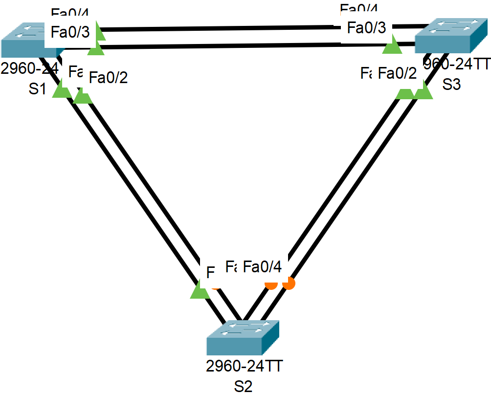

# Лабораторная работа. Развертывание коммутируемой сети с резервными каналами
### Дано:
###	Топология

###	Таблица адресации
|Устройство|Интерфейс|IP-адрес    |Маска подсети|
|----------|---------|------------|-------------|
|S1        |VLAN 1   |192.168.10.1|255.255.255.0|
|S2        |VLAN 1   |192.168.20.1|255.255.255.0|
|S3        |VLAN 1   |192.168.30.1|255.255.255.0|

### Задание:
1. [Часть 1. Создание сети и настройка основных параметров устройства.]()
2. [Часть 2. Выбор корневого моста.]()
3. [Часть 3. Наблюдение за процессом выбора протоколом STP порта, исходя из стоимости портов.]()
4. [Часть 4. Наблюдение за процессом выбора протоколом STP порта, исходя из приоритета портов.]()
5. Файлы Cisco Packet Tracer
   - [Основной файл домашнего задания](https://github.com/getmandv/Network_Engineer._Basic/blob/main/Home_work/Lab_07/pkt/lab_07.pkt)
## Часть 1:	Создание сети и настройка основных параметров устройства.
###  Шаг 1:	Создайте сеть согласно топологии.

###  Шаг 2:	Выполните инициализацию и перезагрузку коммутаторов.
Так как в нашем случае лабараторная работа выполняется в CPT процедура инициализации и перезагрузки смысла не имеет, так как коммутаторы условно "из коробки". Тем не менее, в случае использования реальных устройств потребовалось бы сделать следующее:
