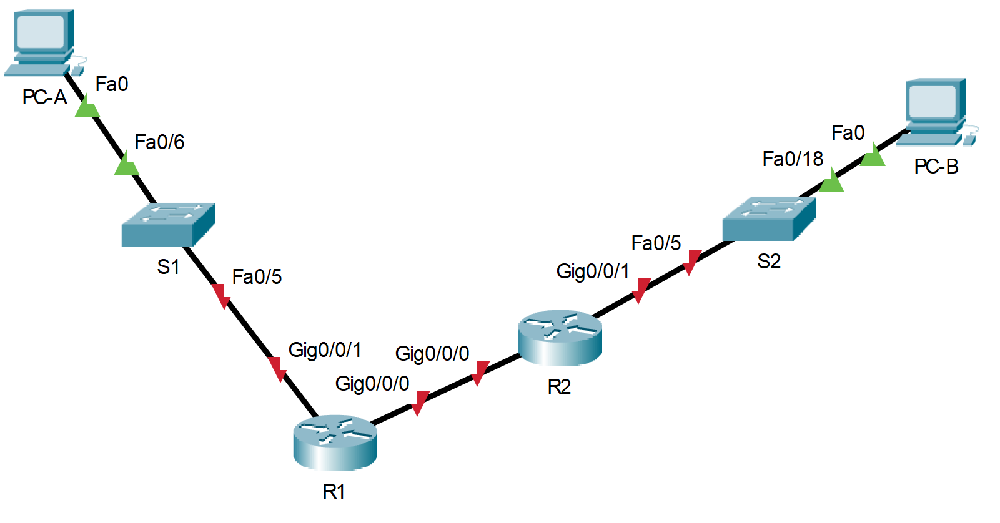
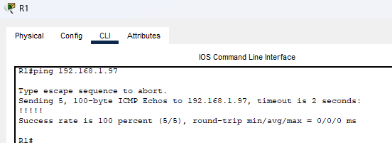
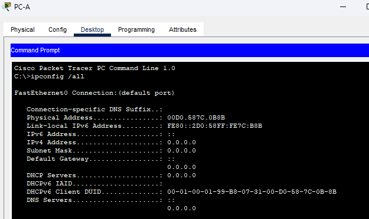
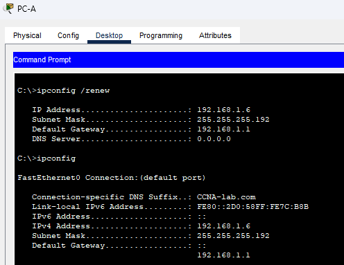
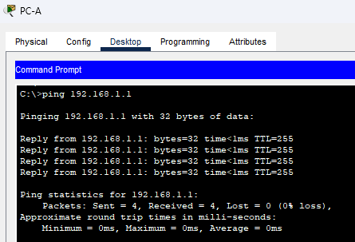
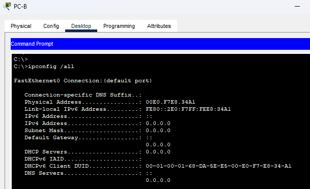
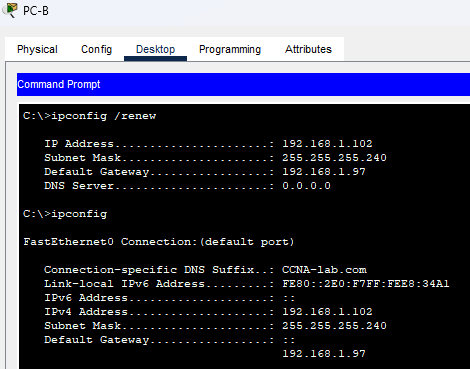
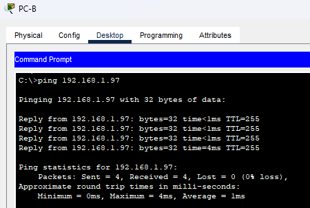

# Лабораторная работа - Реализация DHCPv4.
### Дано:
### Топология:

### 1.Таблица адресации:
|Устройство|Интерфейс  |IP-адрес    |Маска подсети  |Шлюз по умолчанию|
|----------|-----------|------------|---------------|-----------------|
|R1        |G0/0/0     |10.0.0.1    |255.255.255.252|-                |
|R1        |G0/0/1     |-           |-              |-                |
|R1        |G0/0/1.100 |192.168.1.1 |255.255.255.192|-                |
|R1        |G0/0/1.200 |192.168.1.65|255.255.255.224|-                |
|R1        |G0/0/1.1000|-           |-              |-                |
|R2        |G0/0       |10.0.0.2    |255.255.255.252|-                |
|R2        |G0/0/1     |192.168.1.97|255.255.255.240|                 |
|S1        |VLAN 200   |192.168.1.66|255.255.255.224|192.168.1.65     |
|S2        |VLAN 1     |192.168.1.98|255.255.255.240|192.168.1.97     |
|PC-A      |NIC        |DHCP        |DHCP           |DHCP             |
|PC-B      |NIC        |DHCP        |DHCP           |DHCP             |
### 2. Таблица VLAN:
|VLAN|Имя         |Назначенный интерфейс      |
|----|------------|---------------------------|
|1   |Нет         |S2: F0/18                  |
|100 |Клиенты     |S1: F0/6                   |
|200 |Управление  |S1: VLAN 200               |
|999 |Parking_Lot |S1: F0/1-4, F0/7-24, G0/1-2|
|1000|Собственная |-                          |
### Задание:
1. [Часть 1. Создание сети и настройка основных параметров устройства.](https://github.com/getmandv/Network_Engineer._Basic/blob/main/Home_work/Lab_08/DHCPv4/README.md#%D1%87%D0%B0%D1%81%D1%82%D1%8C-1%D1%81%D0%BE%D0%B7%D0%B4%D0%B0%D0%BD%D0%B8%D0%B5-%D1%81%D0%B5%D1%82%D0%B8-%D0%B8-%D0%BD%D0%B0%D1%81%D1%82%D1%80%D0%BE%D0%B9%D0%BA%D0%B0-%D0%BE%D1%81%D0%BD%D0%BE%D0%B2%D0%BD%D1%8B%D1%85-%D0%BF%D0%B0%D1%80%D0%B0%D0%BC%D0%B5%D1%82%D1%80%D0%BE%D0%B2-%D1%83%D1%81%D1%82%D1%80%D0%BE%D0%B9%D1%81%D1%82%D0%B2%D0%B0)
2. [Часть 2. Настройка и проверка двух серверов DHCPv4 на R1.](https://github.com/getmandv/Network_Engineer._Basic/blob/main/Home_work/Lab_08/DHCPv4/README.md#%D1%87%D0%B0%D1%81%D1%82%D1%8C-2%D0%BD%D0%B0%D1%81%D1%82%D1%80%D0%BE%D0%B9%D0%BA%D0%B0-%D0%B8-%D0%BF%D1%80%D0%BE%D0%B2%D0%B5%D1%80%D0%BA%D0%B0-%D0%B4%D0%B2%D1%83%D1%85-%D1%81%D0%B5%D1%80%D0%B2%D0%B5%D1%80%D0%BE%D0%B2-dhcpv4-%D0%BD%D0%B0-r1)
3. [Часть 3. Настройка и проверка DHCP-ретрансляции на R2.](https://github.com/getmandv/Network_Engineer._Basic/blob/main/Home_work/Lab_08/DHCPv4/README.md#%D1%87%D0%B0%D1%81%D1%82%D1%8C-3%D0%BD%D0%B0%D1%81%D1%82%D1%80%D0%BE%D0%B9%D0%BA%D0%B0-%D0%B8-%D0%BF%D1%80%D0%BE%D0%B2%D0%B5%D1%80%D0%BA%D0%B0-dhcp-%D1%80%D0%B5%D1%82%D1%80%D0%B0%D0%BD%D1%81%D0%BB%D1%8F%D1%86%D0%B8%D0%B8-%D0%BD%D0%B0-r2)
4. Файлы Cisco Packet Tracer
   - [Основной файл домашнего задания](https://github.com/getmandv/Network_Engineer._Basic/blob/main/Home_work/Lab_08/DHCPv4/pkt/lab_08.pkt)
## Часть 1.	Создание сети и настройка основных параметров устройства.
###  Шаг 1.	Создание схемы адресации.
Подсеть сети 192.168.1.0/24 в соответствии со следующими требованиями:
- a.	Одна подсеть «Подсеть A», поддерживающая 58 хостов (клиентская VLAN на R1).

Подсеть A: *192.168.1.0 255.255.255.192*

Запишите первый IP-адрес в таблице адресации для R1 G0/0/1.100: *192.168.1.1*
- b.	Одна подсеть «Подсеть B», поддерживающая 28 хостов (управляющая VLAN на R1).

Подсеть B: *192.168.1.64 255.255.255.224*

Запишите первый IP-адрес в таблице адресации для R1 G0/0/1.200: *192.168.1.65*

Запишите второй IP-адрес в таблице адресов для S1 VLAN 200: *192.168.1.66*

Введите соответствующий шлюз по умолчанию: 192.168.1.65
- c.	Одна подсеть «Подсеть C», поддерживающая 12 узлов (клиентская сеть на R2).

Подсеть C: *192.168.1.96 255.255.255.240*

Запишите первый IP-адрес в таблице адресации для R2 G0/0/1: *192.168.1.97*
### Шаг 2.	Создайте сеть согласно топологии.

### Шаг 3.	Произведите базовую настройку маршрутизаторов.
- a.	Назначьте маршрутизатору имя устройства.
- b.	Отключите поиск DNS, чтобы предотвратить попытки маршрутизатора неверно преобразовывать введенные команды таким образом, как будто они являются именами узлов.
- c.	Назначьте class в качестве зашифрованного пароля привилегированного режима EXEC.
- d.	Назначьте cisco в качестве пароля консоли и включите вход в систему по паролю.
- e.	Назначьте cisco в качестве пароля VTY и включите вход в систему по паролю.
- f.	Зашифруйте открытые пароли.
- g.	Создайте баннер с предупреждением о запрете несанкционированного доступа к устройству.
- h.	Сохраните текущую конфигурацию в файл загрузочной конфигурации.
- i.	Установите часы на маршрутизаторе на сегодняшнее время и дату
```
Router>en
Router#conf t
Enter configuration commands, one per line.  End with CNTL/Z.
Router(config)#hostname R1
R1(config)#no ip domain-lookup
R1(config)#enable secret class
R1(config)#line con 0
R1(config-line)#password cisco
R1(config-line)#login
R1(config-line)#exit
R1(config)#line vty 0 15
R1(config-line)#password cisco
R1(config-line)#login
R1(config-line)#exit
R1(config)#service password-encryption
R1(config)#banner motd #
Enter TEXT message.  End with the character '#'.
This is R1 router.
Authorized Users Only!#

R1(config)#exit
R1#
%SYS-5-CONFIG_I: Configured from console by console

R1#wr
Building configuration...
[OK]
R1#clock set 19:32:00 Mar 23 2026
R1#
```
*Данную настройку повторяем на маршрутизаторе R2.*
### Шаг 4.	Настройка маршрутизации между сетями VLAN на маршрутизаторе R1.
- a.	Активируйте интерфейс G0/0/1 на маршрутизаторе.
```
R1(config)#interface gigabitEthernet 0/0/1
R1(config-if)#no shutdown 

R1(config-if)#
%LINK-5-CHANGED: Interface GigabitEthernet0/0/1, changed state to up

%LINEPROTO-5-UPDOWN: Line protocol on Interface GigabitEthernet0/0/1, changed state to up

R1(config-if)#
```
- b.	Настройте подинтерфейсы для каждой VLAN в соответствии с требованиями таблицы IP-адресации. Все субинтерфейсы используют инкапсуляцию 802.1Q и назначаются первый полезный адрес из вычисленного пула IP-адресов. Убедитесь, что подинтерфейсу для native VLAN не назначен IP-адрес. Включите описание для каждого подинтерфейса.
```
R1(config)#interface gigabitEthernet 0/0/1.100
R1(config-subif)#
%LINK-5-CHANGED: Interface GigabitEthernet0/0/1.100, changed state to up

%LINEPROTO-5-UPDOWN: Line protocol on Interface GigabitEthernet0/0/1.100, changed state to up

R1(config-subif)#description Clients
R1(config-subif)#encapsulation dot1Q 100
R1(config-subif)#ip address 192.168.1.1 255.255.255.192
R1(config-subif)#exit
R1(config)#interface GigabitEthernet0/0/1.200
R1(config-subif)#
%LINK-5-CHANGED: Interface GigabitEthernet0/0/1.200, changed state to up

%LINEPROTO-5-UPDOWN: Line protocol on Interface GigabitEthernet0/0/1.200, changed state to up

R1(config-subif)#description Management
R1(config-subif)#encapsulation dot1Q 200
R1(config-subif)#ip address 192.168.1.65 255.255.255.224
R1(config-subif)#exit
R1(config)#interface GigabitEthernet0/0/1.1000
R1(config-subif)#
%LINK-5-CHANGED: Interface GigabitEthernet0/0/1.1000, changed state to up

%LINEPROTO-5-UPDOWN: Line protocol on Interface GigabitEthernet0/0/1.1000, changed state to up

R1(config-subif)#description Native
R1(config-subif)#encapsulation dot1Q 1000 native
R1(config-subif)#no ip address
R1(config-subif)#
```
- c.	Убедитесь, что вспомогательные интерфейсы работают.
```
R1#show ip interface brief 
Interface              IP-Address      OK? Method Status                Protocol 
GigabitEthernet0/0/1   unassigned      YES unset  up                    up 
GigabitEthernet0/0/1.100192.168.1.1     YES manual up                    up 
GigabitEthernet0/0/1.200192.168.1.65    YES manual up                    up 
GigabitEthernet0/0/1.1000unassigned      YES unset  up                    up 
Vlan1                  unassigned      YES unset  administratively down down
R1#
```
### Шаг 5.	Настройте G0/1 на R2, затем G0/0/0 и статическую маршрутизацию для обоих маршрутизаторов.
- a.	Настройте G0/0/1 на R2 с первым IP-адресом подсети C, рассчитанным ранее.
*Перед пунктами этого ашга хотелось бы оговориться что помимо настроек указанных в шагах, потребуется ещё непосредственно включить интерфейсы g0/0/0 и g0/0/1, так как они выключены из коробки, по этому в настройках портов добавлена команда "no shutdown".
```
R2(config)#interface gigabitEthernet 0/0/1
R2(config-if)#ip address 192.168.1.97 255.255.255.240
R2(config-if)#no shutdown 

R2(config-if)#
%LINK-5-CHANGED: Interface GigabitEthernet0/0/1, changed state to up

%LINEPROTO-5-UPDOWN: Line protocol on Interface GigabitEthernet0/0/1, changed state to up

R2(config-if)#
```
- b.	Настройте интерфейс G0/0/0 для каждого маршрутизатора на основе приведенной выше таблицы IP-адресации.

*Маршрутизатор R1*
```
R1(config)#interface gigabitEthernet 0/0/0
R1(config-if)#ip address 10.0.0.1 255.255.255.252
R1(config-if)#no shutdown 

R1(config-if)#
%LINK-5-CHANGED: Interface GigabitEthernet0/0/0, changed state to up

R1(config-if)#
```
*Маршрутизатор R2*
```
R2(config)#interface gigabitEthernet 0/0/0
R2(config-if)#ip address 10.0.0.2 255.255.255.252
R2(config-if)#no shutdown 

R2(config-if)#
%LINK-5-CHANGED: Interface GigabitEthernet0/0/0, changed state to up

%LINEPROTO-5-UPDOWN: Line protocol on Interface GigabitEthernet0/0/0, changed state to up

R2(config-if)#
```
- c.	Настройте маршрут по умолчанию на каждом маршрутизаторе, указываемом на IP-адрес G0/0/0 на другом маршрутизаторе.

*Маршрутизатор R1*
```
R1(config)#ip route 0.0.0.0 0.0.0.0 10.0.0.2
R1(config)#
```
*Маршрутизатор R2*
```
R2(config)#ip route 0.0.0.0 0.0.0.0 10.0.0.1
R2(config)#
```
- d.	Убедитесь, что статическая маршрутизация работает с помощью пинга до адреса G0/0/1 R2 от R1.

- e.	Сохраните текущую конфигурацию в файл загрузочной конфигурации.

*Маршрутизатор R1*
```
R1#wr
Building configuration...
[OK]
R1#
```
*Маршрутизатор R2*
```
R2#wr
Building configuration...
[OK]
R2#
```
### Шаг 6.	Настройте базовые параметры каждого коммутатора.
- a.	Присвойте коммутатору имя устройства.
- b.	Отключите поиск DNS, чтобы предотвратить попытки маршрутизатора неверно преобразовывать введенные команды таким образом, как будто они являются именами узлов.
- c.	Назначьте class в качестве зашифрованного пароля привилегированного режима EXEC.
- d.	Назначьте cisco в качестве пароля консоли и включите вход в систему по паролю.
- e.	Назначьте cisco в качестве пароля VTY и включите вход в систему по паролю.
- f.	Зашифруйте открытые пароли.
- g.	Создайте баннер с предупреждением о запрете несанкционированного доступа к устройству.
- h.	Сохраните текущую конфигурацию в файл загрузочной конфигурации.
- i.	Установите часы на маршрутизаторе на сегодняшнее время и дату.
- j.	Скопируйте текущую конфигурацию в файл загрузочной конфигурации.

```
Switch>
Switch>en
Switch#conf t
Enter configuration commands, one per line.  End with CNTL/Z.
Switch(config)#hostname S1
S1(config)#no ip domain-lookup
S1(config)#enable secret class
S1(config)#line con 0
S1(config-line)#password cisco
S1(config-line)#login
S1(config-line)#exit
S1(config)#line vty 0 15
S1(config-line)#password cisco
S1(config-line)#login
S1(config-line)#exit
S1(config)#service password-encryption
S1(config)#banner motd #
Enter TEXT message.  End with the character '#'.
This is S1 switch.
Authorized Users Only!#

S1(config)#end
S1#
%SYS-5-CONFIG_I: Configured from console by console

S1#wr
Building configuration...
[OK]
S1#clock set 18:58:00 Mar 24 2026
S1#
```
*Данную настройку повторяем на коммутаторе S2.*
### Шаг 7.	Создайте сети VLAN на коммутаторе S1.
- a.	Создайте необходимые VLAN на коммутаторе 1 и присвойте им имена из приведенной выше таблицы.
```
S1(config)#vlan 100
S1(config-vlan)#name Clients
S1(config-vlan)#exit
S1(config)#vlan 200
S1(config-vlan)#name Management
S1(config-vlan)#exit
S1(config)#vlan 999
S1(config-vlan)#name Parking_Lot
S1(config-vlan)#exit
S1(config)#vlan 1000
S1(config-vlan)#name Native
S1(config-vlan)#
```
- b.	Настройте и активируйте интерфейс управления на S1 (VLAN 200), используя второй IP-адрес из подсети, рассчитанный ранее. Кроме того установите шлюз по умолчанию на S1.
```
S1(config)#interface vlan 200
S1(config-if)#

%LINK-5-CHANGED: Interface Vlan200, changed state to up

S1(config-if)#ip address 192.168.1.66 255.255.255.224
S1(config-if)#exit
S1(config)#ip default-gateway 192.168.1.65
S1(config)#
```
- c.	Настройте и активируйте интерфейс управления на S2 (VLAN 1), используя второй IP-адрес из подсети, рассчитанный ранее. Кроме того, установите шлюз по умолчанию на S2.

*Судя по всему в предыдущих шагах был пропущен пункт о необходимости записать вышев ведённые данные в таблицу машрутизации, так что добавим эту запись.*
```
S2(config)#interface vlan 1
S2(config-if)#ip address 192.168.1.98 255.255.255.240
S2(config-if)#exit
S2(config)#ip default-gateway 192.168.1.97
S2(config)#
```
- d.	Назначьте все неиспользуемые порты S1 VLAN Parking_Lot, настройте их для статического режима доступа и административно деактивируйте их. На S2 административно деактивируйте все неиспользуемые порты.
*Коммутатор S1*
```
S1(config)#interface range fastEthernet 0/1-4, fastEthernet 0/7-24, gigabitEthernet 0/1-2
S1(config-if-range)#switchport access vlan 999
S1(config-if-range)#switchport mode access
S1(config-if-range)#shutdown 

%LINK-5-CHANGED: Interface FastEthernet0/1, changed state to administratively down

%LINK-5-CHANGED: Interface FastEthernet0/2, changed state to administratively down

%LINK-5-CHANGED: Interface FastEthernet0/3, changed state to administratively down

%LINK-5-CHANGED: Interface FastEthernet0/4, changed state to administratively down

%LINK-5-CHANGED: Interface FastEthernet0/7, changed state to administratively down

%LINK-5-CHANGED: Interface FastEthernet0/8, changed state to administratively down

%LINK-5-CHANGED: Interface FastEthernet0/9, changed state to administratively down

%LINK-5-CHANGED: Interface FastEthernet0/10, changed state to administratively down

%LINK-5-CHANGED: Interface FastEthernet0/11, changed state to administratively down

%LINK-5-CHANGED: Interface FastEthernet0/12, changed state to administratively down

%LINK-5-CHANGED: Interface FastEthernet0/13, changed state to administratively down

%LINK-5-CHANGED: Interface FastEthernet0/14, changed state to administratively down

%LINK-5-CHANGED: Interface FastEthernet0/15, changed state to administratively down

%LINK-5-CHANGED: Interface FastEthernet0/16, changed state to administratively down

%LINK-5-CHANGED: Interface FastEthernet0/17, changed state to administratively down

%LINK-5-CHANGED: Interface FastEthernet0/18, changed state to administratively down

%LINK-5-CHANGED: Interface FastEthernet0/19, changed state to administratively down

%LINK-5-CHANGED: Interface FastEthernet0/20, changed state to administratively down

%LINK-5-CHANGED: Interface FastEthernet0/21, changed state to administratively down

%LINK-5-CHANGED: Interface FastEthernet0/22, changed state to administratively down

%LINK-5-CHANGED: Interface FastEthernet0/23, changed state to administratively down

%LINK-5-CHANGED: Interface FastEthernet0/24, changed state to administratively down

%LINK-5-CHANGED: Interface GigabitEthernet0/1, changed state to administratively down

%LINK-5-CHANGED: Interface GigabitEthernet0/2, changed state to administratively down
S1(config-if-range)#
```
*Коммутатор S2*
```
S2(config)#interface range fastEthernet 0/1-4, fastEthernet 0/6-17, fastEthernet 0/19-24, gigabitEthernet 0/1-2
S2(config-if-range)#shutdown 

%LINK-5-CHANGED: Interface FastEthernet0/1, changed state to administratively down

%LINK-5-CHANGED: Interface FastEthernet0/2, changed state to administratively down

%LINK-5-CHANGED: Interface FastEthernet0/3, changed state to administratively down

%LINK-5-CHANGED: Interface FastEthernet0/4, changed state to administratively down

%LINK-5-CHANGED: Interface FastEthernet0/6, changed state to administratively down

%LINK-5-CHANGED: Interface FastEthernet0/7, changed state to administratively down

%LINK-5-CHANGED: Interface FastEthernet0/8, changed state to administratively down

%LINK-5-CHANGED: Interface FastEthernet0/9, changed state to administratively down

%LINK-5-CHANGED: Interface FastEthernet0/10, changed state to administratively down

%LINK-5-CHANGED: Interface FastEthernet0/11, changed state to administratively down

%LINK-5-CHANGED: Interface FastEthernet0/12, changed state to administratively down

%LINK-5-CHANGED: Interface FastEthernet0/13, changed state to administratively down

%LINK-5-CHANGED: Interface FastEthernet0/14, changed state to administratively down

%LINK-5-CHANGED: Interface FastEthernet0/15, changed state to administratively down

%LINK-5-CHANGED: Interface FastEthernet0/16, changed state to administratively down

%LINK-5-CHANGED: Interface FastEthernet0/17, changed state to administratively down

%LINK-5-CHANGED: Interface FastEthernet0/19, changed state to administratively down

%LINK-5-CHANGED: Interface FastEthernet0/20, changed state to administratively down

%LINK-5-CHANGED: Interface FastEthernet0/21, changed state to administratively down

%LINK-5-CHANGED: Interface FastEthernet0/22, changed state to administratively down

%LINK-5-CHANGED: Interface FastEthernet0/23, changed state to administratively down

%LINK-5-CHANGED: Interface FastEthernet0/24, changed state to administratively down

%LINK-5-CHANGED: Interface GigabitEthernet0/1, changed state to administratively down

%LINK-5-CHANGED: Interface GigabitEthernet0/2, changed state to administratively down
S2(config-if-range)#
```
### Шаг 8.	Назначьте сети VLAN соответствующим интерфейсам коммутатора.
- a.	Назначьте используемые порты соответствующей VLAN (указанной в таблице VLAN выше) и настройте их для режима статического доступа.
*Коммутатор S1*
```
S1(config)#interface fastEthernet 0/6
S1(config-if)#switchport access vlan 100
S1(config-if)#switchport mode access 
S1(config-if)#switchport nonegotiate
S1(config-if)#
```
*Коммутатор S2 - настроек не требуется.*
- b.	Убедитесь, что VLAN назначены на правильные интерфейсы.
*Коммутатор S1*
```
S1#show vlan brief 

VLAN Name                             Status    Ports
---- -------------------------------- --------- -------------------------------
1    default                          active    Fa0/5
100  Clients                          active    Fa0/6
200  Management                       active    
999  Parking_Lot                      active    Fa0/1, Fa0/2, Fa0/3, Fa0/4
                                                Fa0/7, Fa0/8, Fa0/9, Fa0/10
                                                Fa0/11, Fa0/12, Fa0/13, Fa0/14
                                                Fa0/15, Fa0/16, Fa0/17, Fa0/18
                                                Fa0/19, Fa0/20, Fa0/21, Fa0/22
                                                Fa0/23, Fa0/24, Gig0/1, Gig0/2
1000 Native                           active    
1002 fddi-default                     active    
1003 token-ring-default               active    
1004 fddinet-default                  active    
1005 trnet-default                    active    
S1#
```
*Коммутатор S2*
```
S2#show vlan brief 

VLAN Name                             Status    Ports
---- -------------------------------- --------- -------------------------------
1    default                          active    Fa0/1, Fa0/2, Fa0/3, Fa0/4
                                                Fa0/5, Fa0/6, Fa0/7, Fa0/8
                                                Fa0/9, Fa0/10, Fa0/11, Fa0/12
                                                Fa0/13, Fa0/14, Fa0/15, Fa0/16
                                                Fa0/17, Fa0/18, Fa0/19, Fa0/20
                                                Fa0/21, Fa0/22, Fa0/23, Fa0/24
                                                Gig0/1, Gig0/2
1002 fddi-default                     active    
1003 token-ring-default               active    
1004 fddinet-default                  active    
1005 trnet-default                    active    
S2#
```
- Почему интерфейс F0/5 указан в VLAN 1?

*Для интерфейса F0/5 ещё не производилось настроек ни на одном коммутаторе.*
### Шаг 9.	Вручную настройте интерфейс S1 F0/5 в качестве транка 802.1Q.
- a.	Измените режим порта коммутатора, чтобы принудительно создать магистральный канал.
- b.	В рамках конфигурации транка  установите для native  VLAN значение 1000.
- c.	В качестве другой части конфигурации магистрали укажите, что VLAN 100, 200 и 1000 могут проходить по транку.
- d.	Сохраните текущую конфигурацию в файл загрузочной конфигурации.
```
S1(config)#interface fastEthernet 0/5
S1(config-if)#switchport mode trunk

S1(config-if)#
%LINEPROTO-5-UPDOWN: Line protocol on Interface FastEthernet0/5, changed state to down

%LINEPROTO-5-UPDOWN: Line protocol on Interface FastEthernet0/5, changed state to up

%LINEPROTO-5-UPDOWN: Line protocol on Interface Vlan200, changed state to up

S1(config-if)#switchport trunk native vlan 1000
S1(config-if)#switchport trunk allowed vlan 100,200,1000
S1(config-if)#switchport nonegotiate
S1(config-if)#end
S1#
%SYS-5-CONFIG_I: Configured from console by console

S1#wr
Building configuration...
[OK]
S1#
```
- e.	Проверьте состояние транка.
```
S1#show interfaces trunk
Port        Mode         Encapsulation  Status        Native vlan
Fa0/5       on           802.1q         trunking      1000

Port        Vlans allowed on trunk
Fa0/5       100,200,1000

Port        Vlans allowed and active in management domain
Fa0/5       100,200,1000

Port        Vlans in spanning tree forwarding state and not pruned
Fa0/5       100,200,1000

S1#
```
- Какой IP-адрес был бы у ПК, если бы он был подключен к сети с помощью DHCP?

*IP-адрес полученный от DHCP сервера.*
## Часть 2.	Настройка и проверка двух серверов DHCPv4 на R1.
### Шаг 1.	Настройте R1 с пулами DHCPv4 для двух поддерживаемых подсетей. Ниже приведен только пул DHCP для подсети A.
- a.	Исключите первые пять используемых адресов из каждого пула адресов.
- b.	Создайте пул DHCP (используйте уникальное имя для каждого пула).
- c.	Укажите сеть, поддерживающую этот DHCP-сервер.
- d.	В качестве имени домена укажите CCNA-lab.com.
- e.	Настройте соответствующий шлюз по умолчанию для каждого пула DHCP.
```
R1(config)#ip dhcp excluded-address 192.168.1.1 192.168.1.5
R1(config)#ip dhcp excluded-address 192.168.1.97 192.168.1.101
R1(config)#ip dhcp pool Subnet_A
R1(dhcp-config)#network 192.168.1.0 255.255.255.192
R1(dhcp-config)#domain-name CCNA-lab.com
R1(dhcp-config)#default-router 192.168.1.1
R1(dhcp-config)#
```
- f.	Настройте время аренды на 2 дня 12 часов и 30 минут.
 
*В предоставленной версии CPT маршрутизатор "не знает" о команде lease. Тем не менее, настройка аренды выглядила бы следующим образом "lease 2 12 30".*
- g.	Затем настройте второй пул DHCPv4, используя имя пула R2_Client_LAN и вычислите сеть, маршрутизатор по умолчанию, и используйте то же имя домена и время аренды, что и предыдущий пул DHCP.
```
R1(config)#ip dhcp pool R2_Client_LAN
R1(dhcp-config)#net
R1(dhcp-config)#network 192.168.1.96 255.255.255.240
R1(dhcp-config)#domain-name CCNA-lab.com
R1(dhcp-config)#default-router 192.168.1.97
R1(dhcp-config)#
```
### Шаг 2.	Сохраните конфигурацию.
```
R1#wr
Building configuration...
[OK]
R1#
```
### Шаг 3.	Проверка конфигурации сервера DHCPv4.
- a.	Чтобы просмотреть сведения о пуле, выполните команду show ip dhcp pool.
```
R1#show ip dhcp pool 

Pool Subnet_A :
 Utilization mark (high/low)    : 100 / 0
 Subnet size (first/next)       : 0 / 0 
 Total addresses                : 62
 Leased addresses               : 0
 Excluded addresses             : 2
 Pending event                  : none

 1 subnet is currently in the pool
 Current index        IP address range                    Leased/Excluded/Total
 192.168.1.1          192.168.1.1      - 192.168.1.62      0    / 2     / 62

Pool R2_Client_LAN :
 Utilization mark (high/low)    : 100 / 0
 Subnet size (first/next)       : 0 / 0 
 Total addresses                : 14
 Leased addresses               : 0
 Excluded addresses             : 2
 Pending event                  : none

 1 subnet is currently in the pool
 Current index        IP address range                    Leased/Excluded/Total
 192.168.1.97         192.168.1.97     - 192.168.1.110     0    / 2     / 14
R1#
```
- b.	Выполните команду show ip dhcp bindings для проверки установленных назначений адресов DHCP.
```
R1#show ip dhcp binding
IP address       Client-ID/              Lease expiration        Type
                 Hardware address
R1#
```
- c.	Выполните команду show ip dhcp server statistics для проверки сообщений DHCP.

*В предоставленной версии CPT маршрутизатор "не знает" о команде "show ip dhcp server statistics".*
### Шаг 4.	Попытка получить IP-адрес от DHCP на PC-A.
- a.	Из командной строки компьютера PC-A выполните команду ipconfig /all.

- b.	После завершения процесса обновления выполните команду ipconfig для просмотра новой информации об IP-адресе.

*Что бы инициировать процесс получения IP-адреса предварительно выполняю команду "ipconfig /renew", уже после которой выполняю команду "ipconfig".*



- c.	Проверьте подключение с помощью пинга IP-адреса интерфейса R0 G0/0/1.

*В методичке опечатка, речь идёт о R1, а не о R0.*


## Часть 3.	Настройка и проверка DHCP-ретрансляции на R2.
### Шаг 1.	Настройка R2 в качестве агента DHCP-ретрансляции для локальной сети на G0/0/1.
- a.	Настройте команду ip helper-address на G0/0/1, указав IP-адрес G0/0/0 R1.
```
R2(config)#interface gigabitEthernet 0/0/1
R2(config-if)#ip helper-address 10.0.0.1
R2(config-if)#
```
- b.	Сохраните конфигурацию.
```
R2#wr
Building configuration...
[OK]
R2#
```
### Шаг 2.	Попытка получить IP-адрес от DHCP на PC-B.
- a.	Из командной строки компьютера PC-B выполните команду ipconfig /all.



- b.	После завершения процесса обновления выполните команду ipconfig для просмотра новой информации об IP-адресе.



- c.	Проверьте подключение с помощью пинга IP-адреса интерфейса R2 G0/0/1.



- d.	Выполните show ip dhcp binding для R1 для проверки назначений адресов в DHCP.
```
R1#show ip dhcp binding
IP address       Client-ID/              Lease expiration        Type
                 Hardware address
192.168.1.6      00D0.587C.0B8B           --                     Automatic
192.168.1.102    00E0.F7E8.34A1           --                     Automatic
R1#
```
- e.	Выполните команду show ip dhcp server statistics для проверки сообщений DHCP.

*В предоставленной версии CPT маршрутизатор "не знает" о команде "show ip dhcp server statistics".*
