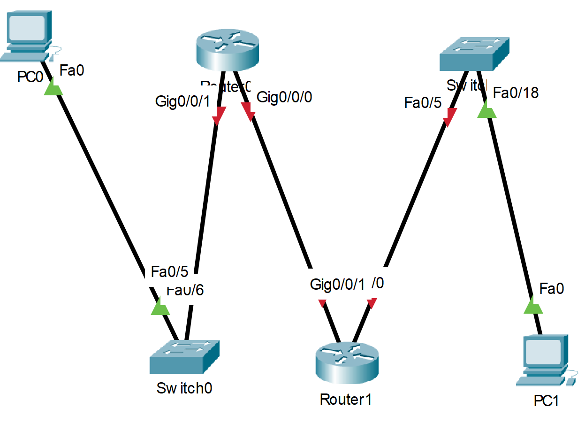

# Лабраторная работа - Настройка DHCPv6.
### Дано:
### Топология:

### Таблица адресации:
|Устройство|Интерфейс|IPv6-адрес           |
|----------|---------|---------------------|
|R1        |G0/0/0   |2001:db8:acad:2::1/64|
|R1        |G0/0/0   |fe80::1              |
|R1        |G0/0/1   |2001:db8:acad:1::1/64|
|R1        |G0/0/1   |fe80::1              |
|R2        |G0/0/0   |2001:db8:acad:2::2/64|
|R2        |G0/0/0   |fe80::2              |
|R2        |G0/0/1   |2001:db8:acad:3::1/64|
|R2        |G0/0/1   |fe80::2              |
|PC-A      |NIC      |DHCP                 |
|PC-B      |NIC      |DHCP                 |

### Задание:
1. [Часть 1. Создание сети и настройка основных параметров устройства.]()
2. [Часть 2. Проверка назначения адреса SLAAC от R1.]()
3. [Часть 3. Настройка и проверка сервера DHCPv6 без гражданства на R1.]()
4. [Часть 4. Настройка и проверка состояния DHCPv6 сервера на R1.]()
5. [Часть 5. Настройка и проверка DHCPv6 Relay на R2.]()
6. Файлы Cisco Packet Tracer
   - [Основной файл домашнего задания](https://github.com/getmandv/Network_Engineer._Basic/blob/main/Home_work/Lab_07/pkt/lab_07.pkt)
## Часть 1. Создание сети и настройка основных параметров устройства.
###  Шаг 1:	Создайте сеть согласно топологии.

### Шаг 2. Настройте базовые параметры каждого коммутатора. (необязательно)
a.	Присвойте коммутатору имя устройства.

b.	Отключите поиск DNS, чтобы предотвратить попытки маршрутизатора неверно преобразовывать введенные команды таким образом, как будто они являются именами узлов.

c.	Назначьте class в качестве зашифрованного пароля привилегированного режима EXEC.

d.	Назначьте cisco в качестве пароля консоли и включите вход в систему по паролю.

e.	Назначьте cisco в качестве пароля VTY и включите вход в систему по паролю.

f.	Зашифруйте открытые пароли.

g.	Создайте баннер с предупреждением о запрете несанкционированного доступа к устройству.

h.	Отключите все неиспользуемые порты.

i.	Сохраните текущую конфигурацию в файл загрузочной конфигурации.
```
Switch>en
Switch#conf t
Enter configuration commands, one per line.  End with CNTL/Z.
Switch(config)#hostname S1
S1(config)#no ip domain-lookup
S1(config)#enable secret class
S1(config)#line con 0
S1(config-line)#password cisco
S1(config-line)#login
S1(config-line)#exit
S1(config)#line vty 0 15
S1(config-line)#password cisco
S1(config-line)#login
S1(config-line)#exit
S1(config)#service password-encryption
S1(config)#banner motd #
Enter TEXT message.  End with the character '#'.
This is S1 switch.
Authorized Users Only!#

S1(config)#interface range fastEthernet 0/1-04, fastEthernet 0/7-24, gigabitEthernet 0/1-2
S1(config-if-range)#shutdown

%LINK-5-CHANGED: Interface FastEthernet0/1, changed state to administratively down

%LINK-5-CHANGED: Interface FastEthernet0/2, changed state to administratively down

%LINK-5-CHANGED: Interface FastEthernet0/3, changed state to administratively down

%LINK-5-CHANGED: Interface FastEthernet0/4, changed state to administratively down

%LINK-5-CHANGED: Interface FastEthernet0/7, changed state to administratively down

%LINK-5-CHANGED: Interface FastEthernet0/8, changed state to administratively down

%LINK-5-CHANGED: Interface FastEthernet0/9, changed state to administratively down

%LINK-5-CHANGED: Interface FastEthernet0/10, changed state to administratively down

%LINK-5-CHANGED: Interface FastEthernet0/11, changed state to administratively down

%LINK-5-CHANGED: Interface FastEthernet0/12, changed state to administratively down

%LINK-5-CHANGED: Interface FastEthernet0/13, changed state to administratively down

%LINK-5-CHANGED: Interface FastEthernet0/14, changed state to administratively down

%LINK-5-CHANGED: Interface FastEthernet0/15, changed state to administratively down

%LINK-5-CHANGED: Interface FastEthernet0/16, changed state to administratively down

%LINK-5-CHANGED: Interface FastEthernet0/17, changed state to administratively down

%LINK-5-CHANGED: Interface FastEthernet0/18, changed state to administratively down

%LINK-5-CHANGED: Interface FastEthernet0/19, changed state to administratively down

%LINK-5-CHANGED: Interface FastEthernet0/20, changed state to administratively down

%LINK-5-CHANGED: Interface FastEthernet0/21, changed state to administratively down

%LINK-5-CHANGED: Interface FastEthernet0/22, changed state to administratively down

%LINK-5-CHANGED: Interface FastEthernet0/23, changed state to administratively down

%LINK-5-CHANGED: Interface FastEthernet0/24, changed state to administratively down

%LINK-5-CHANGED: Interface GigabitEthernet0/1, changed state to administratively down

%LINK-5-CHANGED: Interface GigabitEthernet0/2, changed state to administratively down
S1(config-if-range)#exit
S1(config)#exit
S1#
%SYS-5-CONFIG_I: Configured from console by console

S1#wr
Building configuration...
[OK]
S1#
```
Данную настройку повторяем на коммутаторе S2, с учётом изменившихся портов для отключения согластно пункта i.
### Шаг 3. Произведите базовую настройку маршрутизаторов.
a.	Назначьте маршрутизатору имя устройства.

b.	Отключите поиск DNS, чтобы предотвратить попытки маршрутизатора неверно преобразовывать введенные команды таким образом, как будто они являются именами узлов.

c.	Назначьте class в качестве зашифрованного пароля привилегированного режима EXEC.

d.	Назначьте cisco в качестве пароля консоли и включите вход в систему по паролю.

e.	Назначьте cisco в качестве пароля VTY и включите вход в систему по паролю.

f.	Зашифруйте открытые пароли.

g.	Создайте баннер с предупреждением о запрете несанкционированного доступа к устройству.

h.	Активация IPv6-маршрутизации

i.	Сохраните текущую конфигурацию в файл загрузочной конфигурации.
