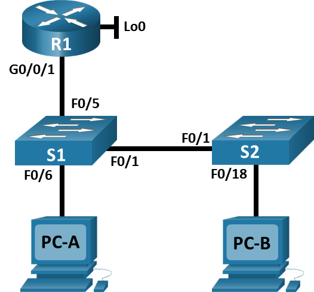
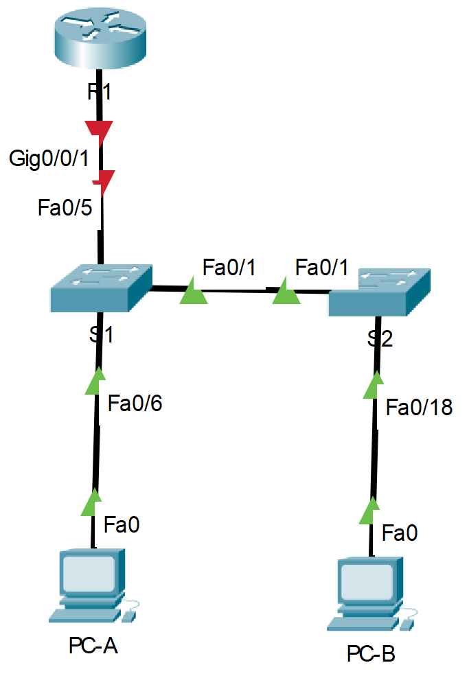
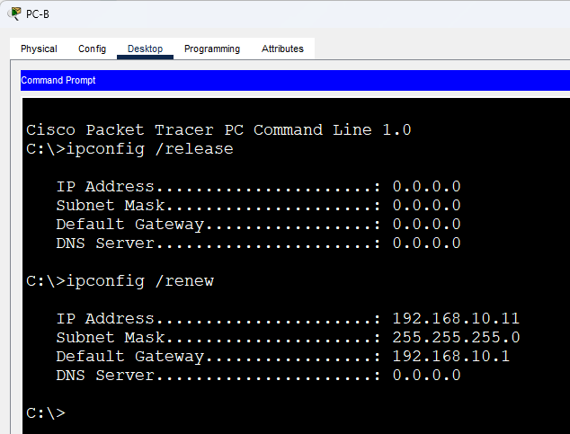
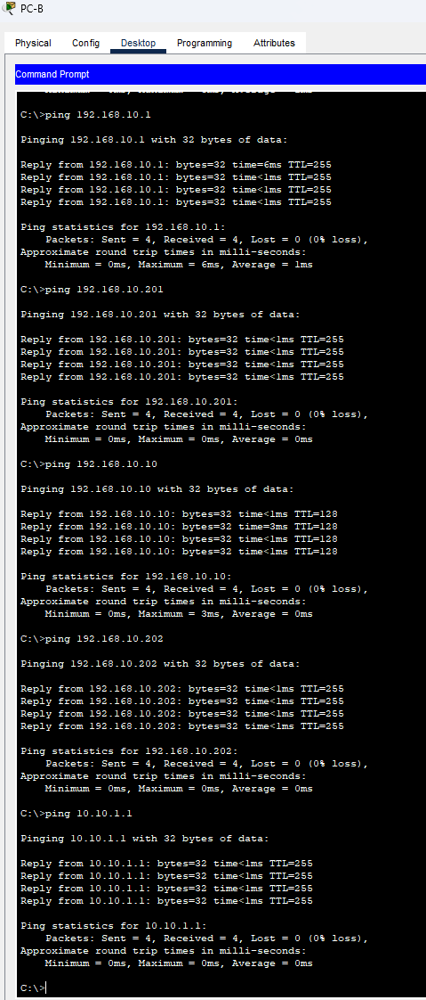

# Лабораторная работа - Конфигурация безопасности коммутатора.
### Дано:
###	Топология

###	Таблица адресации
|Устройство|interface/vlan|IP-адрес      |Маска подсети|
|----------|--------------|--------------|-------------|
|R1        |G0/0/1        |192.168.10.1  |255.255.255.0|
|R1        |Loopback 0    |10.10.1.1     |255.255.255.0|
|S1        |VLAN 10       |192.168.10.201|255.255.255.0|
|S2        |VLAN 10       |192.168.10.202|255.255.255.0|
|PC-A      |NIC           |DHCP          |255.255.255.0|
|PC-B      |NIC           |DHCP          |255.255.255.0|
### Задание:
1. [Часть 1. Настройка основного сетевого устройства.](https://github.com/getmandv/Network_Engineer._Basic/blob/main/Home_work/Lab_09/README.md#%D1%87%D0%B0%D1%81%D1%82%D1%8C-1-%D0%BD%D0%B0%D1%81%D1%82%D1%80%D0%BE%D0%B9%D0%BA%D0%B0-%D0%BE%D1%81%D0%BD%D0%BE%D0%B2%D0%BD%D0%BE%D0%B3%D0%BE-%D1%81%D0%B5%D1%82%D0%B5%D0%B2%D0%BE%D0%B3%D0%BE-%D1%83%D1%81%D1%82%D1%80%D0%BE%D0%B9%D1%81%D1%82%D0%B2%D0%B0)
2. [Часть 2. Настройка сетей VLAN.](https://github.com/getmandv/Network_Engineer._Basic/blob/main/Home_work/Lab_09/README.md#%D1%87%D0%B0%D1%81%D1%82%D1%8C-2-%D0%BD%D0%B0%D1%81%D1%82%D1%80%D0%BE%D0%B9%D0%BA%D0%B0-%D1%81%D0%B5%D1%82%D0%B5%D0%B9-vlan-%D0%BD%D0%B0-%D0%BA%D0%BE%D0%BC%D0%BC%D1%83%D1%82%D0%B0%D1%82%D0%BE%D1%80%D0%B0%D1%85)
3. [Часть 3: Настройки безопасности коммутатора.](https://github.com/getmandv/Network_Engineer._Basic/blob/main/Home_work/Lab_09/README.md#%D1%87%D0%B0%D1%81%D1%82%D1%8C-3-%D0%BD%D0%B0%D1%81%D1%82%D1%80%D0%BE%D0%B9%D0%BA%D0%B8-%D0%B1%D0%B5%D0%B7%D0%BE%D0%BF%D0%B0%D1%81%D0%BD%D0%BE%D1%81%D1%82%D0%B8-%D0%BA%D0%BE%D0%BC%D0%BC%D1%83%D1%82%D0%B0%D1%82%D0%BE%D1%80%D0%B0)
4. [Вопросы для повторения](https://github.com/getmandv/Network_Engineer._Basic/blob/main/Home_work/Lab_09/README.md#%D0%B2%D0%BE%D0%BF%D1%80%D0%BE%D1%81%D1%8B-%D0%B4%D0%BB%D1%8F-%D0%BF%D0%BE%D0%B2%D1%82%D0%BE%D1%80%D0%B5%D0%BD%D0%B8%D1%8F)
5. Файлы Cisco Packet Tracer
   - [Основной файл домашнего задания](https://github.com/getmandv/Network_Engineer._Basic/blob/main/Home_work/Lab_09/pkt/lab_09.pkt)
## Часть 1. Настройка основного сетевого устройства
###  Шаг 1. Создайте сеть.
- a.	Создайте сеть согласно топологии.



- b.	Инициализация устройств

*Устройства "из корробки", инициализация не требуется.*
### Шаг 2. Настройте маршрутизатор R1.
- a.	Загрузите следующий конфигурационный скрипт на R1.

*Я опасался что какая то из команд в скрипте может не поддерживаться CPT, и для собственного большего понимания происходящего я грузил скрипт построчно.*
```
Router>enable
Router#configure terminal
Enter configuration commands, one per line.  End with CNTL/Z.
Router(config)#hostname R1
R1(config)#no ip domain lookup
R1(config)#ip dhcp excluded-address 192.168.10.1 192.168.10.9
R1(config)#ip dhcp excluded-address 192.168.10.201 192.168.10.202
R1(config)#ip dhcp relay information trust-all
R1(config)#ip dhcp pool Students
R1(dhcp-config)#network 192.168.10.0 255.255.255.0
R1(dhcp-config)#default-router 192.168.10.1
R1(dhcp-config)#domain-name CCNA2.Lab-11.6.1
R1(dhcp-config)#interface Loopback0

R1(config-if)#
%LINK-5-CHANGED: Interface Loopback0, changed state to up

%LINEPROTO-5-UPDOWN: Line protocol on Interface Loopback0, changed state to up
R1(config-if)#ip address 10.10.1.1 255.255.255.0
R1(config-if)#interface GigabitEthernet0/0/1
R1(config-if)#description Link to S1
R1(config-if)#ip address 192.168.10.1 255.255.255.0
R1(config-if)#no shutdown

R1(config-if)#
%LINK-5-CHANGED: Interface GigabitEthernet0/0/1, changed state to up

%LINEPROTO-5-UPDOWN: Line protocol on Interface GigabitEthernet0/0/1, changed state to up

R1(config-if)#line con 0
R1(config-line)#logging synchronous
R1(config-line)#exec-timeout 0 0
R1(config-line)#
```
- b.	Проверьте текущую конфигурацию на R1, используя следующую команду: show ip interface brief
```
R1#show ip interface brief 
Interface              IP-Address      OK? Method Status                Protocol 
GigabitEthernet0/0/0   unassigned      YES unset  administratively down down 
GigabitEthernet0/0/1   192.168.10.1    YES manual up                    up 
Loopback0              10.10.1.1       YES manual up                    up 
Vlan1                  unassigned      YES unset  administratively down down
R1#
```
- c.	Убедитесь, что IP-адресация и интерфейсы находятся в состоянии up / up (при необходимости устраните неполадки).
```
GigabitEthernet0/0/1   192.168.10.1    YES manual up                    up 
Loopback0              10.10.1.1       YES manual up                    up
```
*Интересующие нас интерфейсы вклюбчены и работают. IP адресация настроена.*
###  Шаг 3. Настройка и проверка основных параметров коммутатора
- a.	Настройте имя хоста для коммутаторов S1 и S2.
- b.	Запретите нежелательный поиск в DNS.
- c.	Настройте описания интерфейса для портов, которые используются в S1 и S2.
- d.	Установите для шлюза по умолчанию для VLAN управления значение 192.168.10.1 на обоих коммутаторах.
*Коммутатор S1*
```
Switch>en
Switch#conf t
Enter configuration commands, one per line.  End with CNTL/Z.
Switch(config)#hostname S1
S1(config)#no ip domain-lookup
S1(config)#interface FastEthernet0/1
S1(config-if)#description To S2
S1(config-if)#interface FastEthernet0/5
S1(config-if)#description To R1
S1(config-if)#interface FastEthernet0/6
S1(config-if)#description To PC-A
S1(config-if)#exit
S1(config)#ip default-gateway 192.168.10.1
S1(config)#
```
*Коммутатор S2*
```
Switch>en
Switch#conf t
Enter configuration commands, one per line.  End with CNTL/Z.
Switch(config)#hostname S2
S2(config)#no ip domain-lookup 
S2(config)#interface fastEthernet 0/1
S2(config-if)#description To S1
S2(config-if)#interface fastEthernet 0/18
S2(config-if)#description To PC-B
S2(config-if)#exit
S2(config)#ip default-gateway 192.168.10.1
S2(config)#
```
## Часть 2. Настройка сетей VLAN на коммутаторах.
###  Шаг 1. Сконфигруриуйте VLAN 10.
- Добавьте VLAN 10 на S1 и S2 и назовите VLAN - Management.
*Коммутатор S1*
```
S1(config)#vlan 10
S1(config-vlan)#name Management
S1(config-vlan)#
```
*Коммутатор S2*
```
S2(config)#vlan 10
S2(config-vlan)#name Management
S2(config-vlan)#
```
### Шаг 2. Сконфигруриуйте SVI для VLAN 10.
*Коммутатор S1*
```
S1(config)#interface vlan 10
S1(config-if)#
%LINK-5-CHANGED: Interface Vlan10, changed state to up

S1(config-if)#ip address 192.168.10.201 255.255.255.0
S1(config-if)#no shutdown 
S1(config-if)#
```
*Коммутатор S2*
```
S2(config)#interface vlan 10
S2(config-if)#
%LINK-5-CHANGED: Interface Vlan10, changed state to up

S2(config-if)#ip address 192.168.10.202 255.255.255.0
S2(config-if)#no shutdown 
S2(config-if)#
```
### Шаг 3. Настройте VLAN 333 с именем Native на S1 и S2.
*Коммутатор S1*
```
S1(config)#vlan 333
S1(config-vlan)#name Native
S1(config-vlan)#
```
*Повторяем настройку для коммутатора S2*
### Шаг 4. Настройте VLAN 999 с именем ParkingLot на S1 и S2.
*Коммутатор S1*
```
S1(config)#vlan 999
S1(config-vlan)#name ParkingLot
S1(config-vlan)#
```
*Повторяем настройку для коммутатора S2*
## Часть 3. Настройки безопасности коммутатора.
### Шаг 1. Релизация магистральных соединений 802.1Q.
- a. Настройте все магистральные порты Fa0/1 на обоих коммутаторах для использования VLAN 333 в качестве native VLAN.
*Коммутатор S1*
```
S1(config)#interface fastEthernet 0/1
S1(config-if)#switchport trunk native vlan 333
S1(config-if)#switchport mode trunk 

S1(config-if)#
%LINEPROTO-5-UPDOWN: Line protocol on Interface FastEthernet0/1, changed state to down

%LINEPROTO-5-UPDOWN: Line protocol on Interface FastEthernet0/1, changed state to up

%LINEPROTO-5-UPDOWN: Line protocol on Interface Vlan10, changed state to up

S1(config-if)#
```
*Повторяем настройку для коммутатора S2*
- b.	Убедитесь, что режим транкинга успешно настроен на всех коммутаторах.
*Коммутатор S1*
```
S1#show interfaces trunk 
Port        Mode         Encapsulation  Status        Native vlan
Fa0/1       on           802.1q         trunking      333

Port        Vlans allowed on trunk
Fa0/1       1-1005

Port        Vlans allowed and active in management domain
Fa0/1       1,10,333,999

Port        Vlans in spanning tree forwarding state and not pruned
Fa0/1       1,10,333,999

S1#
```
*Коммутатор S2*
```
S2#show interfaces trunk 
Port        Mode         Encapsulation  Status        Native vlan
Fa0/1       on           802.1q         trunking      333

Port        Vlans allowed on trunk
Fa0/1       1-1005

Port        Vlans allowed and active in management domain
Fa0/1       1,10,333,999

Port        Vlans in spanning tree forwarding state and not pruned
Fa0/1       1,10,333,999

S2#
```
- c.	Отключить согласование DTP F0/1 на S1 и S2. 
*Коммутатор S1*
```
S1(config)#interface fastEthernet 0/1
S1(config-if)#switchport nonegotiate 
S1(config-if)#
```
*Повторяем настройку для коммутатора S2*
- d.	Проверьте с помощью команды show interfaces.
*Коммутатор S1*
```
S1#show interfaces fastEthernet 0/1 switchport | include Negotiation
Negotiation of Trunking: Off
S1#
```
*Коммутатор S2*
```
S2#show interfaces fastEthernet 0/1 switchport | include Negotiation
Negotiation of Trunking: Off
S2#
```
### Шаг 2. Настройка портов доступа.
- a.	На S1 настройте F0/5 и F0/6 в качестве портов доступа и свяжите их с VLAN 10
```
S1(config)#interface range fastEthernet 0/5-6
S1(config-if-range)#switchport access vlan 10
S1(config-if-range)#switchport mode access 
S1(config-if-range)#
```
b.	На S2 настройте порт доступа Fa0/18 и свяжите его с VLAN 10.
```
S2(config)#interface fastEthernet 0/18
S2(config-if)#switchport access vlan 10
S2(config-if)#switchport mode access 
S2(config-if)#
```
### Шаг 3. Безопасность неиспользуемых портов коммутатора.
- a.	На S1 и S2 переместите неиспользуемые порты из VLAN 1 в VLAN 999 и отключите неиспользуемые порты.
*Коммутатор S1*
```
S1(config)#interface range fastEthernet 0/2-4, fastEthernet 0/7-24, gigabitEthernet 0/1-2
S1(config-if-range)#switchport access vlan 999
S1(config-if-range)#switchport mode access 
S1(config-if-range)#shutdown 

%LINK-5-CHANGED: Interface FastEthernet0/2, changed state to administratively down

%LINK-5-CHANGED: Interface FastEthernet0/3, changed state to administratively down

%LINK-5-CHANGED: Interface FastEthernet0/4, changed state to administratively down

%LINK-5-CHANGED: Interface FastEthernet0/7, changed state to administratively down

%LINK-5-CHANGED: Interface FastEthernet0/8, changed state to administratively down

%LINK-5-CHANGED: Interface FastEthernet0/9, changed state to administratively down

%LINK-5-CHANGED: Interface FastEthernet0/10, changed state to administratively down

%LINK-5-CHANGED: Interface FastEthernet0/11, changed state to administratively down

%LINK-5-CHANGED: Interface FastEthernet0/12, changed state to administratively down

%LINK-5-CHANGED: Interface FastEthernet0/13, changed state to administratively down

%LINK-5-CHANGED: Interface FastEthernet0/14, changed state to administratively down

%LINK-5-CHANGED: Interface FastEthernet0/15, changed state to administratively down

%LINK-5-CHANGED: Interface FastEthernet0/16, changed state to administratively down

%LINK-5-CHANGED: Interface FastEthernet0/17, changed state to administratively down

%LINK-5-CHANGED: Interface FastEthernet0/18, changed state to administratively down

%LINK-5-CHANGED: Interface FastEthernet0/19, changed state to administratively down

%LINK-5-CHANGED: Interface FastEthernet0/20, changed state to administratively down

%LINK-5-CHANGED: Interface FastEthernet0/21, changed state to administratively down

%LINK-5-CHANGED: Interface FastEthernet0/22, changed state to administratively down

%LINK-5-CHANGED: Interface FastEthernet0/23, changed state to administratively down

%LINK-5-CHANGED: Interface FastEthernet0/24, changed state to administratively down

%LINK-5-CHANGED: Interface GigabitEthernet0/1, changed state to administratively down

%LINK-5-CHANGED: Interface GigabitEthernet0/2, changed state to administratively down
S1(config-if-range)#
```
*Коммутатор S2*
```
S2(config)#interface range fastEthernet 0/2-17, fastEthernet 0/19-24, gigabitEthernet 0/1-2
S2(config-if-range)#switchport access vlan 999
S2(config-if-range)#switchport mode access 
S2(config-if-range)#shutdown 

%LINK-5-CHANGED: Interface FastEthernet0/2, changed state to administratively down

%LINK-5-CHANGED: Interface FastEthernet0/3, changed state to administratively down

%LINK-5-CHANGED: Interface FastEthernet0/4, changed state to administratively down

%LINK-5-CHANGED: Interface FastEthernet0/5, changed state to administratively down

%LINK-5-CHANGED: Interface FastEthernet0/6, changed state to administratively down

%LINK-5-CHANGED: Interface FastEthernet0/7, changed state to administratively down

%LINK-5-CHANGED: Interface FastEthernet0/8, changed state to administratively down

%LINK-5-CHANGED: Interface FastEthernet0/9, changed state to administratively down

%LINK-5-CHANGED: Interface FastEthernet0/10, changed state to administratively down

%LINK-5-CHANGED: Interface FastEthernet0/11, changed state to administratively down

%LINK-5-CHANGED: Interface FastEthernet0/12, changed state to administratively down

%LINK-5-CHANGED: Interface FastEthernet0/13, changed state to administratively down

%LINK-5-CHANGED: Interface FastEthernet0/14, changed state to administratively down

%LINK-5-CHANGED: Interface FastEthernet0/15, changed state to administratively down

%LINK-5-CHANGED: Interface FastEthernet0/16, changed state to administratively down

%LINK-5-CHANGED: Interface FastEthernet0/17, changed state to administratively down

%LINK-5-CHANGED: Interface FastEthernet0/19, changed state to administratively down

%LINK-5-CHANGED: Interface FastEthernet0/20, changed state to administratively down

%LINK-5-CHANGED: Interface FastEthernet0/21, changed state to administratively down

%LINK-5-CHANGED: Interface FastEthernet0/22, changed state to administratively down

%LINK-5-CHANGED: Interface FastEthernet0/23, changed state to administratively down

%LINK-5-CHANGED: Interface FastEthernet0/24, changed state to administratively down

%LINK-5-CHANGED: Interface GigabitEthernet0/1, changed state to administratively down

%LINK-5-CHANGED: Interface GigabitEthernet0/2, changed state to administratively down
S2(config-if-range)#
```
- b.	Убедитесь, что неиспользуемые порты отключены и связаны с VLAN 999, введя команду  show.
*Коммутатор S1*
```
S1#show interfaces status 
Port      Name               Status       Vlan       Duplex  Speed Type
Fa0/1     To S2              connected    trunk      auto    auto  10/100BaseTX
Fa0/2                        disabled 999        auto    auto  10/100BaseTX
Fa0/3                        disabled 999        auto    auto  10/100BaseTX
Fa0/4                        disabled 999        auto    auto  10/100BaseTX
Fa0/5     To R1              connected    10         auto    auto  10/100BaseTX
Fa0/6     To PC-A            connected    10         auto    auto  10/100BaseTX
Fa0/7                        disabled 999        auto    auto  10/100BaseTX
Fa0/8                        disabled 999        auto    auto  10/100BaseTX
Fa0/9                        disabled 999        auto    auto  10/100BaseTX
Fa0/10                       disabled 999        auto    auto  10/100BaseTX
Fa0/11                       disabled 999        auto    auto  10/100BaseTX
Fa0/12                       disabled 999        auto    auto  10/100BaseTX
Fa0/13                       disabled 999        auto    auto  10/100BaseTX
Fa0/14                       disabled 999        auto    auto  10/100BaseTX
Fa0/15                       disabled 999        auto    auto  10/100BaseTX
Fa0/16                       disabled 999        auto    auto  10/100BaseTX
Fa0/17                       disabled 999        auto    auto  10/100BaseTX
Fa0/18                       disabled 999        auto    auto  10/100BaseTX
Fa0/19                       disabled 999        auto    auto  10/100BaseTX
Fa0/20                       disabled 999        auto    auto  10/100BaseTX
Fa0/21                       disabled 999        auto    auto  10/100BaseTX
Fa0/22                       disabled 999        auto    auto  10/100BaseTX
Fa0/23                       disabled 999        auto    auto  10/100BaseTX
Fa0/24                       disabled 999        auto    auto  10/100BaseTX
Gig0/1                       disabled 999        auto    auto  10/100BaseTX
Gig0/2                       disabled 999        auto    auto  10/100BaseTX

S1#
```
*Коммутатор S2*
```
S2#show interfaces status 
Port      Name               Status       Vlan       Duplex  Speed Type
Fa0/1     To S1              connected    trunk      auto    auto  10/100BaseTX
Fa0/2                        disabled 999        auto    auto  10/100BaseTX
Fa0/3                        disabled 999        auto    auto  10/100BaseTX
Fa0/4                        disabled 999        auto    auto  10/100BaseTX
Fa0/5                        disabled 999        auto    auto  10/100BaseTX
Fa0/6                        disabled 999        auto    auto  10/100BaseTX
Fa0/7                        disabled 999        auto    auto  10/100BaseTX
Fa0/8                        disabled 999        auto    auto  10/100BaseTX
Fa0/9                        disabled 999        auto    auto  10/100BaseTX
Fa0/10                       disabled 999        auto    auto  10/100BaseTX
Fa0/11                       disabled 999        auto    auto  10/100BaseTX
Fa0/12                       disabled 999        auto    auto  10/100BaseTX
Fa0/13                       disabled 999        auto    auto  10/100BaseTX
Fa0/14                       disabled 999        auto    auto  10/100BaseTX
Fa0/15                       disabled 999        auto    auto  10/100BaseTX
Fa0/16                       disabled 999        auto    auto  10/100BaseTX
Fa0/17                       disabled 999        auto    auto  10/100BaseTX
Fa0/18    To PC-B            connected    10         auto    auto  10/100BaseTX
Fa0/19                       disabled 999        auto    auto  10/100BaseTX
Fa0/20                       disabled 999        auto    auto  10/100BaseTX
Fa0/21                       disabled 999        auto    auto  10/100BaseTX
Fa0/22                       disabled 999        auto    auto  10/100BaseTX
Fa0/23                       disabled 999        auto    auto  10/100BaseTX
Fa0/24                       disabled 999        auto    auto  10/100BaseTX
Gig0/1                       disabled 999        auto    auto  10/100BaseTX
Gig0/2                       disabled 999        auto    auto  10/100BaseTX

S2#
```
### Шаг 4. Документирование и реализация функций безопасности порта.
- a.	На S1, введите команду show port-security interface f0/6  для отображения настроек по умолчанию безопасности порта для интерфейса F0/6. Запишите свои ответы ниже.
```
S1#show port-security interface fastEthernet 0/6
Port Security              : Disabled
Port Status                : Secure-down
Violation Mode             : Shutdown
Aging Time                 : 0 mins
Aging Type                 : Absolute
SecureStatic Address Aging : Disabled
Maximum MAC Addresses      : 1
Total MAC Addresses        : 0
Configured MAC Addresses   : 0
Sticky MAC Addresses       : 0
Last Source Address:Vlan   : 0000.0000.0000:0
Security Violation Count   : 0
S1#
```
- b.	На S1 включите защиту порта на F0 / 6 со следующими настройками:
- Максимальное количество записей MAC-адресов: 3
- Режим безопасности: restrict
- Aging time: 60 мин.
- Aging type: неактивный
```
S1(config)#interface fastEthernet 0/6
S1(config-if)#switchport port-security 
S1(config-if)#switchport port-security maximum 3
S1(config-if)#switchport port-security violation restrict 
S1(config-if)#switchport port-security aging time 60
S1(config-if)#
```
*Параметр "Aging Type" не реализован в CPT, настроить его не удалось*
- c.	Verify port security on S1 F0/6.
```
S1#show port-security interface fastEthernet 0/6
Port Security              : Enabled
Port Status                : Secure-up
Violation Mode             : Restrict
Aging Time                 : 60 mins
Aging Type                 : Absolute
SecureStatic Address Aging : Disabled
Maximum MAC Addresses      : 3
Total MAC Addresses        : 0
Configured MAC Addresses   : 0
Sticky MAC Addresses       : 0
Last Source Address:Vlan   : 0002.1612.7C83:10
Security Violation Count   : 0

S1#show port-security address
               Secure Mac Address Table
-----------------------------------------------------------------------------
Vlan    Mac Address       Type                          Ports   Remaining Age
                                                                   (mins)
----    -----------       ----                          -----   -------------
10	0002.1612.7C83	DynamicConfigured	FastEthernet0/6		-
-----------------------------------------------------------------------------
Total Addresses in System (excluding one mac per port)     : 0
Max Addresses limit in System (excluding one mac per port) : 1024
S1#
```
- d.	Включите безопасность порта для F0 / 18 на S2. Настройте каждый активный порт доступа таким образом, чтобы он автоматически добавлял адреса МАС, изученные на этом порту, в текущую конфигурацию.
```
S2(config-if)#switchport port-security 
S2(config-if)#switchport port-security mac-address sticky 
S2(config-if)#
```
- e.	Настройте следующие параметры безопасности порта на S2 F / 18:
- Максимальное количество записей MAC-адресов: 2
- Режим безопасности: Protect
- Aging time: 60 мин.
```
S2(config-if)#switchport port-security maximum 2
S2(config-if)#switchport port-security violation protect 
S2(config-if)#switchport port-security aging time 60
S2(config-if)#
```
- f.	Проверка функции безопасности портов на S2 F0/18.
```
S2#show port-security interface fastEthernet 0/18
Port Security              : Enabled
Port Status                : Secure-up
Violation Mode             : Protect
Aging Time                 : 60 mins
Aging Type                 : Absolute
SecureStatic Address Aging : Disabled
Maximum MAC Addresses      : 2
Total MAC Addresses        : 1
Configured MAC Addresses   : 0
Sticky MAC Addresses       : 1
Last Source Address:Vlan   : 0060.3E20.94B0:10
Security Violation Count   : 0

S2#show port-security address 
               Secure Mac Address Table
-----------------------------------------------------------------------------
Vlan    Mac Address       Type                          Ports   Remaining Age
                                                                   (mins)
----    -----------       ----                          -----   -------------
  10    0060.3E20.94B0    SecureSticky                  Fa0/18       -
-----------------------------------------------------------------------------
Total Addresses in System (excluding one mac per port)     : 0
Max Addresses limit in System (excluding one mac per port) : 1024
S2#
```
### Шаг 5. Реализовать безопасность DHCP snooping.
- a.	На S2 включите DHCP snooping и настройте DHCP snooping во VLAN 10.
```
S2(config)#ip dhcp snooping 
S2(config)#ip dhcp snooping vlan 10
S2(config)#
```
- b.	Настройте магистральные порты на S2 как доверенные порты.
```
S2(config)#interface fastEthernet 0/1
S2(config-if)#ip dhcp snooping trust 
S2(config-if)#
```
- c.	Ограничьте ненадежный порт Fa0/18 на S2 пятью DHCP-пакетами в секунду.
```
S2(config)#interface fastEthernet 0/18
S2(config-if)#ip dhcp snooping limit rate 5
S2(config-if)#
```
- d.	Проверка DHCP Snooping на S2.
```
S2#show ip dhcp snooping
Switch DHCP snooping is enabled
DHCP snooping is configured on following VLANs:
10
Insertion of option 82 is enabled
Option 82 on untrusted port is not allowed
Verification of hwaddr field is enabled
Interface                  Trusted    Rate limit (pps)
-----------------------    -------    ----------------
FastEthernet0/1            yes        unlimited       
FastEthernet0/18           no         5               
S2#
```
- e.	В командной строке на PC-B освободите, а затем обновите IP-адрес.

- f.	Проверьте привязку отслеживания DHCP с помощью команды show ip dhcp snooping binding.
```
S2#show ip dhcp snooping binding 
MacAddress          IpAddress        Lease(sec)  Type           VLAN  Interface
------------------  ---------------  ----------  -------------  ----  -----------------
00:60:3E:20:94:B0   192.168.10.11    0           dhcp-snooping  10    FastEthernet0/18
Total number of bindings: 1
S2#
```
## Шаг 6. Реализация PortFast и BPDU Guard
- a.	Настройте PortFast на всех портах доступа, которые используются на обоих коммутаторах.
*Коммутатор S1*
```
S1(config)#interface range fastEthernet 0/5-6
S1(config-if-range)#spanning-tree portfast
%Warning: portfast should only be enabled on ports connected to a single
host. Connecting hubs, concentrators, switches, bridges, etc... to this
interface  when portfast is enabled, can cause temporary bridging loops.
Use with CAUTION

%Portfast has been configured on FastEthernet0/5 but will only
have effect when the interface is in a non-trunking mode.
%Warning: portfast should only be enabled on ports connected to a single
host. Connecting hubs, concentrators, switches, bridges, etc... to this
interface  when portfast is enabled, can cause temporary bridging loops.
Use with CAUTION

%Portfast has been configured on FastEthernet0/6 but will only
have effect when the interface is in a non-trunking mode.
S1(config-if-range)#
```
*Коммутатор S2*
```
S2(config)#interface fastEthernet 0/18
S2(config-if)#spanning-tree portfast
%Warning: portfast should only be enabled on ports connected to a single
host. Connecting hubs, concentrators, switches, bridges, etc... to this
interface  when portfast is enabled, can cause temporary bridging loops.
Use with CAUTION

%Portfast has been configured on FastEthernet0/18 but will only
have effect when the interface is in a non-trunking mode.
S2(config-if)#
```
- b.	Включите защиту BPDU на портах доступа VLAN 10 S1 и S2, подключенных к PC-A и PC-B.
*Коммутатор S1*
```
S1(config)#interface fastEthernet 0/6
S1(config-if)#spanning-tree bpduguard enable
S1(config-if)#
```
*Коммутатор S2*
```
S2(config)#interface fastEthernet 0/18
S2(config-if)#spanning-tree bpduguard enable
S2(config-if)#
```
- c.	Убедитесь, что защита BPDU и PortFast включены на соответствующих портах.
*Коммутатор S1*
```
S1#show spanning-tree interface f0/6 detail


Port 6 (FastEthernet0/6) of VLAN0010 is designated forwarding
  Port path cost 19, Port priority 128, Port Identifier 128.6
  Designated root has priority 32778, address 0002.4AA3.4B98
  Designated bridge has priority 32778, address 0002.4AA3.4B98
  Designated port id is 128.6, designated path cost 19
  Timers: message age 16, forward delay 0, hold 0
  Number of transitions to forwarding state: 1
  The port is in the portfast mode
  Link type is point-to-point by default


S1#
```
*Коммутатор S2*
```
S2#show spanning-tree interface f0/18 detail


Port 18 (FastEthernet0/18) of VLAN0010 is designated forwarding
  Port path cost 19, Port priority 128, Port Identifier 128.18
  Designated root has priority 32778, address 0002.4AA3.4B98
  Designated bridge has priority 32778, address 0050.0F98.3AC9
  Designated port id is 128.18, designated path cost 19
  Timers: message age 16, forward delay 0, hold 0
  Number of transitions to forwarding state: 1
  The port is in the portfast mode
  Link type is point-to-point by default


S2#
```
*Стоит отметить что BPDU guard включен, однако в CPT не реализован вывод об этом. Тем не менее, то что он включен видно в общем конфиге.*
## Шаг 7. Проверьте наличие сквозного подключения.
*В качестве демонстрации связи между всеми устройствами продемонстрирую пинг всех IP адресов с самого дальнего от маршрутизатора устройства ПК PC-B*



## Вопросы для повторения
- 1.	С точки зрения безопасности порта на S2, почему нет значения таймера для оставшегося возраста в минутах, когда было сконфигурировано динамическое обучение - sticky?

*В данном случае таймер не имеет смысла, так как изученый адрес сохраняется в основной конфигурации.

- 2.	Что касается безопасности порта на S2, если вы загружаете скрипт текущей конфигурации на S2, почему порту 18 на PC-B никогда не получит IP-адрес через DHCP?

*Если мы загрузим скрипт текущей конфигруации на S2, в текущей схеме, всё будет работать. Даже если этот скрипт загрузить в коммутатор на аналогичной схеме, то всё равно всё отработает так как лимит адресов для изучения у нас установлен 2, что позволит новому MAC-адресу попасть в конфиг.*

- 3.	Что касается безопасности порта, в чем разница между типом абсолютного устаревания и типом устаревание по неактивности?

*Абсолютное устаревание - таймер устаревания срабатывает сразу после изучения адреса и не прерывается. Устаревание по неактивности - таймер запускается только тогда, когда устройство пересатёт передавать трафик.*	
