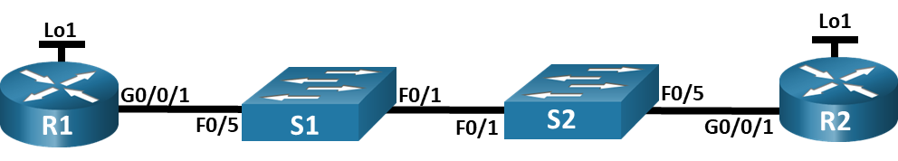
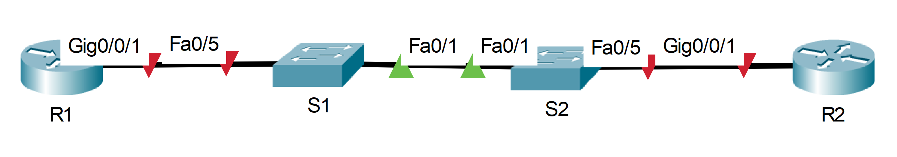
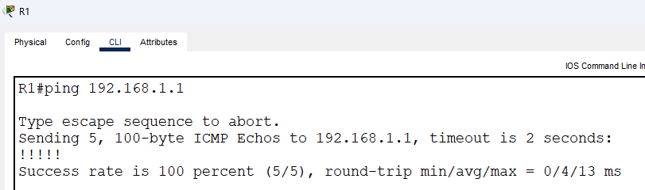
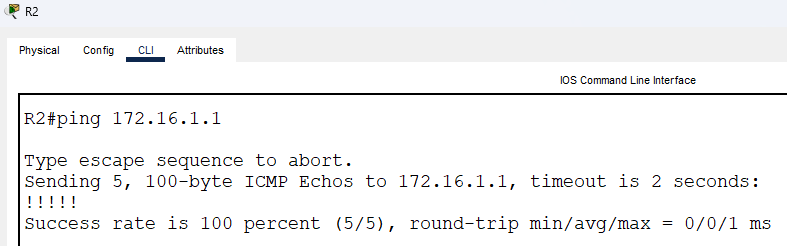

# Настройка протокола OSPFv2 для одной области.
### Дано:
###	Топология:

###	Таблица адресации
|Устройство|Интерфейс|IP-адрес   |Маска подсети|
|----------|---------|-----------|-------------|
|R1        |G0/0/1   |10.53.0.1  |255.255.255.0|
|R1        |Loopback1|172.16.1.1 |255.255.255.0|
|R2        |G0/0/1   |10.53.0.2  |255.255.255.0|
|R2        |Loopback1|192.168.1.1|255.255.255.0|
### Задание:
1. [Часть 1. Создание сети и настройка основных параметров устройства.](https://github.com/getmandv/Network_Engineer._Basic/blob/main/Home_work/Lab_10/README.md#%D1%87%D0%B0%D1%81%D1%82%D1%8C-1-%D1%81%D0%BE%D0%B7%D0%B4%D0%B0%D0%BD%D0%B8%D0%B5-%D1%81%D0%B5%D1%82%D0%B8-%D0%B8-%D0%BD%D0%B0%D1%81%D1%82%D1%80%D0%BE%D0%B9%D0%BA%D0%B0-%D0%BE%D1%81%D0%BD%D0%BE%D0%B2%D0%BD%D1%8B%D1%85-%D0%BF%D0%B0%D1%80%D0%B0%D0%BC%D0%B5%D1%82%D1%80%D0%BE%D0%B2-%D1%83%D1%81%D1%82%D1%80%D0%BE%D0%B9%D1%81%D1%82%D0%B2%D0%B0)
2. [Часть 2. Настройка и проверка базовой работы протокола  OSPFv2 для одной области.](https://github.com/getmandv/Network_Engineer._Basic/blob/main/Home_work/Lab_10/README.md#%D1%87%D0%B0%D1%81%D1%82%D1%8C-2-%D0%BD%D0%B0%D1%81%D1%82%D1%80%D0%BE%D0%B9%D0%BA%D0%B0-%D0%B8-%D0%BF%D1%80%D0%BE%D0%B2%D0%B5%D1%80%D0%BA%D0%B0-%D0%B1%D0%B0%D0%B7%D0%BE%D0%B2%D0%BE%D0%B9-%D1%80%D0%B0%D0%B1%D0%BE%D1%82%D1%8B-%D0%BF%D1%80%D0%BE%D1%82%D0%BE%D0%BA%D0%BE%D0%BB%D0%B0-ospfv2-%D0%B4%D0%BB%D1%8F-%D0%BE%D0%B4%D0%BD%D0%BE%D0%B9-%D0%BE%D0%B1%D0%BB%D0%B0%D1%81%D1%82%D0%B8)
3. [Часть 3: Оптимизация и проверка конфигурации OSPFv2 для одной области.](https://github.com/getmandv/Network_Engineer._Basic/blob/main/Home_work/Lab_10/README.md#%D1%87%D0%B0%D1%81%D1%82%D1%8C-3-%D0%BE%D0%BF%D1%82%D0%B8%D0%BC%D0%B8%D0%B7%D0%B0%D1%86%D0%B8%D1%8F-%D0%B8-%D0%BF%D1%80%D0%BE%D0%B2%D0%B5%D1%80%D0%BA%D0%B0-%D0%BA%D0%BE%D0%BD%D1%84%D0%B8%D0%B3%D1%83%D1%80%D0%B0%D1%86%D0%B8%D0%B8-ospfv2-%D0%B4%D0%BB%D1%8F-%D0%BE%D0%B4%D0%BD%D0%BE%D0%B9-%D0%BE%D0%B1%D0%BB%D0%B0%D1%81%D1%82%D0%B8)
4. Файлы Cisco Packet Tracer
   - [Основной файл домашнего задания](https://github.com/getmandv/Network_Engineer._Basic/blob/main/Home_work/Lab_10/pkt/lab_10.pkt)
## Часть 1. Создание сети и настройка основных параметров устройства.
###  Шаг 1. Создайте сеть согласно топологии.

### Шаг 2. Произведите базовую настройку маршрутизаторов.
- a.	Назначьте маршрутизатору имя устройства.
- b.	Отключите поиск DNS, чтобы предотвратить попытки маршрутизатора неверно преобразовывать введенные команды таким образом, как будто они являются именами узлов.
- c.	Назначьте class в качестве зашифрованного пароля привилегированного режима EXEC.
- d.	Назначьте cisco в качестве пароля консоли и включите вход в систему по паролю.
- e.	Назначьте cisco в качестве пароля VTY и включите вход в систему по паролю.
- f.	Зашифруйте открытые пароли.
- g.	Создайте баннер с предупреждением о запрете несанкционированного доступа к устройству.
- h.	Сохраните текущую конфигурацию в файл загрузочной конфигурации.
*Маршрутизатор R1*
```
Router>en
Router#conf t
Enter configuration commands, one per line.  End with CNTL/Z.
Router(config)#hostname R1
R1(config)#no ip domain-lookup
R1(config)#enable secret class
R1(config)#line con 0
R1(config-line)#password cisco
R1(config-line)#login
R1(config-line)#exit
R1(config)#line vty 0 15
R1(config-line)#password cisco
R1(config-line)#login
R1(config-line)#exit
R1(config)#service password-encryption
R1(config)#banner motd #
Enter TEXT message.  End with the character '#'.
This is R1 router.
Authorized Users Only!#

R1(config)#end
R1#
%SYS-5-CONFIG_I: Configured from console by console

R1#wr
Building configuration...
[OK]
R1#
```
*Повтоярем аналогичную настройку на маршрутизаторе R2.*
### Шаг 3. Настройка и проверка основных параметров коммутатора
- a.	Назначьте коммутатору имя устройства.
- b.	Отключите поиск DNS, чтобы предотвратить попытки маршрутизатора неверно преобразовывать введенные команды таким образом, как будто они являются именами узлов.
- c.	Назначьте class в качестве зашифрованного пароля привилегированного режима EXEC.
- d.	Назначьте cisco в качестве пароля консоли и включите вход в систему по паролю.
- e.	Назначьте cisco в качестве пароля VTY и включите вход в систему по паролю.
- f.	Зашифруйте открытые пароли.
- g.	Создайте баннер с предупреждением о запрете несанкционированного доступа к устройству.
- h.	Сохраните текущую конфигурацию в файл загрузочной конфигурации.
*Коммутатор S1*
```
Switch>en
Switch#conf t
Enter configuration commands, one per line.  End with CNTL/Z.
Switch(config)#hostname S1
S1(config)#no ip domain-lookup
S1(config)#enable secret class
S1(config)#line con 0
S1(config-line)#password cisco
S1(config-line)#login
S1(config-line)#exit
S1(config)#line vty 0 15
S1(config-line)#password cisco
S1(config-line)#login
S1(config-line)#exit
S1(config)#service password-encryption
S1(config)#banner motd #
Enter TEXT message.  End with the character '#'.
This is S1 switch.
Authorized Users Only!#

S1(config)#end
S1#
%SYS-5-CONFIG_I: Configured from console by console

S1#wr
Building configuration...
[OK]
S1#
```
*Повтоярем аналогичную настройку на коммутаторе S2.*
## Часть 2. Настройка и проверка базовой работы протокола OSPFv2 для одной области.
###  Шаг 1. Настройте адреса интерфейса и базового OSPFv2 на каждом маршрутизаторе.
- a.	Настройте адреса интерфейсов на каждом маршрутизаторе, как показано в таблице адресации выше.

*Маршрутизатор R1*
```
R1(config)#interface gigabitEthernet 0/0/1
R1(config-if)#ip address 10.53.0.1 255.255.255.0
R1(config-if)#no shutdown 

R1(config-if)#
%LINK-5-CHANGED: Interface GigabitEthernet0/0/1, changed state to up

%LINEPROTO-5-UPDOWN: Line protocol on Interface GigabitEthernet0/0/1, changed state to up

R1(config-if)#exit
R1(config)#interface loopback 1

R1(config-if)#
%LINK-5-CHANGED: Interface Loopback1, changed state to up

%LINEPROTO-5-UPDOWN: Line protocol on Interface Loopback1, changed state to up

R1(config-if)#ip address 172.16.1.1 255.255.255.0
R1(config-if)#
```
*Не забываем включить интерфейс GigabitEthernet0/0/1 после настрйки адреса.*
*Повтоярем аналогичную настройку на маршрутизаторе R2, с учётом соответствующих адресов.*
- b.	Перейдите в режим конфигурации маршрутизатора OSPF, используя идентификатор процесса 56.
- c.	Настройте статический идентификатор маршрутизатора для каждого маршрутизатора (1.1.1.1 для R1, 2.2.2.2 для R2).
- d.	Настройте инструкцию сети для сети между R1 и R2, поместив ее в область 0.

*Маршрутизатор R1*
```
R1(config)#router ospf 56
R1(config-router)#router-id 1.1.1.1
R1(config-router)#exit
R1(config)#interface gigabitEthernet 0/0/1
R1(config-if)#ip ospf 56 area 0
R1(config-if)#
```
*Маршрутизатор R2*
```
R2(config)#router ospf 56
R2(config-router)#router-id 2.2.2.2
R2(config-router)#
R2(config-router)#exit
R2(config)#interface gigabitEthernet 0/0/1
R2(config-if)#ip ospf 56 area 0
R2(config-if)#
```
- e.	Только на R2 добавьте конфигурацию, необходимую для объявления сети Loopback 1 в область OSPF 0.
```
R2(config)#interface loopback 1
R2(config-if)#ip ospf 56 area 0
R2(config-if)#
```
- f.	Убедитесь, что OSPFv2 работает между маршрутизаторами. Выполните команду, чтобы убедиться, что R1 и R2 сформировали смежность.

*Маршрутизатор R1*
```
R1#show ip ospf neighbor 


Neighbor ID     Pri   State           Dead Time   Address         Interface
2.2.2.2           1   FULL/DR         00:00:39    10.53.0.2       GigabitEthernet0/0/1
R1#
```
*Маршрутизатор R2*
```
R2#show ip ospf neighbor 


Neighbor ID     Pri   State           Dead Time   Address         Interface
1.1.1.1           1   FULL/BDR        00:00:33    10.53.0.1       GigabitEthernet0/0/1
R2#
```
- Какой маршрутизатор является DR?

*DR является маршрутизатор R2*

- Какой маршрутизатор является BDR?

*BDR является маршрутизатор R1*

- Каковы критерии отбора?

*Приоритет и Router ID. В нашем случае приоритет олинаковый, по этому выбор DR основывается на router id.*

- g.	На R1 выполните команду show ip route ospf, чтобы убедиться, что сеть R2 Loopback1 присутствует в таблице маршрутизации. Обратите внимание, что поведение OSPF по умолчанию заключается в объявлении интерфейса обратной связи в качестве маршрута узла с использованием 32-битной маски.
```
R1#show ip route ospf 
     192.168.1.0/32 is subnetted, 1 subnets
O       192.168.1.1 [110/2] via 10.53.0.2, 4294967275:4294967253:4294967284, GigabitEthernet0/0/1

R1#
```
- h.	Запустите Ping до  адреса интерфейса R2 Loopback 1 из R1. Выполнение команды ping должно быть успешным.


## Часть 3. Оптимизация и проверка конфигурации OSPFv2 для одной области.
### Шаг 1. Реализация различных оптимизаций на каждом маршрутизаторе.
- a.	На R1 настройте приоритет OSPF интерфейса G0/0/1 на 50, чтобы убедиться, что R1 является назначенным маршрутизатором.
```
R1(config)#interface gigabitEthernet 0/0/1
R1(config-if)#ip ospf priority 50
R1(config-if)#
```
- b.	Настройте таймеры OSPF на G0/0/1 каждого маршрутизатора для таймера приветствия, составляющего 30 секунд.

*Маршрутизатор R1*
```
R1(config)#interface gigabitEthernet 0/0/1
R1(config-if)#ip ospf hello-interval 30
R1(config-if)#
```
*Повторяем настройку на маршрутизаторе R2*
- c.	На R1 настройте статический маршрут по умолчанию, который использует интерфейс Loopback 1 в качестве интерфейса выхода. Затем распространите маршрут по умолчанию в OSPF. Обратите внимание на сообщение консоли после установки маршрута по умолчанию.
```
R1(config)#ip route 0.0.0.0 0.0.0.0 loopback 1
%Default route without gateway, if not a point-to-point interface, may impact performance
R1(config)#router ospf 56
R1(config-router)#default-information originate 
R1(config-router)#
```
- d.	добавьте конфигурацию, необходимую для OSPF для обработки R2 Loopback 1 как сети точка-точка. Это приводит к тому, что OSPF объявляет Loopback 1 использует маску подсети интерфейса.
```
R2(config)#interface loopback 1
R2(config-if)#ip ospf network point-to-point 
R2(config-if)#
```
- e.	Только на R2 добавьте конфигурацию, необходимую для предотвращения отправки объявлений OSPF в сеть Loopback 1.
```
R2(config)#router ospf 56
R2(config-router)#passive-interface loopback 1
R2(config-router)#
```
- f.	Измените базовую пропускную способность для маршрутизаторов. После этой настройки перезапустите OSPF с помощью команды clear ip ospf process . Обратите внимание на сообщение консоли после установки новой опорной полосы пропускания.

*Маршрутизатор R1.*
```
R1(config)#router ospf 56
R1(config-router)#auto-cost reference-bandwidth 1000
% OSPF: Reference bandwidth is changed.
        Please ensure reference bandwidth is consistent across all routers.
R1(config)#end
R1#
%SYS-5-CONFIG_I: Configured from console by console

R1#clear ip ospf process 
Reset ALL OSPF processes? [no]: y

R1#
00:12:30: %OSPF-5-ADJCHG: Process 56, Nbr 2.2.2.2 on GigabitEthernet0/0/1 from FULL to DOWN, Neighbor Down: Adjacency forced to reset

00:12:30: %OSPF-5-ADJCHG: Process 56, Nbr 2.2.2.2 on GigabitEthernet0/0/1 from FULL to DOWN, Neighbor Down: Interface down or detached

00:12:40: %OSPF-5-ADJCHG: Process 56, Nbr 2.2.2.2 on GigabitEthernet0/0/1 from LOADING to FULL, Loading Done

00:13:15: %OSPF-5-ADJCHG: Process 56, Nbr 2.2.2.2 on GigabitEthernet0/0/1 from LOADING to FULL, Loading Done

R1#
```
*Маршрутизатор R2.*
```
R2(config)#router ospf 56
R2(config-router)#auto-cost reference-bandwidth 1000
% OSPF: Reference bandwidth is changed.
        Please ensure reference bandwidth is consistent across all routers.
R2(config)#end
R2#
%SYS-5-CONFIG_I: Configured from console by console

R2#clear ip ospf process 
Reset ALL OSPF processes? [no]: y

R2#
00:12:48: %OSPF-5-ADJCHG: Process 56, Nbr 1.1.1.1 on GigabitEthernet0/0/1 from FULL to DOWN, Neighbor Down: Adjacency forced to reset

00:12:48: %OSPF-5-ADJCHG: Process 56, Nbr 1.1.1.1 on GigabitEthernet0/0/1 from FULL to DOWN, Neighbor Down: Interface down or detached

00:13:12: %OSPF-5-ADJCHG: Process 56, Nbr 1.1.1.1 on GigabitEthernet0/0/1 from LOADING to FULL, Loading Done

R2#
```
### Шаг 2. Убедитесь, что оптимизация OSPFv2 реализовалась.
- a.	Выполните команду show ip ospf interface g0/0/1 на R1 и убедитесь, что приоритет интерфейса установлен равным 50, а временные интервалы — Hello 30, Dead 120, а тип сети по умолчанию — Broadcast
```
R1#show ip ospf interface gigabitEthernet 0/0/1

GigabitEthernet0/0/1 is up, line protocol is up
  Internet address is 10.53.0.1/24, Area 0
  Process ID 56, Router ID 1.1.1.1, Network Type BROADCAST, Cost: 10
  Transmit Delay is 1 sec, State DR, Priority 50
  Designated Router (ID) 1.1.1.1, Interface address 10.53.0.1
  Backup Designated Router (ID) 2.2.2.2, Interface address 10.53.0.2
  Timer intervals configured, Hello 30, Dead 40, Wait 40, Retransmit 5
    Hello due in 00:00:28
  Index 1/1, flood queue length 0
  Next 0x0(0)/0x0(0)
  Last flood scan length is 1, maximum is 1
  Last flood scan time is 0 msec, maximum is 0 msec
  Neighbor Count is 1, Adjacent neighbor count is 1
    Adjacent with neighbor 2.2.2.2  (Backup Designated Router)
  Suppress hello for 0 neighbor(s)
R1#
```
*Стоит обратить внимание что интервал Dead равен 40, а не 120, так как по ходу лабораторной работы у нас небыло задания изменить его. Тем не менее меняется он в режиме конфигурации интерфейса командой "ip ospf dead-interval"*
- b.	На R1 выполните команду show ip route ospf, чтобы убедиться, что сеть R2 Loopback1 присутствует в таблице маршрутизации. Обратите внимание на разницу в метрике между этим выходным и предыдущим выходным. Также обратите внимание, что маска теперь составляет 24 бита, в отличие от 32 битов, ранее объявленных.
```
R1#show ip route ospf 
O    192.168.1.0 [110/10] via 10.53.0.2, 00:02:30, GigabitEthernet0/0/1

R1#
```
- c.	Введите команду show ip route ospf на маршрутизаторе R2. Единственная информация о маршруте OSPF должна быть распространяемый по умолчанию маршрут R1.
```
R2#show ip route ospf 
O*E2 0.0.0.0/0 [110/1] via 10.53.0.1, 00:08:18, GigabitEthernet0/0/1

R2#
```
- d.	Запустите Ping до адреса интерфейса R1 Loopback 1 из R2. Выполнение команды ping должно быть успешным.



- Почему стоимость OSPF для маршрута по умолчанию отличается от стоимости OSPF в R1 для сети 192.168.1.0/24?
*Если я верно понял вопрос, то на маршрутизаторе R1 стоимость маршрута до сети 192.168.0.1/24 включает себя стоимость интерфейса в OSPF, в нашем случае 10. В стоимости же маршрута по умолчанию подобной стоимости нет.*
