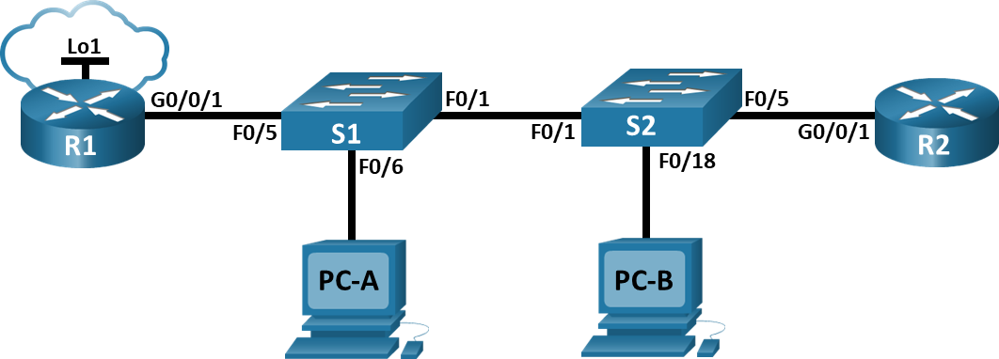
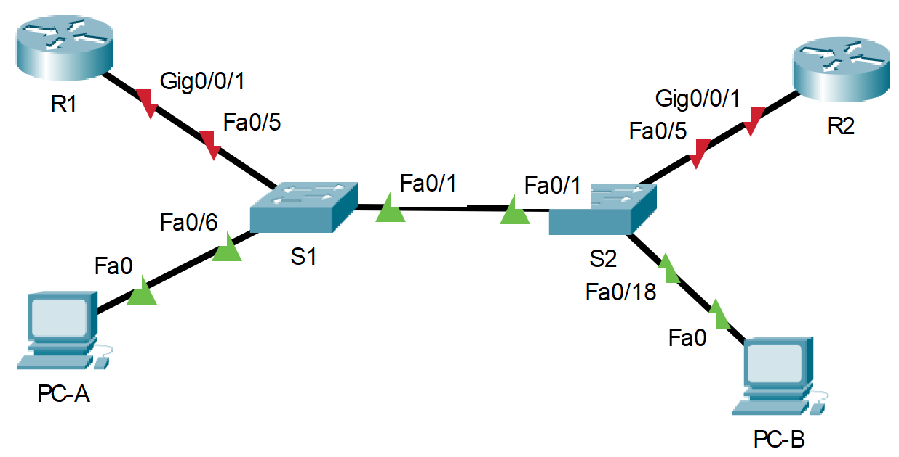

# Настройка и проверка расширенных списков контроля доступа.
### Дано:
###	Топология

###	Таблица адресации
|Устройство  |Интерфейс  |IP-адрес     |Маска подсети|Шлюз по умолчанию|
|------------|-----------|-------------|-------------|-----------------|
|R1          |G0/0/1     |-            |-            |-                |
|R1          |G0/0/1.20  |10.20.0.1    |255.255.255.0|-                |
|R1          |G0/0/1.30  |10.30.0.1    |255.255.255.0|-                |
|R1          |G0/0/1.40  |10.40.0.1    |255.255.255.0|-                |
|R1          |G0/0/1.1000|-            |-            |-                |
|R1          |Loopback1  |172.16.1.1   |255.255.255.0|-                |
|R2          |G0/0/1     |10.20.0.4    |255.255.255.0|-                |
|S1          |VLAN 20    |10.20.0.2    |255.255.255.0|10.20.0.1        |
|S2          |VLAN 20    |10.20.0.3    |255.255.255.0|10.20.0.1        |
|PC-A        |NIC        |10.30.0.10   |255.255.255.0|10.30.0.1        |
|PC-B        |NIC        |10.40.0.10   |255.255.255.0|10.40.0.1        |
###	Таблица VLAN
|VLAN        |Имя        |Назначенный интерфейс                 |
|------------|-----------|--------------------------------------|
|20          |Management |S2: F0/5                              |
|30          |Operations |S1: F0/6                              |
|40          |Sales      |S2: F0/18                             |
|999         |Parking_Lot|S1: F0/2-4, F0/7-24, G0/1-2           |
|999         |Parking_Lot|SS2: F0/2-4, F0/6-17, F0/19-24, G0/1-2|
|1000        |Собственная|-                                     |
### Задание:
1. [Часть 1. Создание сети и настройка основных параметров устройства.]()
2. [Часть 2. Настройка и проверка списков расширенного контроля доступа.]()
3. [Часть 3. Настройте транки (магистральные каналы).]()
4. [Часть 4. Настройте маршрутизацию.]()
5. [Часть 5. Настройте удаленный доступ.]()
6. [Часть 6. Проверка подключения.]()
7. [Часть 7. Настройка и проверка списков контроля доступа (ACL).]()
8. Файлы Cisco Packet Tracer
   - [Основной файл домашнего задания](https://github.com/getmandv/Network_Engineer._Basic/blob/main/Home_work/Lab_06/pkt/lab_06.pkt)
## Часть 1. Создание сети и настройка основных параметров устройства.
###  Шаг 1. Создайте сеть согласно топологии.

###  Шаг 2. Произведите базовую настройку маршрутизаторов.
- a.	Назначьте маршрутизатору имя устройства.
- b.	Отключите поиск DNS, чтобы предотвратить попытки маршрутизатора неверно преобразовывать введенные команды таким образом, как будто они являются именами узлов.
- c.	Назначьте class в качестве зашифрованного пароля привилегированного режима EXEC.
- d.	Назначьте cisco в качестве пароля консоли и включите вход в систему по паролю.
- e.	Назначьте cisco в качестве пароля VTY и включите вход в систему по паролю.
- f.	Зашифруйте открытые пароли.
- g.	Создайте баннер с предупреждением о запрете несанкционированного доступа к устройству.
- h.	Сохраните текущую конфигурацию в файл загрузочной конфигурации.

*Маршрутизатор R1*
```
Router>en
Router#conf t
Enter configuration commands, one per line.  End with CNTL/Z.
Router(config)#hostname R1
R1(config)#no ip domain-lookup
R1(config)#enable secret class
R1(config)#line con 0
R1(config-line)#password cisco
R1(config-line)#login
R1(config-line)#exit
R1(config)#line vty 0 15
R1(config-line)#password cisco
R1(config-line)#login
R1(config-line)#exit
R1(config)#service password-encryption
R1(config)#banner motd #
Enter TEXT message.  End with the character '#'.
This is R1 router.
Authorized Users Only!#

R1(config)#exit
R1#
%SYS-5-CONFIG_I: Configured from console by console

R1#wr
Building configuration...
[OK]
R1#
```
*Повторяем аналогичную настройку для маршрутизатора R2.*
###  Шаг 3. Настройте базовые параметры каждого коммутатора.
- a.	Присвойте коммутатору имя устройства.
- b.	Отключите поиск DNS, чтобы предотвратить попытки маршрутизатора неверно преобразовывать введенные команды таким образом, как будто они являются именами узлов.
- c.	Назначьте class в качестве зашифрованного пароля привилегированного режима EXEC.
- d.	Назначьте cisco в качестве пароля консоли и включите вход в систему по паролю.
- e.	Назначьте cisco в качестве пароля VTY и включите вход в систему по паролю.
- f.	Зашифруйте открытые пароли.
- g.	Создайте баннер с предупреждением о запрете несанкционированного доступа к устройству.
- h.	Сохраните текущую конфигурацию в файл загрузочной конфигурации.

*Коммутатор S1*
```
Switch>en
Switch#conf t
Enter configuration commands, one per line.  End with CNTL/Z.
Switch(config)#hostname S1
S1(config)#no ip domain-lookup
S1(config)#enable secret class
S1(config)#line con 0
S1(config-line)#password cisco
S1(config-line)#login
S1(config-line)#exit
S1(config)#line vty 0 15
S1(config-line)#password cisco
S1(config-line)#login
S1(config-line)#exit
S1(config)#service password-encryption
S1(config)#banner motd #
Enter TEXT message.  End with the character '#'.
This is S1 switch.
Authorized Users Only!#

S1(config)#exit
S1#
%SYS-5-CONFIG_I: Configured from console by console

S1#wr
Building configuration...
[OK]
S1#
```
*Повторяем аналогичную настройку для коммутатора S2.*
## Часть 2. Настройка сетей VLAN на коммутаторах.
### Шаг 1. Создайте сети VLAN на коммутаторах.
- a.	Создайте необходимые VLAN и назовите их на каждом коммутаторе из приведенной выше таблицы.

*Коммутатор S1*
```
S1(config)#vlan 20
S1(config-vlan)#name Management
S1(config-vlan)#exit
S1(config)#vlan 30
S1(config-vlan)#name Operations
S1(config-vlan)#exit
S1(config)#vlan 40
S1(config-vlan)#name Sales
S1(config-vlan)#exit
S1(config)#vlan 999
S1(config-vlan)#name ParkingLot
S1(config-vlan)#exit
S1(config)#vlan 1000
S1(config-vlan)#name Native
S1(config-vlan)#
```
*Коммутатор S2*
```
S2(config)#vlan 20
S2(config-vlan)#name Management
S2(config-vlan)#exit
S2(config)#vlan 40
S2(config-vlan)#name Sales
S2(config-vlan)#exit
S2(config)#vlan 999
S2(config-vlan)#name ParkingLot
S2(config-vlan)#exit
S2(config)#vlan 1000
S2(config-vlan)#name Native
S2(config-vlan)#
```
- b.	Настройте интерфейс управления и шлюз по умолчанию на каждом коммутаторе, используя информацию об IP-адресе в таблице адресации.

*Коммутатор S1*
```
S1(config)#ip default-gateway 10.20.0.1
S1(config)#interface vlan 20
S1(config-if)#
%LINK-5-CHANGED: Interface Vlan20, changed state to up

S1(config-if)#ip address 10.20.0.2 255.255.255.0
S1(config-if)#
```
*Коммутатор S2*
```
S2(config)#ip default-gateway 10.20.0.1
S2(config)#interface vlan 20
S2(config-if)#
%LINK-5-CHANGED: Interface Vlan20, changed state to up

S2(config-if)#ip address 10.20.0.3 255.255.255.0
S2(config-if)#
```
- c.	Назначьте все неиспользуемые порты коммутатора VLAN Parking Lot, настройте их для статического режима доступа и административно деактивируйте их.

*Коммутатор S1*
```
S1(config)#interface range fastEthernet 0/2-4, fastEthernet 0/7-24, gigabitEthernet 0/1-2
S1(config-if-range)#switchport access vlan 999
S1(config-if-range)#switchport mode access
S1(config-if-range)#shutdown

%LINK-5-CHANGED: Interface FastEthernet0/2, changed state to administratively down

%LINK-5-CHANGED: Interface FastEthernet0/3, changed state to administratively down

%LINK-5-CHANGED: Interface FastEthernet0/4, changed state to administratively down

%LINK-5-CHANGED: Interface FastEthernet0/7, changed state to administratively down

%LINK-5-CHANGED: Interface FastEthernet0/8, changed state to administratively down

%LINK-5-CHANGED: Interface FastEthernet0/9, changed state to administratively down

%LINK-5-CHANGED: Interface FastEthernet0/10, changed state to administratively down

%LINK-5-CHANGED: Interface FastEthernet0/11, changed state to administratively down

%LINK-5-CHANGED: Interface FastEthernet0/12, changed state to administratively down

%LINK-5-CHANGED: Interface FastEthernet0/13, changed state to administratively down

%LINK-5-CHANGED: Interface FastEthernet0/14, changed state to administratively down

%LINK-5-CHANGED: Interface FastEthernet0/15, changed state to administratively down

%LINK-5-CHANGED: Interface FastEthernet0/16, changed state to administratively down

%LINK-5-CHANGED: Interface FastEthernet0/17, changed state to administratively down

%LINK-5-CHANGED: Interface FastEthernet0/18, changed state to administratively down

%LINK-5-CHANGED: Interface FastEthernet0/19, changed state to administratively down

%LINK-5-CHANGED: Interface FastEthernet0/20, changed state to administratively down

%LINK-5-CHANGED: Interface FastEthernet0/21, changed state to administratively down

%LINK-5-CHANGED: Interface FastEthernet0/22, changed state to administratively down

%LINK-5-CHANGED: Interface FastEthernet0/23, changed state to administratively down

%LINK-5-CHANGED: Interface FastEthernet0/24, changed state to administratively down

%LINK-5-CHANGED: Interface GigabitEthernet0/1, changed state to administratively down

%LINK-5-CHANGED: Interface GigabitEthernet0/2, changed state to administratively down
S1(config-if-range)#
```
*Коммутатор S2*
```
S2(config)#interface range fastEthernet 0/2-4, fastEthernet 0/6-17, fastEthernet 0/19-24, gigabitEthernet 0/1-2
S2(config-if-range)#switchport access vlan 999
S2(config-if-range)#switchport mode access
S2(config-if-range)#shutdown

%LINK-5-CHANGED: Interface FastEthernet0/2, changed state to administratively down

%LINK-5-CHANGED: Interface FastEthernet0/3, changed state to administratively down

%LINK-5-CHANGED: Interface FastEthernet0/4, changed state to administratively down

%LINK-5-CHANGED: Interface FastEthernet0/6, changed state to administratively down

%LINK-5-CHANGED: Interface FastEthernet0/7, changed state to administratively down

%LINK-5-CHANGED: Interface FastEthernet0/8, changed state to administratively down

%LINK-5-CHANGED: Interface FastEthernet0/9, changed state to administratively down

%LINK-5-CHANGED: Interface FastEthernet0/10, changed state to administratively down

%LINK-5-CHANGED: Interface FastEthernet0/11, changed state to administratively down

%LINK-5-CHANGED: Interface FastEthernet0/12, changed state to administratively down

%LINK-5-CHANGED: Interface FastEthernet0/13, changed state to administratively down

%LINK-5-CHANGED: Interface FastEthernet0/14, changed state to administratively down

%LINK-5-CHANGED: Interface FastEthernet0/15, changed state to administratively down

%LINK-5-CHANGED: Interface FastEthernet0/16, changed state to administratively down

%LINK-5-CHANGED: Interface FastEthernet0/17, changed state to administratively down

%LINK-5-CHANGED: Interface FastEthernet0/19, changed state to administratively down

%LINK-5-CHANGED: Interface FastEthernet0/20, changed state to administratively down

%LINK-5-CHANGED: Interface FastEthernet0/21, changed state to administratively down

%LINK-5-CHANGED: Interface FastEthernet0/22, changed state to administratively down

%LINK-5-CHANGED: Interface FastEthernet0/23, changed state to administratively down

%LINK-5-CHANGED: Interface FastEthernet0/24, changed state to administratively down

%LINK-5-CHANGED: Interface GigabitEthernet0/1, changed state to administratively down

%LINK-5-CHANGED: Interface GigabitEthernet0/2, changed state to administratively down
S2(config-if-range)#
```
### Шаг 2. Назначьте сети VLAN соответствующим интерфейсам коммутатора.
- a.	Назначьте используемые порты соответствующей VLAN (указанной в таблице VLAN выше) и настройте их для режима статического доступа.

*Коммутатор S1*
```
S1(config)#interface FastEthernet0/6
S1(config-if)#switchport access vlan 30
S1(config-if)#switchport mode access
S1(config-if)#
```
*Коммутатор S2*
```
S2(config)#interface FastEthernet0/5
S2(config-if)#switchport access vlan 20
S2(config-if)#switchport mode access
S2(config-if)#exit
S2(config)#interface FastEthernet0/18
S2(config-if)#switchport access vlan 40
S2(config-if)#switchport mode access
S2(config-if)#
```
- b.	Выполните команду show vlan brief, чтобы убедиться, что сети VLAN назначены правильным интерфейсам.

*Коммутатор S1*
```
S1#show vlan brief 

VLAN Name                             Status    Ports
---- -------------------------------- --------- -------------------------------
1    default                          active    Fa0/1, Fa0/5
20   Management                       active    
30   Operations                       active    Fa0/6
40   Sales                            active    
999  ParkingLot                       active    Fa0/2, Fa0/3, Fa0/4, Fa0/7
                                                Fa0/8, Fa0/9, Fa0/10, Fa0/11
                                                Fa0/12, Fa0/13, Fa0/14, Fa0/15
                                                Fa0/16, Fa0/17, Fa0/18, Fa0/19
                                                Fa0/20, Fa0/21, Fa0/22, Fa0/23
                                                Fa0/24, Gig0/1, Gig0/2
1000 Native                           active    
1002 fddi-default                     active    
1003 token-ring-default               active    
1004 fddinet-default                  active    
1005 trnet-default                    active    
S1#
```
*Коммутатор S2*
```
S2#show vlan brief 

VLAN Name                             Status    Ports
---- -------------------------------- --------- -------------------------------
1    default                          active    Fa0/1
20   Management                       active    Fa0/5
40   Sales                            active    Fa0/18
999  ParkingLot                       active    Fa0/2, Fa0/3, Fa0/4, Fa0/6
                                                Fa0/7, Fa0/8, Fa0/9, Fa0/10
                                                Fa0/11, Fa0/12, Fa0/13, Fa0/14
                                                Fa0/15, Fa0/16, Fa0/17, Fa0/19
                                                Fa0/20, Fa0/21, Fa0/22, Fa0/23
                                                Fa0/24, Gig0/1, Gig0/2
1000 Native                           active    
1002 fddi-default                     active    
1003 token-ring-default               active    
1004 fddinet-default                  active    
1005 trnet-default                    active    
S2#
```
## Часть 3. ·Настройте транки (магистральные каналы).
### Шаг 1. Вручную настройте магистральный интерфейс F0/1.
- a.	Измените режим порта коммутатора на интерфейсе F0/1, чтобы принудительно создать магистральную связь. Не забудьте сделать это на обоих коммутаторах.
- b.	В рамках конфигурации транка установите для native vlan значение 1000 на обоих коммутаторах. При настройке двух интерфейсов для разных собственных VLAN сообщения об ошибках могут отображаться временно.
- c.	В качестве другой части конфигурации транка укажите, что VLAN 20, 30, 40 и 1000 разрешены в транке.

*Коммутатор S1*
```
S1(config)#interface FastEthernet0/1
S1(config-if)#switchport mode trunk

S1(config-if)#
%LINEPROTO-5-UPDOWN: Line protocol on Interface FastEthernet0/1, changed state to down

%LINEPROTO-5-UPDOWN: Line protocol on Interface FastEthernet0/1, changed state to up

%LINEPROTO-5-UPDOWN: Line protocol on Interface Vlan20, changed state to up

S1(config-if)#switchport nonegotiate
S1(config-if)#switchport trunk native vlan 1000
S1(config-if)#switchport trunk allowed vlan 20,30,40,1000
S1(config-if)#
```
*Повторяем аналогичную настройку для коммутатора S2.*
- d.	Выполните команду show interfaces trunk для проверки портов магистрали, собственной VLAN и разрешенных VLAN через магистраль.

*Коммутатор S1*
```
S1#show interfaces trunk 
Port        Mode         Encapsulation  Status        Native vlan
Fa0/1       on           802.1q         trunking      1000

Port        Vlans allowed on trunk
Fa0/1       20,30,40,1000

Port        Vlans allowed and active in management domain
Fa0/1       20,30,40,1000

Port        Vlans in spanning tree forwarding state and not pruned
Fa0/1       20,30,40,1000

S1#
```
*Коммутатор S2*
```
S2#show interfaces trunk 
Port        Mode         Encapsulation  Status        Native vlan
Fa0/1       on           802.1q         trunking      1000

Port        Vlans allowed on trunk
Fa0/1       20,30,40,1000

Port        Vlans allowed and active in management domain
Fa0/1       20,40,1000

Port        Vlans in spanning tree forwarding state and not pruned
Fa0/1       20,40,1000

S2#
```
### Шаг 2. Вручную настройте магистральный интерфейс F0/5 на коммутаторе S1.
- a.	Настройте интерфейс S1 F0/5 с теми же параметрами транка, что и F0/1. Это транк до маршрутизатора.
- b.	Сохраните текущую конфигурацию в файл загрузочной конфигурации.
```
S1(config)#interface FastEthernet0/5
S1(config-if)#switchport mode trunk
S1(config-if)#switchport nonegotiate
S1(config-if)#switchport trunk native vlan 1000
S1(config-if)#switchport trunk allowed vlan 20,30,40,1000
S1(config-if)#end
S1#
%SYS-5-CONFIG_I: Configured from console by console

S1#wr
Building configuration...
[OK]
S1#
```
- c.	Используйте команду show interfaces trunk для проверки настроек транка.

*В данной ситуации стоит отметить что произведённая настройки не отобразится по команде show interfaces trunk так как порт со стороны маршрутизатора R1 выключен. Включим его и проверим вывод команды.*
*Маршрутизатор R1*
```
R1(config)#interface gigabitEthernet 0/0/1
R1(config-if)#no shutdown 

R1(config-if)#
%LINK-5-CHANGED: Interface GigabitEthernet0/0/1, changed state to up

%LINEPROTO-5-UPDOWN: Line protocol on Interface GigabitEthernet0/0/1, changed state to up
R1(config-if)#
```
*Коммутатор S1*
```
S1#show interfaces trunk 
Port        Mode         Encapsulation  Status        Native vlan
Fa0/1       on           802.1q         trunking      1000
Fa0/5       on           802.1q         trunking      1000

Port        Vlans allowed on trunk
Fa0/1       20,30,40,1000
Fa0/5       20,30,40,1000

Port        Vlans allowed and active in management domain
Fa0/1       20,30,40,1000
Fa0/5       20,30,40,1000

Port        Vlans in spanning tree forwarding state and not pruned
Fa0/1       20,30,40,1000
Fa0/5       none

S1#
```
## Часть 4. Настройте маршрутизацию.
### Шаг 1. Настройка маршрутизации между сетями VLAN на R1.
- a.	Активируйте интерфейс G0/0/1 на маршрутизаторе.

 *Уже сделали это в предыдущем шаге.*
- b.	Настройте подинтерфейсы для каждой VLAN, как указано в таблице IP-адресации. Все подинтерфейсы используют инкапсуляцию 802.1Q. Убедитесь, что подинтерфейс для собственной VLAN не имеет назначенного IP-адреса. Включите описание для каждого подинтерфейса.
```
R1(config)#interface gigabitEthernet 0/0/1.20
R1(config-subif)#
%LINK-5-CHANGED: Interface GigabitEthernet0/0/1.20, changed state to up

%LINEPROTO-5-UPDOWN: Line protocol on Interface GigabitEthernet0/0/1.20, changed state to up

R1(config-subif)#encapsulation dot1Q 20
R1(config-subif)#ip address 10.20.0.1 255.255.255.0
R1(config-subif)#description Management
R1(config-subif)#exit
R1(config)#interface gigabitEthernet 0/0/1.30
R1(config-subif)#
%LINK-5-CHANGED: Interface GigabitEthernet0/0/1.30, changed state to up

%LINEPROTO-5-UPDOWN: Line protocol on Interface GigabitEthernet0/0/1.30, changed state to up

R1(config-subif)#encapsulation dot1Q 30
R1(config-subif)#ip address 10.30.0.1 255.255.255.0
R1(config-subif)#description Operations
R1(config-subif)#exit
R1(config)#interface gigabitEthernet 0/0/1.40
R1(config-subif)#
%LINK-5-CHANGED: Interface GigabitEthernet0/0/1.40, changed state to up

%LINEPROTO-5-UPDOWN: Line protocol on Interface GigabitEthernet0/0/1.40, changed state to up

R1(config-subif)#encapsulation dot1Q 40
R1(config-subif)#ip address 10.40.0.1 255.255.255.0
R1(config-subif)#description Sales
R1(config-subif)#exit
R1(config)#interface gigabitEthernet 0/0/1.1000
R1(config-subif)#
%LINK-5-CHANGED: Interface GigabitEthernet0/0/1.1000, changed state to up

%LINEPROTO-5-UPDOWN: Line protocol on Interface GigabitEthernet0/0/1.1000, changed state to up

R1(config-subif)#encapsulation dot1Q 1000 native
R1(config-subif)#description Native
R1(config-subif)#end
R1#
%SYS-5-CONFIG_I: Configured from console by console

R1#show interfaces gigabitEthernet 0/0/1.1000
GigabitEthernet0/0/1.1000 is up, line protocol is up (connected)
  Hardware is PQUICC_FEC, address is 0001.42d5.4202 (bia 0001.42d5.4202)
  MTU 1500 bytes, BW 100000 Kbit, DLY 100 usec, 
     reliability 255/255, txload 1/255, rxload 1/255
  Encapsulation 802.1Q Virtual LAN, Vlan ID 1000
  ARP type: ARPA, ARP Timeout 04:00:00, 
  Last clearing of "show interface" counters never

R1#
```
- c.	Настройте интерфейс Loopback 1 на R1 с адресацией из приведенной выше таблицы.
```
R1(config)#interface loopback 1

R1(config-if)#
%LINK-5-CHANGED: Interface Loopback1, changed state to up

%LINEPROTO-5-UPDOWN: Line protocol on Interface Loopback1, changed state to up

R1(config-if)#ip address 172.16.1.1 255.255.255.0
R1(config-if)#
```
- d.	С помощью команды show ip interface brief проверьте конфигурацию подынтерфейса.
```
R1#show ip interface brief 
Interface              IP-Address      OK? Method Status                Protocol 
GigabitEthernet0/0/0   unassigned      YES unset  administratively down down 
GigabitEthernet0/0/1   unassigned      YES unset  up                    up 
GigabitEthernet0/0/1.2010.20.0.1       YES manual up                    up 
GigabitEthernet0/0/1.3010.30.0.1       YES manual up                    up 
GigabitEthernet0/0/1.4010.40.0.1       YES manual up                    up 
GigabitEthernet0/0/1.1000unassigned      YES unset  up                    up 
Loopback1              172.16.1.1      YES manual up                    up 
Vlan1                  unassigned      YES unset  administratively down down
R1#
```
### Шаг 2. Настройка интерфейса R2 g0/0/1 с использованием адреса из таблицы и маршрута по умолчанию с адресом следующего перехода 10.20.0.1
```
R2(config)#interface gigabitEthernet 0/0/1
R2(config-if)#ip address 10.20.0.4 255.255.255.0
R2(config-if)#no shutdown

R2(config-if)#
%LINK-5-CHANGED: Interface GigabitEthernet0/0/1, changed state to up

%LINEPROTO-5-UPDOWN: Line protocol on Interface GigabitEthernet0/0/1, changed state to up

R2(config-if)#exit
R2(config)#ip route 0.0.0.0 0.0.0.0 10.20.0.1
R2(config)#
```
## Часть 5. Настройте удаленный доступ.
### Шаг 1. Настройте все сетевые устройства для базовой поддержки SSH.
- a.	Создайте локального пользователя с именем пользователя SSHadmin и зашифрованным паролем $cisco123!
- b.	Используйте ccna-lab.com в качестве доменного имени.
- c.	Генерируйте криптоключи с помощью 1024 битного модуля.
- d.	Настройте первые пять линий VTY на каждом устройстве, чтобы поддерживать только SSH-соединения и с локальной аутентификацией.

*Маршрутизатор R1*
```

```
*Повторяем аналогичную настройку для маршрутизатора R2 и коммутаторов S1 и S2.*
