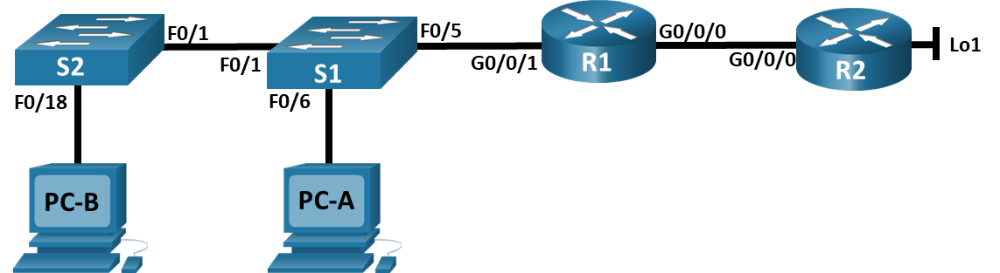
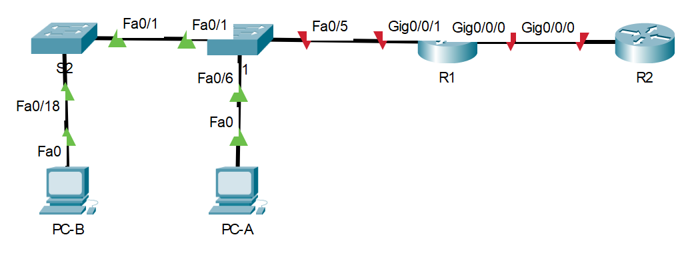
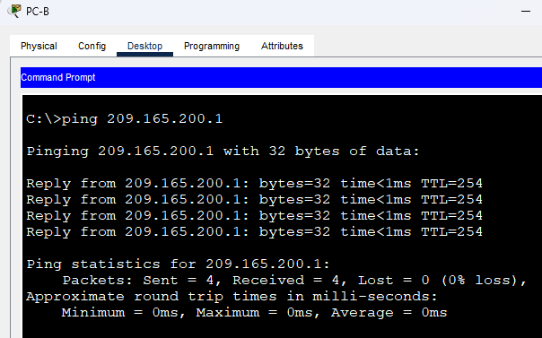

# Настройка NAT для IPv4.
### Дано:
###	Топология

###	Таблица адресации
|Устройство  |Интерфейс  |IP-адрес       |Маска подсети  |
|------------|-----------|---------------|---------------|
|R1          |G0/0/0     |209.165.200.230|255.255.255.248|
|R1          |G0/0/1     |192.168.1.1    |255.255.255.0  |
|R2          |G0/0/0     |209.165.200.225|255.255.255.248|
|R2          |GLo1       |209.165.200.1  |255.255.255.224|
|S1          |VLAN 1     |192.168.1.11   |255.255.255.0  |
|S2          |VLAN 1     |192.168.1.12   |255.255.255.0  |
|PC-A        |NIC        |192.168.1.2    |255.255.255.0  |
|PC-B        |NIC        |192.168.1.3    |255.255.255.0  |
### Задание:
1. [Часть 1. Создание сети и настройка основных параметров устройства.]()
2. [Часть 2. Настройка и проверка NAT для IPv4.]()
3. [Часть 3. Настройка и проверка PAT для IPv4.]()
4. [Часть 4. Настройка и проверка статического NAT для IPv4.]()
5. Файлы Cisco Packet Tracer
   - [Основной файл домашнего задания](https://github.com/getmandv/Network_Engineer._Basic/blob/main/Home_work/Lab_12/pkt/lab_12.pkt)
## Часть 1. Создание сети и настройка основных параметров устройства.
###  Шаг 1. Подключите кабели сети согласно приведенной топологии.

###  Шаг 2. Произведите базовую настройку маршрутизаторов.
- a.	Назначьте маршрутизатору имя устройства.
- b.	Отключите поиск DNS, чтобы предотвратить попытки маршрутизатора неверно преобразовывать введенные команды таким образом, как будто они являются именами узлов.
- c.	Назначьте class в качестве зашифрованного пароля привилегированного режима EXEC.
- d.	Назначьте cisco в качестве пароля консоли и включите вход в систему по паролю.
- e.	Назначьте cisco в качестве пароля VTY и включите вход в систему по паролю.
- f.	Зашифруйте открытые пароли.
- g.	Создайте баннер с предупреждением о запрете несанкционированного доступа к устройству.
- h.	Настройте IP-адресации интерфейса, как указано в таблице выше.
- i.	Настройте маршрут по умолчанию. от R2 до  R1.
- j.	Сохраните текущую конфигурацию в файл загрузочной конфигурации.

*Маршрутизатор R2*
```
Router>en
Router#conf t
Enter configuration commands, one per line.  End with CNTL/Z.
Router(config)#hostname R2
R2(config)#no ip domain-lookup
R2(config)#enable secret class
R2(config)#line con 0
R2(config-line)#password cisco
R2(config-line)#login
R2(config-line)#exit
R2(config)#line vty 0 15
R2(config-line)#password cisco
R2(config-line)#login
R2(config-line)#exit
R2(config)#service password-encryption
R2(config)#banner motd #
Enter TEXT message.  End with the character '#'.
This is R2 router.
Authorized Users Only!#

R2(config)#interface Loopback1

R2(config-if)#
%LINK-5-CHANGED: Interface Loopback1, changed state to up

%LINEPROTO-5-UPDOWN: Line protocol on Interface Loopback1, changed state to up
ip address 209.165.200.1 255.255.255.224
R2(config-if)#exit
R2(config)#interface GigabitEthernet 0/0/0
R2(config-if)#ip address 209.165.200.225 255.255.255.248
R2(config-if)#exit
R2(config)#ip route 0.0.0.0 0.0.0.0 209.165.200.230
R2(config)#end
R2#
%SYS-5-CONFIG_I: Configured from console by console

R2#wr
Building configuration...
[OK]
R2#
```
*Повторяем аналогичную настройку для маршрутизатора R1, используюя IP-адресацию для R1 и не выполнаяя пунк i в обратную сторону.*
###  Шаг 3. Настройте базовые параметры каждого коммутатора.
- a.	Присвойте коммутатору имя устройства.
- b.	Отключите поиск DNS, чтобы предотвратить попытки маршрутизатора неверно преобразовывать введенные команды таким образом, как будто они являются именами узлов.
- c.	Назначьте class в качестве зашифрованного пароля привилегированного режима EXEC.
- d.	Назначьте cisco в качестве пароля консоли и включите вход в систему по паролю.
- e.	Назначьте cisco в качестве пароля VTY и включите вход в систему по паролю.
- f.	Зашифруйте открытые пароли.
- g.	Создайте баннер с предупреждением о запрете несанкционированного доступа к устройству.
- h.	Выключите все интерфейсы, которые не будут использоваться.
- i.	Настройте IP-адресации интерфейса, как указано в таблице выше.
- j.	Сохраните текущую конфигурацию в файл загрузочной конфигурации.

*Коммутатор S1*
```
Switch>en
Switch#conf t
Enter configuration commands, one per line.  End with CNTL/Z.
Switch(config)#hostname S1
S1(config)#no ip domain-lookup
S1(config)#enable secret class
S1(config)#line con 0
S1(config-line)#password cisco
S1(config-line)#login
S1(config-line)#exit
S1(config)#line vty 0 15
S1(config-line)#password cisco
S1(config-line)#login
S1(config-line)#exit
S1(config)#service password-encryption
S1(config)#banner motd #
Enter TEXT message.  End with the character '#'.
This is S1 switch.
Authorized Users Only!#

S1(config)#interface range fastEthernet 0/2-4, fastEthernet 0/7-24, gigabitEthernet 0/1-2
S1(config-if-range)#shutdown 

%LINK-5-CHANGED: Interface FastEthernet0/2, changed state to administratively down

%LINK-5-CHANGED: Interface FastEthernet0/3, changed state to administratively down

%LINK-5-CHANGED: Interface FastEthernet0/4, changed state to administratively down

%LINK-5-CHANGED: Interface FastEthernet0/7, changed state to administratively down

%LINK-5-CHANGED: Interface FastEthernet0/8, changed state to administratively down

%LINK-5-CHANGED: Interface FastEthernet0/9, changed state to administratively down

%LINK-5-CHANGED: Interface FastEthernet0/10, changed state to administratively down

%LINK-5-CHANGED: Interface FastEthernet0/11, changed state to administratively down

%LINK-5-CHANGED: Interface FastEthernet0/12, changed state to administratively down

%LINK-5-CHANGED: Interface FastEthernet0/13, changed state to administratively down

%LINK-5-CHANGED: Interface FastEthernet0/14, changed state to administratively down

%LINK-5-CHANGED: Interface FastEthernet0/15, changed state to administratively down

%LINK-5-CHANGED: Interface FastEthernet0/16, changed state to administratively down

%LINK-5-CHANGED: Interface FastEthernet0/17, changed state to administratively down

%LINK-5-CHANGED: Interface FastEthernet0/18, changed state to administratively down

%LINK-5-CHANGED: Interface FastEthernet0/19, changed state to administratively down

%LINK-5-CHANGED: Interface FastEthernet0/20, changed state to administratively down

%LINK-5-CHANGED: Interface FastEthernet0/21, changed state to administratively down

%LINK-5-CHANGED: Interface FastEthernet0/22, changed state to administratively down

%LINK-5-CHANGED: Interface FastEthernet0/23, changed state to administratively down

%LINK-5-CHANGED: Interface FastEthernet0/24, changed state to administratively down

%LINK-5-CHANGED: Interface GigabitEthernet0/1, changed state to administratively down

%LINK-5-CHANGED: Interface GigabitEthernet0/2, changed state to administratively down
S1(config-if-range)#exit
S1(config)#interface vlan 1
S1(config-if)#ip address 192.168.1.11 255.255.255.0
S1(config-if)#end
S1#
%SYS-5-CONFIG_I: Configured from console by console

S1#wr
Building configuration...
[OK]
S1#
```
*Повторяем аналогичную настройку для коммутатора S2, с учётом изменившихся портов для отключения и IP-адресации.*
## Часть 2. Настройка и проверка NAT для IPv4.
### Шаг 1. Настройте NAT на R1, используя пул из трех адресов 209.165.200.226-209.165.200.228.
- a.	Настройте простой список доступа, который определяет, какие хосты будут разрешены для трансляции. В этом случае все устройства в локальной сети R1 имеют право на трансляцию.
```
R1(config)#access-list 1 permit 192.168.1.0 0.0.0.255
R1(config)#
```
- b.	Создайте пул NAT и укажите ему имя и диапазон используемых адресов.
```
R1(config)#ip nat pool PUBLIC_ACCESS 209.165.200.226 209.165.200.228 netmask 255.255.255.248
R1(config)#
```
-c. Настройте перевод, связывая ACL и пул с процессом преобразования.
```
R1(config)#ip nat inside source list 1 pool PUBLIC_ACCESS
R1(config)#
```
- d. Задайте внутренний (inside) интерфейс.
```
R1(config)#interface gigabitEthernet 0/0/1
R1(config-if)#ip nat inside
R1(config-if)#
```
- e.	Определите внешний (outside) интерфейс.
```
R1(config)#interface gigabitEthernet 0/0/0
R1(config-if)#ip nat outside
R1(config-if)#
```
### Шаг 2. Проверьте и проверьте конфигурацию.
*Прежде чем выполнить проверку, включаем все задействованные, но "выключенные из коробки" порты маршрутизаторов R1 и R2*
- a.	С PC-B,  запустите эхо-запрос интерфейса Lo1 (209.165.200.1) на R2. Если эхо-запрос не прошел, выполните процес поиска и устранения неполадок. На R1 отобразите таблицу NAT на R1 с помощью команды show ip nat translations.


```
R1#show ip nat translations 
Pro  Inside global     Inside local       Outside local      Outside global
icmp 209.165.200.226:93192.168.1.3:93     209.165.200.1:93   209.165.200.1:93
icmp 209.165.200.226:94192.168.1.3:94     209.165.200.1:94   209.165.200.1:94
icmp 209.165.200.226:95192.168.1.3:95     209.165.200.1:95   209.165.200.1:95
icmp 209.165.200.226:96192.168.1.3:96     209.165.200.1:96   209.165.200.1:96
```
