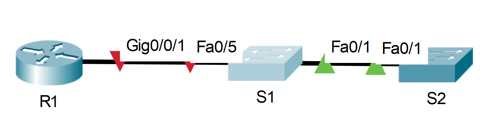

# Лабораторная работа - Настройка протоколов CDP, LLDP и NTP.
### Дано:
###	Топология

###	Таблица адресации
|Устройство  |Интерфейс |IP-адрес  |Маска подсети|Шлюз по умолчанию|
|------------|----------|----------|-------------|-----------------|
|R1          |Loopback1 |172.16.1.1|255.255.255.0|                 |
|R1          |G0/0/1    |10.22.0.1 |255.255.255.0|                 |
|S1          |SVI VLAN 1|10.22.0.2 |255.255.255.0|10.22.0.1        |
|S2          |SVI VLAN 1|10.22.0.3 |255.255.255.0|10.22.0.1        |
### Задание:
1. [Часть 1. Создание сети и настройка основных параметров устройства.]()
2. [Часть 2. Обнаружение сетевых ресурсов с помощью протокола CDP.]()
3. [Часть 3. Обнаружение сетевых ресурсов с помощью протокола LLDP.]()
4. [Часть 4. Настройка и проверка NTP.]()
5. Файлы Cisco Packet Tracer
   - [Основной файл домашнего задания](https://github.com/getmandv/Network_Engineer._Basic/blob/main/Home_work/Lab_13/pkt/lab_13.pkt)
## Часть 1. Создание сети и настройка основных параметров устройства.
###  Шаг 1. Создайте сеть согласно топологии.

###  Шаг 2. Настройте базовые параметры для маршрутизатора.
- a.	Назначьте маршрутизатору имя устройства.
- b.	Отключите поиск DNS, чтобы предотвратить попытки маршрутизатора неверно преобразовывать введенные команды таким образом, как будто они являются именами узлов.
- c.	Назначьте class в качестве зашифрованного пароля привилегированного режима EXEC.
- d.	Назначьте cisco в качестве пароля консоли и включите вход в систему по паролю.
- e.	Назначьте cisco в качестве пароля VTY и включите вход в систему по паролю.
- f.	Зашифруйте открытые пароли.
- g.	Создайте баннер с предупреждением о запрете несанкционированного доступа к устройству.
- h.	Настройка интерфейсов, перечисленных в таблице выше
- i.	Сохраните текущую конфигурацию в файл загрузочной конфигурации.

*Маршрутизатор R1*
```
Router>en
Router#conf t
Enter configuration commands, one per line.  End with CNTL/Z.
Router(config)#hostname R1
R1(config)#no ip domain-lookup
R1(config)#enable secret class
R1(config)#line con 0
R1(config-line)#password cisco
R1(config-line)#login
R1(config-line)#exit
R1(config)#line vty 0 15
R1(config-line)#password cisco
R1(config-line)#login
R1(config-line)#exit
R1(config)#service password-encryption
R1(config)#banner motd #
Enter TEXT message.  End with the character '#'.
This is R1 router.
Authorized Users Only!#

R1(config)#interface loopback1

R1(config-if)#
%LINK-5-CHANGED: Interface Loopback1, changed state to up

%LINEPROTO-5-UPDOWN: Line protocol on Interface Loopback1, changed state to up

R1(config-if)#ip address 172.16.1.1 255.255.255.0
R1(config-if)#exit
R1(config)#interface gigabitEthernet 0/0/1
R1(config-if)#ip address 10.22.0.1 255.255.255.0
R1(config-if)#end
R1#
%SYS-5-CONFIG_I: Configured from console by console

R1#wr
Building configuration...
[OK]
R1#
```
###  Шаг 3. Настройте базовые параметры каждого коммутатора.
- a.	Присвойте коммутатору имя устройства.
- b.	Отключите поиск DNS, чтобы предотвратить попытки маршрутизатора неверно преобразовывать введенные команды таким образом, как будто они являются именами узлов.
- c.	Назначьте class в качестве зашифрованного пароля привилегированного режима EXEC.
- d.	Назначьте cisco в качестве пароля консоли и включите вход в систему по паролю.
- e.	Назначьте cisco в качестве пароля VTY и включите вход в систему по паролю.
- f.	Зашифруйте открытые пароли.
- g.	Создайте баннер, который предупреждает всех, кто обращается к устройству, видит баннерное сообщение «Только авторизованные пользователи!».  
- h.	Отключите неиспользуемые интерфейсы
- i.	Сохраните текущую конфигурацию в файл загрузочной конфигурации.

*Коммутатор S1*
```
Switch>en
Switch#conf t
Enter configuration commands, one per line.  End with CNTL/Z.
Switch(config)#hostname S1
S1(config)#no ip domain-lookup
S1(config)#enable secret class
S1(config)#line con 0
S1(config-line)#password cisco
S1(config-line)#login
S1(config-line)#exit
S1(config)#line vty 0 15
S1(config-line)#password cisco
S1(config-line)#login
S1(config-line)#exit
S1(config)#service password-encryption
S1(config)#banner motd #
Enter TEXT message.  End with the character '#'.
This is S1 switch.
Authorized Users Only!#

S1(config)#interface range fastEthernet 0/2-4, fastEthernet 0/6-24, gigabitEthernet 0/1-2
S1(config-if-range)#shutdown 

%LINK-5-CHANGED: Interface FastEthernet0/2, changed state to administratively down

%LINK-5-CHANGED: Interface FastEthernet0/3, changed state to administratively down

%LINK-5-CHANGED: Interface FastEthernet0/4, changed state to administratively down

%LINK-5-CHANGED: Interface FastEthernet0/6, changed state to administratively down

%LINK-5-CHANGED: Interface FastEthernet0/7, changed state to administratively down

%LINK-5-CHANGED: Interface FastEthernet0/8, changed state to administratively down

%LINK-5-CHANGED: Interface FastEthernet0/9, changed state to administratively down

%LINK-5-CHANGED: Interface FastEthernet0/10, changed state to administratively down

%LINK-5-CHANGED: Interface FastEthernet0/11, changed state to administratively down

%LINK-5-CHANGED: Interface FastEthernet0/12, changed state to administratively down

%LINK-5-CHANGED: Interface FastEthernet0/13, changed state to administratively down

%LINK-5-CHANGED: Interface FastEthernet0/14, changed state to administratively down

%LINK-5-CHANGED: Interface FastEthernet0/15, changed state to administratively down

%LINK-5-CHANGED: Interface FastEthernet0/16, changed state to administratively down

%LINK-5-CHANGED: Interface FastEthernet0/17, changed state to administratively down

%LINK-5-CHANGED: Interface FastEthernet0/18, changed state to administratively down

%LINK-5-CHANGED: Interface FastEthernet0/19, changed state to administratively down

%LINK-5-CHANGED: Interface FastEthernet0/20, changed state to administratively down

%LINK-5-CHANGED: Interface FastEthernet0/21, changed state to administratively down

%LINK-5-CHANGED: Interface FastEthernet0/22, changed state to administratively down

%LINK-5-CHANGED: Interface FastEthernet0/23, changed state to administratively down

%LINK-5-CHANGED: Interface FastEthernet0/24, changed state to administratively down

%LINK-5-CHANGED: Interface GigabitEthernet0/1, changed state to administratively down

%LINK-5-CHANGED: Interface GigabitEthernet0/2, changed state to administratively down
S1(config-if-range)#end
S1#
%SYS-5-CONFIG_I: Configured from console by console

S1#wr
Building configuration...
[OK]
S1#
```
*Повторяем аналогичную настройку для коммутатора S2, с учётом изменившихся портов для отключения.*
## Часть 2. Обнаружение сетевых ресурсов с помощью протокола CDP.
- a.	На R1 используйте соответствующую команду show cdp, чтобы определить, сколько интерфейсов включено CDP, сколько из них включено и сколько отключено.
